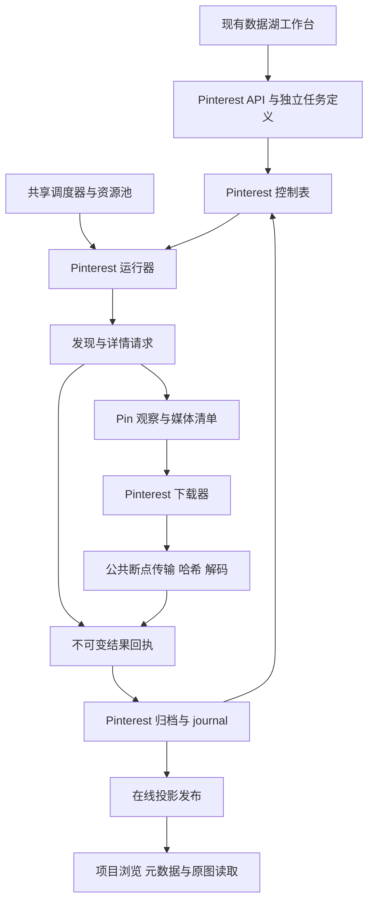

# Pinterest 独立采集下载模块与数据湖接入设计

创建日期：2026-10-09。状态：第一批指定 Pin 已接入。独立 Python 采集、下载、归档、在线发布和恢复，Rust 读取、HTTP/SDK 与现有工作台已贯通。第二至四批以及下文标注的扩展入口仍是实施目标，以实际能力接口为准。

Pinterest 直接在 Dataset Studio 内接入，通过正式任务、下载、归档和浏览路径验证与迭代。Pinterest 独立维护自己的采集下载模块，只共享来源无关的基础能力。首批完成指定 Pin 的端到端处理，之后加入图版与推荐发现，不再以独立验证原型或视觉模型选型作为前置条件。

来源行为依据见[采集研究](pinterest-collector-design.md)、[入口实测](pinterest-discovery-strategy.md)和[原始媒体规则](pinterest-original-media.md)。本设计取代这些早期方案中“先做收益或视觉预筛原型，再安排入湖接入”的推进顺序。

## 已确定的范围

- Pinterest 的 HTTP 请求、响应解析、Pin 与图版身份、发现策略、媒体选择、下载编排、增量判断和恢复规则独立维护，不通过 Pixiv 的作者任务、作品分级或 Ugoira 流程表达。
- 接入同一个受控 lake-worker、资源调度、数据湖工作台和项目浏览器。模块独立不意味着另起后台进程、产品页面或一套全局资源池。
- 下载后以 SHA-256 做字节身份与物理去重，同时保留实际下载字节的 MD5，供已有 Booru 元数据比对。CLIP、SigLIP、感知哈希、AI 检测和跨湖近似匹配留给后续统一分析。
- 默认保留源站返回的原始文件；各 Pin、媒体位置、图版关系与观察独立保留。跨湖相同哈希不自动合并项目图片身份或建立共享物理文件。
- 首批面向匿名可访问的普通静态 Pin，包括“单页单个图片块，且块签名与 Pin 签名相同”的故事封装。实测中这类封装约占列表 Pin 的一半。复杂媒体、访问受限和解析未知均有明确状态；题材筛选、登录与扩展入口按能力逐批开放。

## 当前代码基础与复用边界

当前 `collections` 是已经投入使用的 Pixiv 实现，并非可以直接套用的多来源采集框架。`model.py` 只接受 `pixiv_web_v1`；`planner.py` 解释作者前沿与 Pixiv 分级；`runner.py` 直接导入 Pixiv HTTP 和规范化代码。控制表还限定 `author/work`、Pixiv 账号和固定任务类型。[定义校验](../../../services/lake-worker/src/studio_lake/collections/model.py)、[前沿规划](../../../services/lake-worker/src/studio_lake/collections/planner.py)、[运行器](../../../services/lake-worker/src/studio_lake/collections/runner.py)、[控制表](../../../services/lake-worker/src/studio_lake/collections/schema.sql)

现有 `media_lake` 的分层原则适用，但实现中仍固定 Pixiv 来源、清单类型、字段与规划版本；Pinterest 已使用独立 `pinterest/lake`。Rust 在线读取增加精确的 Pinterest 格式分支，并保留既有站点与格式组合。[归档检查](../../../services/lake-worker/src/studio_lake/media_lake/library.py)、[Pinterest 在线表](../../../services/lake-worker/src/studio_lake/pinterest/lake/online.sql)、[读取分派](../../../crates/studio-sources/src/online/mod.rs)

| 层次 | 处理方式 | 具体边界 |
| --- | --- | --- |
| HTTP 断点、字节流与哈希 | 复用 `updates/transfer.py` | Pinterest 提供已选媒体 URL、请求会话与限额；公共层不猜原图、不解析 Pin |
| 请求限速与资源预留 | 复用 `updates/rate.py`、`updates/resources.py` | 来源键为 `pinterest`，元数据与媒体请求分别限速，共享全局网络、内存、编码和暂存额度 |
| 图片解码与保存配方 | 复用现有图片基础设施 | Pinterest 决定媒体角色与所需表示；公共层执行解码、尺寸检查和明确的派生配方 |
| 锁、原子写入、路径与对象读取 | 复用 `util.py` 及现有低层实现 | 保留已验证的文件与事务不变量，不夹带 Pixiv 字段 |
| 全局排队与工作台列表 | 增加 Pinterest 来源入口 | 只处理作业摘要、时间片、暂停和资源竞争；不解释其分页或覆盖规则 |
| 归档封装与提交 | 小范围提取来源无关的底层能力 | 共享 TAR、Parquet、清单哈希、journal 接受及发布顺序；Pinterest schema、关系验证与回放独立 |
| 来源业务与控制状态 | Pinterest 独立实现 | 不调用 Pixiv planner、scope、content revision、媒体清单或账号验证 |

公共能力的提取以 Pinterest 实际调用所需为限。保留 Pixiv 现有入口与语义；仅在共享实现确有调用需求时增加参数或提取纯函数，并用已有针对性回归证明兼容，不先重构整套 Pixiv 流程。

## 模块与运行路径

建议新增 `services/lake-worker/src/studio_lake/pinterest/`，由该包完整拥有采集与下载业务。以下为目标模块，实施时可按实际体量合并小文件：

| 目标模块 | 职责 |
| --- | --- |
| `model.py`、`service.py` | 定义校验、能力声明、幂等命令、任务查询与动作 |
| `http.py` | 网页资源调用、访问条件、字段集、原始响应和错误分类 |
| `normalize.py`、`media_manifest.py` | Pin、图版与关系规范化，逐项媒体清单和内容修订依据 |
| `planner.py` | 根种子、分页流、候选准入、入口预算与后续任务 |
| `downloader.py` | 媒体选择结果的下载执行、验证、表示生成、文件复用与下载回执 |
| `runner.py`、`recovery.py` | 有界运行片、任务领取、恢复、取消与暂存回收 |
| `control.sql`、`receipts.py` | Pinterest 控制表、不可变结果、回放和检查点推进 |
| `lake/` | 独立来源 schema、归档适配、在线投影与重建 |

依赖方向为 Pinterest 业务调用公共基础层；公共基础层不导入 Pinterest 或 Pixiv 业务。全局运行器按来源登记选择执行器，不通过多处 `if pixiv ... else pinterest ...` 共同维护两个站点的状态机。



抓取、下载和解码均在控制库短事务之外执行。HTTP 结果先形成持久回执，经归档接受后才推进来源检查点和派生任务；发布成功后才计入可浏览图片。

## 数据身份与湖内模型

每个 Pinterest 湖拥有独立 `library_id`、媒体目录和在线索引目录。项目中的图片身份继续是 `source_id + stored SHA-256`；Pin ID 与归档资产记录 ID 不替代这一身份。多个 Pin 指向同一文件时，浏览对象可以去重，来源关系仍按 Pin 和媒体出现位置分别查询。

目标事实表组如下。来源表使用 Pinterest 命名，不建立虚构的 Pixiv 作者；具体 DDL 在首批实现中与写入、读取和重建一起落地。

| 表组 | 保存事实与约束 |
| --- | --- |
| `visibility_contexts`、`captures` | 访问身份引用、语言地区、请求参数、字段集、响应时间、状态、原始响应和解析版本；不归档可复用 Cookie 或令牌 |
| `source_entities`、`entity_observations` | 图版、分区、账号、主题等来源实体及各次观察；账号角色包括维护者、上传者、转存者，不能自动赋为原作者 |
| `pins`、`pin_observations` | 稳定 Pin ID 与独立的列表或详情观察；字段存在性、标题、出处、统计和来源标记保留对应 capture |
| `media_manifests`、`media_entries` | 一次 Pin 内容观察中的媒体清单、完整性、位置、角色、版本、原始字段路径、URL 与声明尺寸 |
| `acquisitions`、`assets`、`objects` | 下载或复用证据、来源媒体与存储表示的关联、实际文件对象；对象主键为存储字节 SHA-256 |
| `discovery_snapshots`、`discovery_members` | 一次图版分页、推荐、搜索或主题响应的成员、顺序、入口、根种子、上下文、游标和结束依据 |
| `source_relations` | 观察支持的 Pin 与图版、分区、账号、主题、外部出处等关系，带角色及 capture 引用 |

Pin 是来源实体，每次读取是观察；`image_signature` 是来源报告的标识，不是文件哈希，也不代表整个多媒体 Pin。不能只按签名建立一条媒体任务后跳过该 Pin 的其他页、组件或视频。

图版成员与 More ideas 分别存为成员关系和推荐快照。相关推荐不证明目标属于种子图版；搜索排名与机器主题不表示人工审美认可。来源聚合收藏数保存聚合依据，不累加各转存 Pin 上的同一指标。

列表字段不能覆盖成“最新完整详情”。保留观察种类、字段集和字段存在性；缺失、显式空值、零与 false 分别表达。当前展示投影引用采用的观察，字段跨观察补充时保留依据，不能静默拼成一份来源从未返回的完整记录。

媒体位置以清单为范围。新清单换图、增页、减页或重排时产生新的媒体出现记录；不能把旧清单同序号的文件当成新清单下载成功。来源内容修订依据由 Pinterest 自己定义，排除单纯的收藏数、标题和描述变化；无法确认内容相容时补取详情或清单。

同一 capture 在相同解析版本下重放产生稳定记录 ID，新的抓取保留新的观察。数据库约束覆盖 Pin ID、清单内位置、来源资产与表示的唯一性，以及 snapshot 内成员顺序；索引覆盖按 Pin 查历史和媒体、按图版查成员、按 SHA 查来源关联及按作业状态领取任务。所有关系查询使用固定发布水位和有界游标，避免每次查看图片时扫描全湖 JSON 或重新枚举图版。

## 下载与哈希处理

正式下载链为：保存媒体字段完整的观察 → 解析媒体角色和原始字段 → 冻结媒体任务 → 下载到稳定暂存 → 识别与完整解码 → 计算并核验哈希 → 归档表示与来源关联 → 发布在线投影。首批的观察来自指定 Pin 的详情；发现入口的列表项何时可以直接形成清单，见下文“清单来源与详情补取”。

首批只下载清单中来源明确报告的静态原始媒体。`/originals/` 路径只是依据的一部分，封面和故事背景不自动充当完整 Pin。缺失的原始字段、复杂合成内容及未知媒体类型保存原文和缺口，不以第一张可下载图片结束整个 Pin。后续扩展回退下载时，回退与原始媒体成功必须分开计数。

判断是否为静态图，要同时看 `images.orig`、`carousel_data`、`videos` 和 `story_pin_data` 的各页各块。实测有 5 个 Pin 的 `is_video` 为 false、`videos` 为 null，视频只出现在故事块中，`images.orig` 是封面。只看顶层视频字段会把封面误记为原图成功。[媒体形态统计](pinterest-original-media.md#媒体类型的特别处理)

| 值 | 语义与使用 |
| --- | --- |
| `download_sha256` | 本次实际 GET 返回完整字节的 SHA-256，用于下载完整性与来源文件身份 |
| `download_md5` | 对同一下载字节计算的 MD5，用于兼容既有 Booru 来源 MD5；不是 Pinterest 声明的校验值 |
| `objects.sha256` | 实际入湖保存字节的 SHA-256；转码时可能不同于下载 SHA-256 |
| `cdn_etag` | 响应的强 ETag，原样保存。实测 3 个 `originals` 中均等于下载字节的 MD5；只作为校验器和核对依据，不填入文件哈希字段 |
| `image_signature` | 站内关联线索，按原字段保留，不能填入任何文件哈希字段 |

首批实现已在公共传输成功回执中增加实际计算的 MD5 和强 ETag，旧调用方可继续忽略这两个字段；Pinterest 将它们持久化在下载取得记录中。原有 SHA-256 与“来源 MD5 是否验证”的语义保持不变。

ETag 若是 32 位十六进制，下载后与 `download_md5` 比较，不一致时记为待检查。其他形式只保存，不作判断。Pinterest 不提供下载前的来源 MD5，但 CDN 返回强 ETag 并支持 Range，所以现有断点规则（要求有来源 MD5 或强 ETag）可以直接续传，不需要放宽。[当前传输实现](../../../services/lake-worker/src/studio_lake/updates/transfer.py)

首批按“规范化的媒体 URL 加访问条件”合并下载取得。同一签名派生的原图地址相同，多条转存 Pin 指向同一 URL 时，同一运行内只发起一次 GET。每个 Pin 仍保留自己的清单项、资产和来源关联，下载后再按 SHA-256 复用字节对象。合并的依据是相同 URL，不是“签名相同”，因此不会跳过某个 Pin 的其他页、组件或视频。

后续若加入跨运行的历史复用，必须核对媒体定位、角色、版本、保存配方、访问条件和允许复用的时间范围。CDN 对原 ETag 的 `If-None-Match` 返回 304，满足这些条件时可以记为 `http_validated`；只沿用旧记录时记 `historical_reuse`，不冒充本次 HTTP 核验。现有 `fetch` 把 200、206 以外的状态当作失败或待检查，这一重新验证路径需要单独实现。

MD5 命中已有 Booru 元数据可形成待核对的来源关联，不据此跨湖删除文件。但当前 Booru 在线索引不支持按 MD5 查询：观察表的 `md5` 列没有索引，资产索引以 `post_id` 开头。Pixiv 湖没有来源 MD5；各湖只能按 `assets(sha256)` 查已保存的未转码字节。因此首批只持久化 MD5 与 SHA-256。跨湖精确命中由后续共享的只读哈希索引承担，不为 Pinterest 修改 Booru 在线格式，也不逐行扫描已有湖。

ETag 让下载前取得 MD5 成为可能。是否据此跳过与已有湖完全相同的文件，属于跨湖对象引用的后续决定；首批仍然下载。不同编码、裁切、尺寸甚至仅元数据不同的文件可以暂时共存。原件与派生文件分别建资产记录，缩略图和模型输入不能填补原图完成状态。

图片完整性、尺寸与帧信息检查复用基础设施，媒体角色解释留在 Pinterest 下载模块。每个任务使用稳定的下载目录；恢复沿用有效断点，显式重试可建立新下载 generation，旧 claim 不得覆盖新执行结果。

## 独立控制状态与发现任务

Pinterest 使用共享控制库中的独立表组，例如 `pinterest_jobs`、`pinterest_tasks`、`pinterest_frontier`、`pinterest_streams`、`pinterest_receipts`、`pinterest_batches` 和 `pinterest_schedules`。湖位置仍登记到公共 `lakes`。不扩写 Pixiv 的 `collection_entities` 和 `collection_tasks` 枚举来容纳图版，也不把图版 ID 存为作者 ID。

作业冻结定义、定义哈希与根种子；任务冻结输入、访问范围和解析版本。前沿记录候选 Pin、图版、分区、查询或主题，后续入口可按能力增加。控制表是执行与查询索引，已接受的任务结果、分页推进和发现依据在归档中有对应回放记录。

| 任务 | 输入与结果 | 关键约束 |
| --- | --- | --- |
| `pin_detail` | Pin ID 与用途（形成清单或补取元数据）→ 详情观察与媒体清单 | 同一冻结输入合并任务，保留所有发现来源；补取元数据的任务另有预算、优先级更低，不阻塞下载 |
| `board_page`、`section_page` | 来源 ID、scan、游标 → 本页 Pin、可确定的媒体清单和下一游标 | 只将真实成员记录为属于该图版或分区 |
| `board_more_ideas`、`related_pins` | 图版或 Pin 种子 → 推荐快照 | 每入口预算与深度限制，不混入图版成员覆盖 |
| `search_page`、`topic_page` | 查询或主题 → 候选与排序上下文 | 查询参数和语言绑定游标；主题截断不解释为全站完整 |
| `media_download` | 清单媒体项 → 下载取得记录与资产 | 不在任务中重新猜测另一张图片；来源变更交回详情刷新 |

任务领取使用短事务和 claim/epoch。后续分页、媒体任务与检查点推进，均从已归档结果生成；中断后重放同一结果不重复推进游标或重复增加计数。重试发起的新观察使用新的 capture，不能覆盖已接受的旧响应。

每个分页流保存 `scan_id`、入口、根种子、完整规范化参数、字段集、访问条件引用、游标及 revision。游标按不透明来源值处理；重复游标且无进展时停为待检查。游标失效、访问条件改变或重新扫描时建立新的 scan，并保留与旧扫描的关系。

首版按人工种子优先级、入口轮转、发现顺序与稳定 ID 排序。分别限制准入 Pin、展开图版、推荐请求、详情请求和待下载积压；不依赖视觉评分、新颖度模型或多臂老虎机。下载和归档积压到达上限时暂停发现，已有文件继续归档发布，避免不断扩展候选占满暂存。

### 清单来源与详情补取

发现入口返回的列表项可以直接形成媒体清单。只有两种情况才请求 Pin 详情：列表项不足以确定媒体；或者任务要求补充元数据。各入口的字段统计见[字段可得性](pinterest-discovery-strategy.md#各入口的字段可得性)。

| 方面 | 由列表项形成清单 | 每个 Pin 都请求详情 |
| --- | --- | --- |
| 下载的文件 | 相同。3 个同时出现在列表和详情中的 Pin，两边都有的媒体字段取值完全一致 | 相同 |
| 一页 25 个 Pin 的请求数 | 1 次 | 26 次 |
| 元数据 | 缺少下列详情独有信息 | 最完整 |
| 主要风险 | 字段集变化可能导致误判媒体形态，由下文的逐条检查与抽样校验控制 | 请求量大，匿名访问更容易被限流，采集速度相应下降 |

匿名访问的可持续速率尚未测量，请求量直接决定限流风险和每轮能处理多少 Pin。详情多出来的是元数据，不是更好的文件，所以默认以列表形成清单。

这样做的代价是缺少以下信息：

- **图版内容入口**：没有机器标签、AI 类别、创建时间和创建方式。图版又是主要入口，看重这些信息时需要补取详情。
- **所有列表入口**：都没有转存来源、本 Pin 的转存数与分享数、下载许可标记、主类别和检测框。
- **相关推荐和搜索**：没有图片级收藏数，媒体判定字段也不齐，因此这两个入口始终要请求详情。
- **故事 Pin**：页级字段（含页级视频）只在详情中出现，列表只能依据块级数据判断形态。

缺少的信息可以日后按 Pin ID 补取，但 Pin 被删除或改为不可见后就无法补回。列表观察本身始终保留。

规则如下：

1. **逐条检查。** 列表项带齐 `images`、`carousel_data`、`story_pin_data`、`videos` 和 `is_video`，且按故事块判定为已支持的静态形态时，由这条列表观察形成清单，并记录 capture、入口和字段集。检查按条进行，不因为入口曾经可靠就整体信任。
2. **用详情形成清单。** 任一判定字段缺失、形态未支持或不确定时，生成用于形成清单的 `pin_detail`。实测中，相关推荐和搜索的条目都属于这种情况。指定 Pin 种子同样以详情形成清单。
3. **元数据补取单独成任务。** 补取使用扩展字段集，因为 `detailed` 字段集不含 AI 类别和自动描述。补取有独立预算，优先级低于清单和下载，不阻塞下载与发布。补取结果是新的观察，不覆盖列表观察；投影按字段注明采用了哪次观察。
4. **抽样校验。** 每次扫描抽取少量由列表形成清单的 Pin 请求详情，比较媒体字段。若不一致（包括详情中页级视频非空而列表看不到），该扫描剩余的条目改为逐 Pin 请求详情，差异证据保留待检查。抽样请求计入补取预算。

任务定义中的 `metadata.detail_enrichment` 控制补取范围：

| 取值 | 行为 |
| --- | --- |
| `none` | 只请求形成清单所需的详情，不做抽样校验 |
| `sample`（默认） | 只做抽样校验，顺带得到少量完整元数据 |
| `all` | 为每个新准入的 Pin 补取一次详情 |

补取请求计入 `run_budget.detail_requests`，预算耗尽时补取进入 `waiting_budget`，不影响已形成清单的下载。选择 `none` 时，由列表形成的清单缺少校验，任务详情需要显示这一点。

## 完成语义与增量复查

| 情况 | 处理与对外含义 |
| --- | --- |
| 预算耗尽 | `waiting_budget`，保留候选与游标；继续任务获得新一轮预算，不声称范围采全 |
| 来源明确返回结束游标 | 本次访问条件下的流已结束；图版扫描不是整个分页期间的原子快照 |
| 搜索或推荐返回空页 | 保存空结果与原始信号；没有明确限制依据时原因记未知，不仅凭 `sensitivity` 字段判定受限 |
| HTTP 401、403、登录页或挑战 | 记录访问阻断并暂停受影响范围；匿名任务不自动升级为登录任务 |
| 429 或暂时网络故障 | 来源级冷却或有界重试，保留有效下载断点 |
| 响应形状变化或媒体清单不确定 | 保存 raw-only 证据并待检查，不当成空列表或成功 Pin |
| 明确不在选择范围的类型 | 记录范围排除，与失败缺口分别统计 |
| 已选择类型尚未支持或原图取得失败 | 记录缺口，不能以封面、缩略图或其他组件抵充 |

完成度分为发现流、Pin 详情、媒体清单、下载、归档和在线发布。媒体清单与下载的完成不依赖元数据补取。补取的待办、完成和失败（例如 Pin 已删除）单独计数，不算作媒体缺口。未知总量使用 `null`；任务全部处理完但仍有范围内缺口时使用 `completed_with_gaps`。新增 Pin 数、站内签名数、下载字节、字节去重后的对象数和复用数分别统计，不将新哈希数称为新作品数。

图版复查重新形成成员观察；本次未见某 Pin 不等于历史删除。推荐和搜索每次运行保留独立快照，不建立“此前读过所以永久完整”的覆盖缓存。详情与清单复用需同时检查访问条件、新鲜度和内容相容性；沿用旧观察必须展示原时间。

外链保存为出处线索。首版不隐式创建其他来源任务；后续明确交接给 Pixiv 等采集器时，外部作品、媒体及来源观察独立保留，不覆盖 Pinterest 原记录。

## 归档提交与版本兼容

Pinterest 使用与现有湖一致的对象、来源资产、原始响应、批次清单、journal 和可重建在线索引原则。首批即保存可独立重建的归档，不能先只写一个工作数据库、后续再补归档协议。

提交顺序沿用已有可靠性约束：

1. 固定作业意图与任务输入；下载、解析结果写成不可变 prepared 回执。
2. 校验字段、记录数、字节预算、媒体关联与文件哈希。不能规范化的响应以明确的 raw-only 结果保存。
3. 在有界批次内冻结回执成员，封装媒体与 Parquet，写入并封存批次清单。
4. journal 接受批次后，以 receipt ID 幂等回放控制状态和 checkpoint；不会在文件尚未持久化时丢掉来源游标。
5. 发布在线事务并推进 `served_seq`，随后确认发布计数与释放可回收暂存。

归档接受与在线发布分别记录。首版沿用接受时验证关系和可用在线状态的约束，不另外引入一套权威对象目录。在线库不可用时暂停接受，先按归档重建；不能因 UI 只读暂时失败就丢弃已保存回执。已接受批次继续回放，未接受的非法结果隔离并保留原因，不能把隔离标作成功发布。

设计基线的控制库 schema 版本是 v14，首批实现已通过 v15 迁移增加 Pinterest 独立表组；非空旧控制库先备份再在事务中迁移。早期 Pixiv 文档中的 v11 是历史基线。[当前控制迁移](../../../services/lake-worker/src/studio_lake/updates/state.py)

| 组件 | 当前基础 | Pinterest 实施目标 |
| --- | --- | --- |
| 共享控制库 | v14 | 已实现 v15：增加独立 Pinterest 表与调度登记；不重写旧作业定义 |
| 不可变归档 | Booru 格式 1，Pixiv 格式 2 | 新 Pinterest 格式 3，`schema_set=pinterest-media-v1`，登记独立必需特性与回放版本 |
| 在线索引 | Booru 格式 2，Pixiv 格式 3 | Pinterest 格式 4，独立建表、投影和 reader |
| 作业定义 | Pixiv `version=1`、`pixiv_web_v1` | Pinterest 独立 `version=1`、`pinterest_web_v1`；两者不互相转换 |
| 项目图片引用 | 来源 ID 加存储 SHA-256 | 保持相同结构；新湖来源类型为 `pinterest` |

版本分派必须同时核对站点、容器版本、schema set 与必需特性。旧读写器遇到新格式明确拒绝，不能按“版本大于等于 2”猜测兼容。已有三湖与 Pixiv 的目录、归档和图片引用无需迁移。共享封装代码按版本选择严格 schema，不能修改一个全局 `FACTS` 或常量而改变旧归档的解释。

共享控制库迁移沿用备份与事务机制，只增加本期登记和表组；回归核对旧任务定义哈希、计划与发布水位没有变化。Pinterest reader 和 writer 的格式支持随同一项目版本交付，防止先开放建湖而当前浏览器无法读取。

## API 和现有界面接入

独立路由前缀 `/v1/pinterest-collections` 已提供 `status`、`capabilities`、湖创建与分页列表、任务预览创建、任务列表详情、细项与动作接口。已有湖的采集登记、单独覆盖报告与周期计划尚未开放。Pinterest 独立 DTO 和 SDK 客户端拥有其任务定义，不要求旧 `CollectionScope` 增加大量仅某站点有意义的可空字段。

已有 Pixiv 路由和 JSON 形状保持兼容。全局工作台与调度加入 `family=pinterest` 的明确分支，调用独立服务；全局摘要只依赖湖、作业 ID、状态、阶段、计数和操作能力。联合列表的来源筛选与新增 family 通过能力版本和显式查询范围暴露，旧默认查询不突然返回旧客户端无法解析的新变体。列表继续在数据库中有界合并，不逐来源读取全量任务后在内存排序。

下例是首批支持的完整定义。`POST /jobs/preview` 直接提交定义；`POST /jobs` 提交 `{"request_key":"<fresh UUID>","definition":...}`：

```json
{
  "version": 1,
  "collector": "pinterest_web_v1",
  "library_id": "<library UUID>",
  "access": { "mode": "anonymous", "language": "zh-TW" },
  "seeds": [{ "kind": "pin", "id": "858146903966145189" }],
  "scope": { "media_types": ["image"], "ai_policy": "record_only" },
  "discovery": { "entrypoints": [], "max_depth": 0 },
  "metadata": { "detail_enrichment": "none" },
  "media": {
    "image_policy": { "profile": "original", "existing": "match_profile", "allow_sample": false },
    "retain_original": true,
    "reuse": { "mode": "revalidate", "max_age_hours": 0 }
  },
  "run_budget": {
    "api_requests": 100,
    "admitted_pins": 100,
    "admitted_boards": 0,
    "detail_requests": 100,
    "download_bytes": 1073741824,
    "wall_seconds": 3600
  }
}
```

预算数字是可调整的定义示例，不代表已测出的站点限额。列表项数、待下载数、并发文件、单文件尺寸、解码内存与回执元数据另受服务端资源配置约束；已准入下载造成的预算超出必须限定在已预留的有界批次内。

预览只做输入解析、范围规范化与本地能力检查，不偷偷联网或创建作业。无法从链接本身得到图版 ID 时，预览明确标出需要解析；解析进入正式任务并计入请求预算。创建命令用 `request_key` 幂等，动作使用 revision，Pin 与图版 ID 以字符串传输。

匿名访问不要求用户配置一个虚构的登录账号。执行器为访问条件建立持久引用，记录实际响应报告的地区、语言、客户端配置版本及会话变化；访问 Cookie 与可归档证据分开。后续登录使用 Pinterest 自己的验证与可见条件逻辑，只复用安全凭据存储基础设施。

工作台增加 Pinterest 来源选项和独立表单组件，复用现有湖位置、保存配方、任务列表与通用预算控件。输入区按 Pin、图版、分区、查询等实际能力显示，不显示作者 ID、R-18/R-18G 或 Ugoira 选项。最小界面与首批后端同时交付，直接从项目中创建任务和查看结果。

浏览器沿用图片对象视图、预览、原图读取与工作集。新增 Pinterest reader 提供 Pin、媒体角色、图版关系、来源信号和 raw 引用；不把维护者显示为画师。查询条件在同一 Pin 或同一来源关联上共同满足后，再按存储对象去重，防止把不同 Pin 的条件拼成一次命中。未实现的关系查询或排序能力明确关闭，不复用 Pixiv 的页序和作者接口冒充支持。

## 代码落点

| 现有入口或新增位置 | 需要完成的改动 |
| --- | --- |
| `studio_lake/pinterest/` | 新增独立业务包、控制迁移、任务执行与湖实现，不从 Pixiv 业务模块继承 |
| [控制库](../../../services/lake-worker/src/studio_lake/updates/state.py)、[全局分派](../../../services/lake-worker/src/studio_lake/updates/dispatch.py)、[全局运行器](../../../services/lake-worker/src/studio_lake/updates/runner.py) | 注册 Pinterest 湖与独立执行器，复用每湖排他、公平时间片、资源池、搬盘互斥与后台生命周期 |
| [传输层](../../../services/lake-worker/src/studio_lake/updates/transfer.py)、[资源池](../../../services/lake-worker/src/studio_lake/updates/resources.py) | 返回实际 MD5 与强 ETag，登记 Pinterest 来源限额，避免来源业务进入公共传输 |
| [归档入口](../../../services/lake-worker/src/studio_lake/library.py)、[既有多媒体归档](../../../services/lake-worker/src/studio_lake/media_lake/library.py) | 新格式分派；只提取需要共享的封装与提交底层，保留 Pixiv schema 与回放验证 |
| [存储维护工具](../../../tooling/lake-storage.mjs) | 后续增加 Pinterest build、verify、compare 路径；首批独立重建由 `pinterest.lake.online.rebuild` 实现并回归验证 |
| [Rust 来源声明](../../../crates/studio-sources/src/profiles.rs)、[在线读取](../../../crates/studio-sources/src/online/mod.rs)、[查询字段](../../../crates/studio-sources/src/query/fields.rs) | 增加来源描述与 Pinterest reader 路由，保留公共查询、预览、raw 和导出边界 |
| `crates/studio-protocol/src/pinterest.rs`、`crates/studio-engine/src/api/pinterest.rs` | 独立 DTO、路由及 worker 服务分派；domain 操作与 application 端口不依赖 HTTP 或控制数据库 |
| `packages/client/src/pinterestCollections.ts`、[现有工作台](../../../apps/desktop/src/features/lake-updates/LakeWorkspace.tsx) | 新 SDK、来源表单与任务详情，接入联合列表；网络调用继续经 client 与 SDK |
| `services/lake-worker/tests/test_pinterest_*.py`、`tooling/integration-pinterest.mjs` | 正式模块的解析、下载、恢复、归档重建与 HTTP/SDK 集成回归；不是第二套采集原型 |

## 分批实施与验收

每批均修改正式模块，在现有项目链路内使用模拟源站和受控真实任务验证。真实请求只在明确启动的任务中执行；自动测试使用最小构造响应，验证工具只驱动正式 API，不另写一套抓取逻辑。

| 批次 | 交付范围 | 完成条件 |
| --- | --- | --- |
| 第一批 指定 Pin（已接入） | 新湖格式与 reader、独立控制/API、普通静态 Pin 详情、原图下载、哈希、归档发布、最小工作台入口 | 从空目录建湖，在项目中提交 Pin 后可浏览、查看来源和读取原文件；重复提交与中断恢复不重复发布，归档可独立重建 |
| 第二批 图版与分区 | 图版解析、成员分页、分区、发现证据、由列表项形成清单与元数据补取选项、积压限制与断点续抓 | 多页成员可处理；暂停或预算耗尽后接续，不因重复 Pin 丢关系，不将成员变化或占位条目误算为图片；由列表形成的清单与抽样详情一致 |
| 第三批 推荐与搜索 | More ideas、单 Pin 推荐、Pin/图版搜索、Ideas 主题，入口预算与固定优先级 | 推荐与成员分别保存；重复游标、空页、字段集差异和响应变化有可检查结果；入口收益按 Pin、哈希与成本分别统计 |
| 第四批 持续运行 | 增量复查、历史复用、周期计划及更完整的诊断 | 统计变化不误判内容替换；换图产生新媒体身份；计划不与未结束作业重叠，旧 Pixiv 与三湖运行保持兼容 |

普通静态图之外的图片轮播、简单图片页、复杂故事、视频和动画按媒体能力分别扩展，每种类型都有清单与文件对应的回归。已遇到的未支持类型从第一批开始保留状态，不在后续阶段开放前计入完整原图成功。

每批实现至少覆盖它触及的故障边界：

- 同一原文件出现在不同 Pin 或位置时，只复用字节对象，来源关联完整；相同签名返回不同字节时不覆盖对象。
- 成功响应是 HTML、截断图片、错误尺寸或角色不符时，不会误报原图成功；ETag 与实际 MD5 不一致时记为待检查；故事块中的视频封面不会计为静态原图。新增下载样本在项目运行环境中完成真实解码。
- 请求成功后、prepared 后、journal 接受后、在线发布后分别中断，恢复不漏页、不重复计数、不丢原始响应；取消只清理本作业可回收暂存。
- 换会话、游标失效、429、403、原图失效和显式重试保留不同原因；空结果没有证据时不升级为“无内容”或“受限”的确定结论。
- 新湖归档重建与在线查询一致；旧 Pixiv 格式 2/3 和 Booru 格式 1/2 的针对性读取、调度及共享传输回归通过。

验证按实际改动选择 Python 用例、Rust 来源测试和 Pinterest API 集成套件；公共 DTO 变化时生成契约。最小工作台入口做一次相关界面验证即可，不以全湖扫描、全套后端测试或容量压测作为每次提交门槛。

题材范围、登录入口、复杂媒体下载和后续视觉分析可以通过能力与配置继续扩展。当前代码接入以第一批完整路径为起点，来源访问与媒体角色的不确定性由真实任务证据反馈到独立 Pinterest 模块中修正。

## 首批使用与验证边界（2026-10-09）

在现有数据湖工作台选择“创建 / 登记数据湖 → Pinterest”，使用两个独立空目录，可同时添加到当前项目。随后在“新建更新 → Pinterest”输入 1–500 个 Pin ID 或完整链接，检查摘要后启动。无需账号；摘要检查不联网。共享运行器按每湖互斥与全局资源预算执行。

目前只保留原图字节。指定 Pin 均获取一次 `detailed` 响应，`metadata.detail_enrichment=none/sample` 不会额外请求扩展字段，`all` 明确拒绝。Board、分区、推荐、搜索、登录、定期复查、跨轮文件复用和衍生图片配方未开放。预算耗尽保留进度；本批没有“追加预算”命令，可取消剩余工作，为未完成 Pin 新建任务。已有 Pinterest 湖可以作为项目只读来源添加，尚无采集控制器接管或专用搬盘界面。

`client.pinterestCollections` 与 `/v1/pinterest-collections` 对应。任务动作提交 `action` 与 `expected_revision`；工作台会先读取最新状态。统一湖/任务列表只有显式传入 `include_pinterest=true` 才返回新来源和 `family=pinterest`。独立 `identity_summaries` 能力允许浏览卡片显示 Pin 身份，不要求开启 Pin 排序。当前查询字段仅包括存储 SHA-256、扩展名、大小、宽高；Pin、Board 和账号的联合筛选尚未开放。

项目元数据以 `pin_origin` 表达 Pin、媒体、清单与角色，保存账号和原始保存账号分别显示，不映射为画师。实际下载 MD5、CDN ETag 与来源图像签名分别保存；缺少字段、显式 null、false 和 0 保持区别。原始响应读取先验证对象、来源资产与 Pin 的归属，再按同一保留版本返回有界正文。

首批验证覆盖解析、下载和真实解码，Pin/媒体两阶段各 7 个中断点、暂停/取消恢复、旧控制库备份迁移、URL 获取复用与字节去重、归档独立重建；另外通过 Rust 在线读取与格式拒绝测试、Pinterest/Pixiv HTTP/SDK 集成、2560×1440 界面检查、类型/Lint/边界检查。界面验证包含创建空湖并挂接项目、Pin 身份展示、原文归属、任务控制，以及服务端成功但浏览器丢失响应后复用同一个提交键。

一次正式 `Service + Runner` 的匿名真实样本取得 Pin `858146903966145189`：原图 399×600、77,302 字节，1 次详情请求和 1 次原图 GET；实际 MD5 为 `622dfab81fc759e66957127fdcb86e2c`，与该响应的强 ETag 相同，归档/发布水位均为 3。它只证明该样本时点的完整链路，不代表大范围覆盖、长期源站稳定性或吞吐。

复跑入口：`pnpm test:lake tests/test_pinterest_manifest.py tests/test_pinterest_pipeline.py`、`pnpm test:rust -p studio-sources online::tests`、`pnpm test:rust -p studio-sources pinterest_metadata`、`pnpm test:integration pinterest`、`node tooling/smoke-pinterest-ui.mjs`。集成与 UI 使用隔离构造响应，不访问源站；运行摘要与截图保留在本机 `.local/reports/pinterest-phase1-20261009/`，不随 Git 分发。
