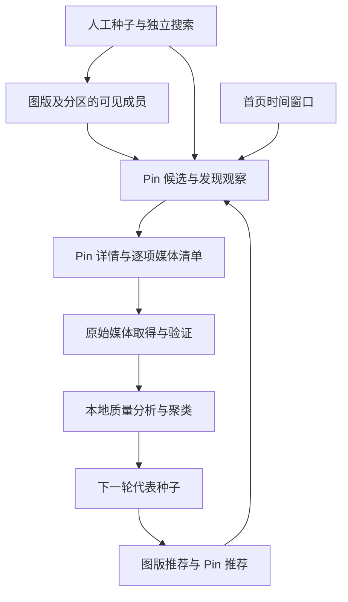

# Pinterest 采集研究与方案

创建日期：2026-10-09。状态：采集研究与方案草案，Pinterest 采集器尚未接入。

Pinterest 是下一阶段优先研究的数据湖来源。采集方案以图版组织已知集合，以 Pin 和图版推荐发现新内容，以搜索引入新题材；质量判断结合采集上下文、可得元数据和图片本身。本阶段首先确认如何取得 Pinterest 的原始媒体并识别缩略图回退，再验证发现收益，最后设计数据湖与 Studio 接入。

原图的定义、获取顺序、失败处理和本轮小样本结果见 [Pinterest 原图获取与验证](pinterest-original-media.md)。总体职责延续[多来源图片采集规划](README.md)。下文中的调度、质量和状态规则是设计建议，尚未成为已实现的接口或存储契约。

## 来源选择与范围

当前项目已有 Danbooru、Gelbooru、Yandere 三个 Booru 数据湖，以及以作者为扩展核心的 Pixiv 数据湖。Rule34 保留为后续 Booru 扩展候选；本轮优先研究 Pinterest 带来的新内容和发现方式。Rule34 与现有湖的重叠、噪声及相对收益尚未进行量化比较。

Pinterest 的价值需要通过具体入口衡量。精选图版和推荐页面的观感不能代表全站平均质量，也不能证明采集结果天然适合后续用途。首轮研究集中在公开或账号有权访问的 Pin、图版、分区、推荐及其媒体，先取得原始响应和文件，再进行本地分析。

## 采集对象与关系

| 对象 | 作用 | 身份与解释边界 |
| --- | --- | --- |
| Pin | 站点内容条目及媒体入口 | Pin ID 与图片文件身份分别保留 |
| Board | 维护者组织内容的图版 | 用图版 ID 表示身份，名称和链接作为可变资料 |
| Section | 图版内的分区 | 保留分区身份、所属图版及实际观察到的成员关系 |
| Pinterest 账号 | 图版维护者、收藏者或发布者 | 不能仅凭账号拥有 Pin 就认定其为图片原作者 |
| 媒体 | 图片、视频或多媒体内容中的独立文件 | 保留条目内的位置、角色、版本和实际内容哈希 |
| 外部出处 | Pin 关联的网站或作品链接 | 链接是出处线索，作者和作品对应关系需要核对 |
| 发现观察 | 某个入口在特定条件下返回一组候选 | 带时间、入口、种子、访问条件及返回位置 |

Pinterest 的 Pin 与图版关系具有选图和主题上下文价值。Pinterest 的 PinSage 研究曾使用这类图结构；研究中的内部全量图不等于外部可枚举的接口。不能预设能反查一张 Pin 被收藏到的所有图版。[Pinterest 工程说明](https://medium.com/pinterest-engineering/pinsage-a-new-graph-convolutional-neural-network-for-web-scale-recommender-systems-88795a107f48)

同一文件被多个 Pin 引用时，可以复用物理对象，但保留每个 Pin、每条发现关系和各自元数据。近似图、不同裁切、压缩版本及更高分辨率版本保留各自身份，交由后续聚类分析。

## 发现入口与分工

| 入口 | 建议职责 | 覆盖与使用边界 |
| --- | --- | --- |
| 图版和分区的已保存内容 | 主要收集单位，定期复查 | 表达本次可见成员，不承诺历史完整 |
| 图版 More ideas | 围绕主题种子持续扩展 | 推荐内容与图版已保存成员分别记录 |
| 单 Pin 相关推荐 | 从具体画风、构图和题材向外发现 | 按轮选择种子，限制每轮扩展量 |
| 维护者的其他公开图版 | 发现相近选图偏好的其他主题 | 逐图版评估，不自动扩展整个账号 |
| 关键词和图版搜索 | 补充推荐链之外的题材 | 保留多语言和不同描述角度，查询结束不等于全量覆盖 |
| 首页推荐 | 发现综合兴趣下的新候选 | 按会话和时间窗口观察，单独统计收益 |
| 视觉搜索及图片结合文字搜索 | 探索具体元素或调整方向 | 后续实验入口，记录图片种子、局部区域及文字条件 |

官方图版功能区分 All saves 与 More ideas；搜索支持内容类型筛选和从 Pin 出发细化搜索，视觉搜索支持选择图片局部。客户端、地区及账号可见能力需要分别核对。[图版功能](https://newsroom.pinterest.com/news/pinterest-boards-get-ai-powered-upgrade-for-personalized-experience/)、[搜索功能](https://help.pinterest.com/en/article/search-for-ideas-on-pinterest)、[视觉搜索](https://help.pinterest.com/en/article/use-visual-search-features)

种子既可以来自人工挑选，也可以来自查询结果或已有湖中的 Pinterest 出处。只使用已有 Booru 内容作为种子可能限制新题材的发现，应保留独立搜索和人工补充入口。

## 采集循环与调度

同一实体的重复任务合并，但发现依据保留。每轮分别约束推荐请求、新图版展开、详情补全和媒体积压，避免推荐递归占满下载与已知范围补全预算。入口新增收益降低时可以降低优先级或延后复查，候选与延后原因继续保留。

下一轮种子应覆盖不同主题和视觉簇，避免大量近似转载支配扩展。采集初期先下载再做本地去重与聚类，不把跨站相似或低热度直接作为永久排除理由。

可以试验维护少量主题种子图版，以图版推荐取得候选，再用本地评审结果帮助挑选后续种子。下载到本地与收藏回 Pinterest 是两个独立动作；采集器不默认把下载结果全部保存回图版。

收藏、搜索和浏览活动会影响推荐。首页研究需要记录会话身份引用、语言地区、推荐偏好及采样时间，并考虑研究操作本身改变推荐的影响。不同图版也不保证完全隔离账号偏好。[推荐依据](https://help.pinterest.com/en/article/tune-your-home-feed)

## 访问通道与会话

当前 gallery-dl 源码包含 Pin 详情、图版及分区、Pin 推荐、图版推荐和搜索的网页资源调用，可作为独立采集器的参考。网页资源并非稳定的公开开发者契约；首页与视觉搜索的连续采集仍需另行核对。[固定版本源码](https://github.com/mikf/gallery-dl/blob/382b1c717eb5d0b856d6b4c66fa9bce6573a3cf9/gallery_dl/extractor/pinterest.py)

公开 API 与网页通道分别评估。普通 `/search/pins` 面向操作账号的 Pins，`/search/partner/pins` 属于受限 Beta；不能预设公开 API 能提供完整的搜索与个性化推荐能力。2026-09-14 起，新注册应用读取部分 Pin 和图版数据还可能需要额外审批。[官方 API 定义](https://raw.githubusercontent.com/pinterest/api-description/main/v5/openapi.yaml)、[开发者更新说明](https://developers.pinterest.com/docs/changelog/changelog/)

建议先在正常访问条件下核对结构化响应，再决定浏览器辅助与 HTTP 客户端的分工。登录会话能否复用、是否需要浏览器持续参与，均由实测决定。凭据与采集证据分开保存，公开文档和共享结果不含 Cookie、令牌或可复用认证信息。

认证失效、权限不足、限流、网络故障和响应结构变化分别报告。受限请求暂停或冷却，不把错误页面当空列表，也不静默切换访问条件继续同一覆盖声明。Pinterest 条款要求自动化采集获得事先许可，正式运行范围需与获得的授权相符。[服务条款](https://policy.pinterest.com/en/terms-of-service)

## 原图取得前置条件

发现入口只负责交出候选。正式媒体获取按 Pin 详情和媒体类型生成清单，优先使用来源明确报告的原始媒体 URL；通过路径替换得到的地址仅作为候选。每个文件实际下载、解码和核对后，再记录取得结果。

Pinterest 原始媒体、当前已知可用的最大版本、创作者原件和 Studio 存储文件是不同概念。缩略图可用、URL 包含 `originals`、HTTP 返回 200，均不能单独完成原图判定。多媒体 Pin 还需要区分图片页、背景图、合成结果、视频和封面。

本轮 CDN 样本已证明部分 `/originals/` 文件比 `736x` 更大，也出现同尺寸但字节不同，以及缩略图成功而原始媒体候选返回 403 的情况。首次匿名 Pin 详情请求返回 403；2026-10-09 补测带上网页客户端请求头后，详情、图版、推荐和搜索均可匿名读取，见[发现策略与入口实测](pinterest-discovery-strategy.md)。详情字段与文件的逐项对应仍待按原图规则验证。具体数据与后续规则见[原图获取与验证](pinterest-original-media.md)。

## 质量与审美证据

Pinterest 来源身份只说明采集来源。精选图版可以成为较高质量候选入口，但需要抽样验证，不能给该入口的每张图自动赋予已确认的高审美标签。

| 证据 | 适合承担的作用 | 使用约束 |
| --- | --- | --- |
| 实际尺寸、编码、清晰度及压缩情况 | 技术质量和用途适配 | 高清不等于审美好，艺术性柔焦不自动判坏 |
| 标题、描述、图版和分区 | 题材、风格和收藏语境 | 语义相关不直接解释为审美认可 |
| 可取得的收藏、反应和评论 | 受欢迎程度与保存价值先验 | 保留字段来源、时间、范围及缺失情况 |
| 经抽样认可的图版和维护者 | 人工选图形成的先验 | 用独立样本评价稳定性，不由粉丝数直接赋予权威 |
| 推荐种子、位置和多入口命中 | 目标关联与发现优先级 | 同一推荐链或同一账号的重复命中不视为独立投票 |
| 图片本身的视觉评审 | 构图、色彩、表现力和完成度 | 依照目标用途与审美标准校准 |
| 经核对的外部出处 | 补充作者、版本及其他来源证据 | 保存图片对应关系，避免把另一版本的证据直接移用 |

Pinterest 有收藏、曝光、评论和反应等分析指标，但完整分析受账号权限约束。采集方案不能以任意公开 Pin 均有完整统计为前提；缺失值保留为未知。官方 Pin stats 会按相同图片及适用时的链接聚合，采集字段需先核对口径，重复 Pin 的数字不能直接求和。[Pin stats](https://help.pinterest.com/en/business/article/pin-stats)、[分析接口说明](https://developers.pinterest.com/docs/analytics-and-reports/organic-reporting/)

收藏可能表达审美、实用参考或购买意图。缺少曝光分母时无法把收藏量转换为可比的收藏率；内容分发还受语言、地区、季节和趋势影响。此类信号用于安排评审顺序，不能直接视为跨主题、跨来源统一的审美分。[分发说明](https://help.pinterest.com/en/business/article/pin-performance-and-distribution)

AI 标记作为来源信号保留；未标记不推断为非 AI。水印、文字、拼贴和多画面是否适合目标任务，由用途条件决定，不以单一形式特征直接判定审美低下。[AI 标记说明](https://help.pinterest.com/en/article/gen-ai-labels)

建议严格挑选初始入口，保留候选与原始证据，再在本地精排。稳定的优质图版可以先整版收集，以降低逐图评审成本，但“来自认可图版”和“本图已经评审通过”分别记录。具体质量阈值、权重及自动排除规则，需要试验后确定。该边界与项目 [MetaRecall 实验设计](../../design/metarecall/MetaRecall%20v2.0%20实验设计.md)一致。

## 覆盖与增量复查

| 任务 | 可以表达的完成范围 | 不能推导的结论 |
| --- | --- | --- |
| 图版及分区 | 本次访问条件下返回的成员分页已处理 | 全部历史成员已覆盖 |
| 单 Pin | 本次清单中的目标媒体均有明确结果 | 下载一张封面即完成多媒体 Pin |
| 搜索 | 指定查询及本轮返回结果已处理 | 查询相关内容或全站历史已采全 |
| 推荐和首页 | 指定预算或时间窗口内的结果已处理 | 推荐池已耗尽或质量已获保证 |

每次观察保存原始响应、入口类型、根种子、访问条件引用、时间、分页游标、返回位置及结束原因。游标视为不透明的来源状态，并绑定生成它的查询与会话条件；失效后记录重启扫描及重叠去重，不能伪造连续覆盖。

图版成员、分区与媒体可能变化。复查保留新增、变化和本次不可见记录；一次未返回不直接判为永久删除。增量扫描策略先通过样本验证，不预设按 ID 大小或遇到首个已知 Pin 即可安全停止。

来源明确结束、达到预算、重复过多而暂停、权限变化、游标失效和网络失败分别记录。成功取得候选或缩略图，不消除详情和原始媒体缺口。

## 数据保留与项目职责

Pinterest 采集器负责发现、来源身份、分页、媒体角色、版本与覆盖解释；统一调度负责跨来源资源、优先级、暂停及冷却。现有[发现规划代码](../../../services/lake-worker/src/studio_lake/collections/planner.py)提供实体和发现边的设计参考，但含有 Pixiv 业务语义，不能视为已具备 Pinterest 的通用实现。

后续契约至少需要容纳以下信息，但本轮不确定具体表结构或接口字段：

- 原始响应及观察时间，Pin、图版、分区和账号资料。
- 实际观察到的成员关系、推荐关系、查询上下文与位置。
- 媒体清单及每项角色、URL 依据、请求结果、实际尺寸和内容哈希。
- 原始媒体、回退文件、衍生文件与外部来源文件之间的关系。
- 指标口径、缺失状态、AI 等来源标记和出处证据。
- 来源筛选依据、本地视觉评审、未知情况与失败缺口。

下载后的原始字节先保留；编码配方、预览和用于模型输入的图片作为后续处理。若用户选择有损存储策略，应保留其处理依据，不能把处理产物描述成与源站文件逐字节相同。

## 推进顺序与验收问题

| 阶段 | 要解决的问题 | 主要产物 |
| --- | --- | --- |
| 原始媒体验证 | 当前详情能否提供可靠的逐项原始媒体信息，回退是否可识别 | 详情与文件对应样本、取得状态和失败分类 |
| 发现入口验证 | 各入口是否可读、可分页、可恢复，返回内容是否属于预期集合 | 入口能力与覆盖边界、访问条件、最小采集核心 |
| 收益与质量验证 | 哪些入口持续提供新图，元数据能否帮助筛选 | 分入口新增率、尺寸分布、盲评与漏图分析 |
| 湖与 Studio 接入 | 如何保存已验证的来源语义并复用调度和浏览 | 来源契约、版本与恢复设计、分阶段实现 |

原始媒体阶段先覆盖普通静态图、小尺寸原件、不同图片格式，以及带多页或视频的 Pin。比较真实下载尺寸和原始响应；具备正常下载入口时，可将站点“Download image”取得的文件作为另一份对照，但不预设它等于创作者原件。

发现试验使用少量差异明显的主题、图版和代表 Pin，在相同请求预算下比较图版内容、图版推荐、Pin 推荐与首页，并跨多个时间窗口复查。分别统计新增 Pin、字节去重后的图片、新版本、近似重复及与已有湖的重叠，不能只用 Pin 数衡量扩张收益。

质量试验隐藏来源与热度进行盲评，再检验入口和元数据是否能预测结果。样本覆盖低热度、缺失元数据及原本会被筛掉的图片；用于选择优质图版和验证图版表现的样本分开，近似图与同图转载避免泄漏到两侧。评价目标是固定成本下的好图收益与漏失，而不是排名看起来更分散。

当前不承诺全站规模、固定吞吐、特定原图取得率或 Pinterest 整体高质量。上述阶段的证据满足后，再确定默认范围、筛选阈值和实施排期。
