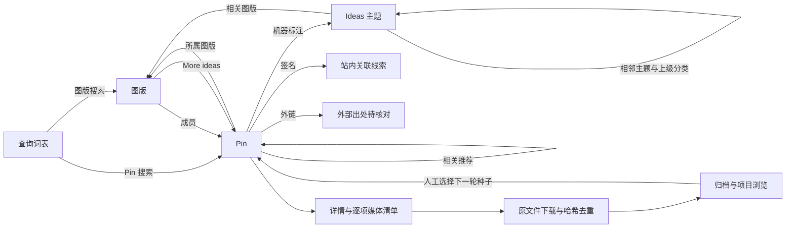

# Pinterest 发现策略与入口实测

创建日期：2026-10-09。状态：研究结论与方案建议；Pinterest 采集器尚未实现。

本文研究如何利用 Pinterest 自身的站点特性取得图片，并记录 2026-10-09 的一轮小规模匿名入口实测。总体采集原则见 [Pinterest 采集研究与方案](pinterest-collector-design.md)，原图判定见 [Pinterest 原图获取与验证](pinterest-original-media.md)。本文补充三件事：Pinterest 用什么替代 Booru 的 ID 遍历和 Pixiv 的作者目录、哪些入口实际可读、以及如何组织一个有预算的聚焦采集循环。

当前实施方向见[独立采集下载模块与数据湖接入设计](pinterest-backend-and-lake-design.md)：直接在项目内接入，Pinterest 独立维护来源业务与下载编排；首期先下载并做文件哈希去重。以下视觉预筛、跨湖近似匹配及模型评分作为后续研究，不是本期前置条件。

## 结论摘要

1. **按种子与预算组织采集。** Booru 的帖子遍历和 Pixiv 的作者目录不能直接定义 Pinterest 的全站覆盖。采集从种子出发，按图版、推荐、主题与搜索扩展，首期用人工优先级和入口预算安排下一步，覆盖只针对实际处理的范围。
2. **利用图版、站内签名与兴趣主题。** 图版提供人工策展上下文；`image_signature` 提供站内图片关联线索；`/ideas/` 提供题材入口。它们不替代 Pin 实体、媒体清单或实际文件哈希。
3. **本轮已测入口可匿名读取。** 带上网页客户端请求头后，Pin 详情、图版内容、图版 More ideas、单 Pin 相关推荐、Pin 与图版搜索、账号图版列表及 Ideas 主题页均返回结构化数据。上一轮的匿名详情 403 不应归因为必须登录；本轮小样本不证明长期可用。首页推荐和视觉搜索尚未验证。
4. **列表提供有价值的结构化信号。** 部分字段集包含原始媒体宽高、聚合收藏数、AI 类别和机器标注。首期保留这些信号，用于浏览和来源范围判断，不引入本地视觉预筛作为原图下载门槛。
5. **小样本显示题材差异。** 动漫样本的无外链上传较多，水彩风景样本的外链比例更高；规模与选择方式不足以确定全站收益。具体任务选择种子和题材，后续在正式任务中积累入口成本、文件与关系收益。

## 与已有来源的组织方式对比

| 维度 | Booru 湖 | Pixiv 湖 | Pinterest |
| --- | --- | --- | --- |
| 全集形态 | 有限归档，帖子 ID 可遍历 | 作者目录有限，全站经由作者扩展 | 无可遍历全集，只有图结构与推荐结果 |
| 组织单位 | 帖子与标签 | 作者与作品 | 图版、图片签名、兴趣主题 |
| 内容身份 | 帖子 ID 与文件 md5 | 作品 ID 与页码 | Pin ID 是来源实体，签名是站内线索，实际文件按 SHA-256 标识 |
| 作者信息 | 标签与来源字段 | 发布账号即作者 | 上传者、转存者和原作者通常不同 |
| 更新语义 | 新帖子与标签变更 | 新作品与作品替换 | 图版成员变化，推荐结果随时间与会话变化 |
| 覆盖声明 | 某 ID 范围已同步 | 某作者某时目录已补全 | 某种子、图版或查询在预算内已处理 |

因此，Pixiv 的作者前沿不能直接搬用。Pinterest 独立规划前沿，首期采用人工优先级、入口轮转与稳定顺序，对每类入口、每轮扩展和媒体积压分别设预算。

## 2026-10-09 匿名入口实测

使用与 gallery-dl 1.32.1 相同的网页资源调用方式：`/resource/<Name>Resource/get/`，`data` 参数携带 `options`，请求头包含 `X-Requested-With`、`X-APP-VERSION`、`X-Pinterest-AppState`、`X-Pinterest-PWS-Handler`，并设置随机 `csrftoken` Cookie。共向 `www.pinterest.com` 发送 15 次请求，另向 CDN 下载 3 个原图文件，请求间隔约 2–3 秒。已记录的 14 次网页请求和 3 次下载均返回 200；另 1 次 Ideas 页请求因本地 brotli 解码失败未留下记录，改用 gzip 后重取成功。未出现限流。未登录，未保存或使用任何账号材料。

| 入口 | 资源 | 结果 | 每页规模与分页 |
| --- | --- | --- | --- |
| Pin 详情 | `Pin`，`field_set_key=detailed` | 成功，约 12 KB，含完整媒体与关系字段 | 单条 |
| Pin 详情（扩展字段） | `Pin`，`auth_web_main_pin` 加 `add_fields=pin.gen_ai_topics`、`fetch_visual_search_objects` | 成功，额外返回 AI 类别与检测框 | 单条 |
| 图版内容 | `BoardFeed` | 成功 | 25 条，有续页游标 |
| 图版 More ideas | `BoardContentRecommendation` | 成功；过滤非 Pin 条目后，与图版首页没有非空签名重合 | 19 条，有续页游标 |
| 单 Pin 相关推荐 | `RelatedPinFeed` | 成功；12 条分别来自 12 个图版和 12 个账号 | 12 条，有续页游标 |
| Pin 搜索 | `BaseSearch`，`scope=pins` | 前两个查询成功；“anime girl illustration”首请求为空，对末尾标记再次请求也为空 | 成功查询返回 17–18 条及续页游标；末尾标记不算有效续页 |
| 图版搜索 | `BaseSearch`，`scope=boards` | 成功，返回图版 ID、名称、Pin 数和分区数 | 50 个图版，有续页游标 |
| 账号图版列表 | `Boards` | 成功 | 25 个图版，有续页游标 |
| Ideas 主题页 | `/ideas/<slug>/<id>/` 页面内嵌 JSON | 成功；含 `InterestResource` 与 18 条精选 Pin | 匿名时精选 Pin 游标为 `-end-` |
| CDN 原始媒体候选 | `i.pinimg.com/originals/...` | 3 次均 200，响应类型与地址后缀一致；本轮解码未完成 | — |

需要特别注意的现象：

- **200 空结果的原因需要保留。** 含“girl”的动漫查询返回 `results: []`；其 `sensitivity` 中 `severity=0`、`notices=[]`，不足以确定发生安全过滤。采集器保存本次空结果和原始信号，原因记未知。`-end-` 只说明该次访问返回结束标记，不证明相关内容不存在；不再把该标记当下一页请求。
- **服务端按 IP 判定地区。** 响应的 `client_context` 显示 `country_from_ip` 为 TW。搜索与推荐结果可能按地区、语言变化，观察记录需要保存这一条件。
- **字段随字段集变化。** 收藏数在图版内容和 More ideas 中可得，在相关推荐和搜索的列表项中缺失；`gen_ai_topics` 在 More ideas 中逐条出现，在图版内容中缺失。记录“本响应未提供”及字段集，不据此推导零值或非 AI，必要时补取详情。
- **签名不是文件 MD5，CDN 的 ETag 才是。** 3 个下载响应字节的 MD5 均与 URL 中的 32 位签名不同，因此签名不能直接与 Danbooru 的 md5 比对。补测发现，这 3 个 `originals` 的强 ETag 都等于实际下载字节的 MD5，CDN 还支持 Range 续传和 304 重新验证；细节与边界见[原图文档](pinterest-original-media.md#cdn-响应头)。第一张的 SHA-256 与上一轮已解码文件一致，只证明这两次采样的字节相同。
- **约一半 Pin 套着故事结构。** 92 个不同 Pin 中，42 个是“单页单图、块签名与 Pin 相同”的故事封装，5 个是视频 Pin。这 5 个视频 Pin 的 `is_video` 为 false，`videos` 为 null，视频只在故事块中出现。判断静态图必须检查故事块。
- **文件验证仍有缺口。** `signature-check.json` 的 3 项均记录缺少 Pillow，未在本轮完成解码；一项可凭相同 SHA-256 关联此前的解码证据，其余候选需在项目接入中完成文件核验。
- **列表含非 Pin 条目。** 图版和 More ideas 各有一个 `type=story`、无签名的条目。此前将两个空签名计为重合，造成“1 个签名重合”的误计；过滤后 25 个与 19 个 Pin 的非空签名交集为 0。解析器保留原始响应，仅将已识别的 Pin 项纳入 Pin 统计。
- **`X-APP-VERSION` 是固定值。** 当前沿用客户端参考值也能通过；网页版本更新后可能失效，需要监测响应结构与错误。

本机证据位于 `.local/reports/pinterest-discovery-20261009/`，不随仓库分发。其中包含 `requests.jsonl`、原始响应、`summary.json`、`signature-check.json` 和 `media-shape-summary.json`，以及存放 CDN 响应头的 `cdn-headers/` 目录。

## 可利用的站点特性

### 图片签名与聚合 Pin

Pinterest 中大量 Pin 是同一图片的再次保存：本轮动漫图版首页 25 条全部为转存。每条 Pin 带有 `image_signature`，原图地址由签名派生；详情中的 `pin_join.canonical_pin` 指向该图片的规范 Pin，`aggregated_pin_data` 给出按图片聚合的收藏数。

Pin 是来源实体，每次读取形成独立观察。签名用于站内关联，不代替多媒体清单和实际文件身份。首期合并同一媒体任务，下载后按 SHA-256 复用字节对象，保留各 Pin 的资产、图版关系与元数据；跨 Pin 的历史下载复用另核对媒体定位、角色和版本。跨来源先保留实际 MD5 与 SHA-256，近似匹配留给后续共享分析。

### 图版：人工策展单元

图版是 Pinterest 最接近“作者目录”的组织单位，但它表达的是策展者的选择，而不是创作者的作品。图版搜索直接返回 Pin 数和分区数；`BoardContentRecommendation`（即图版页面的 More ideas）基于图版内容产生推荐，本轮所测公开图版可以匿名读取。

这支持用可访问的公开图版作为种子：找到主题吻合的图版，读取其成员，再用 More ideas 向外扩展。本轮两组 Pin 的非空签名没有重合，说明该次推荐提供了图版首页之外的候选，尚不能解释为已有数据湖之外的新作品。

维护者账号的其他图版不宜自动展开。本轮样本中，“Anime Art”图版的维护者另有 25 个以上、题材完全不同的图版，账号层面的主题一致性明显弱于 Pixiv 作者。

### 相关推荐：近邻扩展

`RelatedPinFeed` 返回与一张 Pin 视觉和关系相近的结果，相当于站点提供的近邻检索。本轮 12 条结果来自 12 个不同的图版和账号，适合从某张高分图片出发，向题材、画风或构图相近的区域扩散，同时触达新的图版。它适合作为“利用”型扩展，按轮限制种子数量与深度，避免沿推荐链进入大量近似转存。

### Ideas 兴趣主题图

每条 Pin 的 `pin_join.annotations_with_links` 给出若干机器标注，每个标注链接到 `/ideas/<slug>/<id>/` 主题页。主题页内嵌的 `InterestResource` 提供：

- `related_boards`：与主题相关的图版（本轮样本 10 个），可直接作为种子图版候选。
- `seo_related_interests` 与 `seo_breadcrumbs`：相邻主题与上级分类路径（如 Entertainment › Film › …），可以构成主题树。
- `internal_search_count`：主题的站内搜索量，可作为热度参考。
- 精选 Pin：匿名时只返回首屏 18 条。

主题图适合承担系统化的题材覆盖：从目标题材出发，沿相邻主题和上级分类展开，在每个主题收集候选图版，再交给图版评估。它也是避免推荐链持续集中于单一画风的独立入口。

### 下载前可用的结构化信号

| 信号 | 字段 | 适合的作用 | 已知限制 |
| --- | --- | --- | --- |
| 原图尺寸与格式 | `images.orig` 宽高与 URL 后缀 | 不下载即可过滤过小图片 | 尺寸不代表编码质量 |
| 图片级收藏数 | `aggregated_pin_data.aggregated_stats.saves` | 热度先验、评审排序 | 无曝光分母，部分字段集缺失 |
| AI 内容类别 | `gen_ai_topics` | AI 内容标记与范围控制 | 部分字段集缺失，未标记不代表非 AI |
| 机器标注与主题 | `pin_join.visual_annotation`、`annotations_with_links` | 题材标签、主题图入口 | 机器生成，可能偏向 SEO 用语 |
| 检测框 | `visual_objects`（标签与相对坐标） | 局部视觉搜索输入、构图线索 | 需要扩展字段集 |
| 上传与转存链 | `method`、`is_repin`、`native_creator`、`origin_pinner`、`via_pinner` | 区分首次上传与转存 | 上传者不等于原作者 |
| 外部出处 | `link`、`domain`、`rich_metadata` | 交给 Pixiv 等来源采集器复核 | 动漫样本中外链很少 |
| 其他 | `dominant_color`、`created_at`、`is_eligible_for_image_download` | 多样性控制、时间分层 | — |

`gen_ai_topics` 的值是兴趣类别（本轮出现 `art` 和 `beauty`），与 Pinterest 按类别提供的“减少 AI Pin”控制一致。官方说明 AI 标记依据图片元数据和自有分类器，且分类器可能出错；第三方整理的可调类别包括艺术、娱乐、美妆、建筑、家居、时尚、运动、健康。该字段与页面上“AI modified”标签的逐条对应关系尚未核对。[减少 AI Pin](https://help.pinterest.com/en/article/see-fewer-ai-pins)、[AI 标记说明](https://help.pinterest.com/en/article/gen-ai-labels)、[类别整理](https://metricool.com/pinterest-ai/)

### 多尺寸 CDN

CDN 提供 `236x`、`474x`、`736x` 和 `originals` 等候选版本，其可用性与实际尺寸仍需核对。原图宽度不超过某个档位时，该档位可能返回与 `originals` 相同的字节；同字节数不代表同字节，要看 ETag 或实际哈希。本期缩略图可用于界面预览，不承担模型预筛门槛。后续若研究缩略图评分或近似匹配，应单独评估其误差；缩略图始终不进入原图取得统计。

### 依赖登录的入口

| 入口 | 参考资源 | 价值 | 当前判断 |
| --- | --- | --- | --- |
| 首页推荐 | `UserHomefeed` | 综合兴趣下的新候选，随账号行为变化 | 依赖账号，未验证 |
| 视觉搜索 | `VisualLiveSearch`，参数含签名与相对裁切框 | 以局部区域检索相似内容，可用 `visual_objects` 给出的框 | 预计依赖账号，未验证 |
| 搜索分级 | `BaseSearch` | 匿名过滤后的查询可能恢复结果 | 未验证 |

参数形态参考 [py3-pinterest](https://github.com/bstoilov/py3-pinterest/blob/master/py3pin/Pinterest.py)，不代表当前站点行为。

## 方案：以图版为主干的聚焦采集

### 发现图

所有实体与边均作为带时间、入口、访问条件和返回位置的观察保存。推荐和搜索的同一请求在不同时间可能得到不同结果，每次响应都是独立快照。

### 前沿排序与预算

首期按人工种子优先级、入口轮转、发现顺序和稳定 ID 调度。各入口分别记录请求数、新增 Pin、非空签名、字节对象和下载成本；这些指标帮助调整预算，不自动等价为作品新颖度或审美质量。模型评分、多样性估计与多臂老虎机式预算分配暂不进入采集器。

每轮分别限制新图版展开、推荐请求、详情补全和原图下载积压。低优先级候选保留记录和延后原因，不作为永久排除。

### 图版评估

图版是主要范围选择单位。首期可以读取首页并显示预览、尺寸与来源字段，供人工选择；不自动运行质量评分、AI 检测或已有湖近似匹配。以下为对应的范围处理：

| 评估结果 | 后续动作 |
| --- | --- |
| 人工选中的目标图版 | 在预算内读取成员与分区，按启用的入口做推荐扩展 |
| 只选中部分 Pin | 按明确 Pin 范围下载，保留其发现上下文 |
| 已取得相同字节 | 复用本湖对象，保留新 Pin、图版和观察关系 |
| 暂不投入采集预算 | 保留候选与延后原因，不声称其质量或 AI 属性已被确认 |

首页样本能否预测整个图版的质量留待后续研究。图版“经人工选择”和“本图已评审通过”仍分别记录。

### 当前媒体取得与后续预筛研究

本期流程为保存元数据与媒体清单、下载原始媒体、完整解码、计算 SHA-256 与 MD5、归档发布。采集规模由种子范围、入口预算和积压上限控制，不需要先建立视觉模型才能开始。

后续跨湖聚类与感知去重阶段可以研究“元数据与缩略图预筛 → 下载入选原图”，但需同时验证模型、缩略图失真、相似阈值、误杀漏检及来源题材差异。CLIP/SigLIP、感知哈希、审美评分与 AI 检测承担不同任务，不能视为一项开箱即用的能力。

保留被搁置候选的元数据有助于复查，但不保证未来仍能取得文件，因此不能将下载前预筛称为完全无损可逆。是否改为该模式，属于后续分析能力和收益证据齐备后的独立决定。

项目当前没有这些本地视觉组件；Pinterest 接入按[独立后端设计](pinterest-backend-and-lake-design.md)推进，不等待其实现。

### 与已有湖的交叉利用

- **已有湖作为种子：** 已有湖来源字段中的 Pinterest 或 pinimg 链接可以作为初始 Pin 种子；其规模尚未统计。
- **文件哈希关联：** 本期保留实际下载 MD5 和 SHA-256。与已有湖命中时记录关联依据，不删除 Pinterest 来源观察或跨湖合并物理文件。
- **后续近似匹配：** 由共享分析识别同图、不同版本或相似作品，再回挂有依据的策展关系和来源信号。机器标注不是人工审美证据，视觉相似也不自动证明同一作品。
- **收益度量：** 当前分别报告新增 Pin、字节对象、版本与来源关系。未命中某种匹配只说明该方法没有命中，不足以证明作品新颖；已有作品的新文件、出处和关系也可能有收益。
- **外链交接：** 指向 Pixiv 等来源的外链交给对应采集器取得原站文件，Pinterest 观察独立保留。

### 种子图版写回（可选）

可以用专用账号维护少量种子图版，把本地评审通过的图片保存回去，使 More ideas 和首页推荐更贴近目标，形成相关反馈循环。由于公开图版的 More ideas 可以匿名读取，这一循环中只有写回步骤需要登录。写回会改变账号推荐和站点上的公开内容，也增加账号受限的风险，建议在匿名入口的收益试验之后再决定是否尝试。

## 题材收益判断

| 样本 | Pin 数 | 无外链的用户上传 | AI 类别标记 | 长边 ≥1500 |
| --- | --- | --- | --- | --- |
| 动漫图版首页 | 25 | 25 | 字段未提供 | 15 |
| 该图版 More ideas | 19 | 18 | 5 | 10 |
| 搜索“anime illustration” | 17 | 14 | 6 | 6 |
| 搜索“watercolor landscape” | 18 | 9 | 0 | 8 |

动漫图版首页中另有 6 张为 AI 生成常见尺寸（5 张 1024×1536，1 张 1152×2048）；尺寸只是弱信号，不能单独判定 AI。样本很小且非随机，只用于提出假设：

- **动漫插画：** 大量为无出处的转存，与 Pixiv 和现有 Booru 湖重叠的可能性高，并有可观的 AI 内容。主要价值可能在于人工策展信号，以及已有湖之外、来自 X 等平台的作品。应以交叉匹配后的新颖度衡量收益。
- **摄影、绘画、设计、建筑、时尚等：** 现有 Booru 湖覆盖少，外链比例更高，Pinterest 更可能直接带来新的高质量内容，但同样需要 AI 和尺寸控制。

目标题材范围影响词表和主题入口，可由每次正式任务的种子与配置限定。首期保留来源 AI 标记及其缺失状态，不按常见尺寸自动判为 AI；评分模型和自动筛选策略属于后续研究。

## 访问条件与风险

- 当前所有已测入口都依赖网页内部资源，不是稳定的开发者接口。请求头、字段集和游标格式变化应能被识别为结构错误，而不是空结果。
- 匿名会话存在查询过滤和精选流截断，地区由 IP 决定。覆盖声明需要绑定访问条件。
- 本轮请求量很小，未测量限流阈值。持续运行前应逐步提高请求速率，记录 429、挑战页和异常空结果出现的条件。
- Pinterest 条款要求自动化采集获得事先许可，现有方案已注明这一点；使用账号写回会进一步增加账号层面的风险。[服务条款](https://policy.pinterest.com/en/terms-of-service)

## 与现有采集框架的衔接

现有 [发现规划代码](../../../services/lake-worker/src/studio_lake/collections/planner.py) 使用作者前沿与 Pixiv 范围规则。Pinterest 独立维护自己的任务、状态和下载模块，只共享传输、哈希、资源与归档基础；详细代码落点见[独立接入设计](pinterest-backend-and-lake-design.md)。来源模块需要：

- 新的实体类型：Pin、图片签名、图版、分区、账号、兴趣主题、查询。
- 按人工优先级、入口预算与稳定顺序管理前沿，深度仅限制发现范围。
- 推荐与搜索快照语义：相同请求的不同时刻结果分别保存，不要求可重放。
- 按 Pin、清单和媒体位置创建任务；指向同一 URL 的媒体项合并为一次下载，下载后按实际字节哈希去重。签名保留为来源线索。
- 发现、详情、下载与发布分别设置积压上限，避免推荐无限展开。

## 项目内验证与后续研究

| 试验 | 内容 | 回答的问题 |
| --- | --- | --- |
| 原图与恢复 | 通过正式任务取得详情、文件、归档和可浏览对象，并验证中断接续 | 媒体角色与文件是否对应，是否漏页或重复发布 |
| 入口收益 | 已接入入口使用相同请求预算，在若干主题中比较 | 新 Pin、非空签名、字节对象、尺寸分布、来源 AI 标记及缺失比例 |
| 跨湖重叠 后续 | 共享分析组件建立后比较文件哈希与近似匹配 | 匹配精度、版本差异及可关联的来源信号 |
| 图版预测 后续 | 具备独立质量评价后比较首页与更多成员 | 首页样本能否用于图版选择 |
| 推荐稳定性 | 对同一图版和 Pin 在多个时间窗口重复读取推荐 | 推荐是否稳定、何时值得复查 |
| 限流测量 | 低速开始逐步提速 | 可持续速率与限流表现 |
| 登录入口 | 决定是否使用账号后，再验证首页推荐、视觉搜索和过滤差异 | 登录入口的额外收益是否值得账号风险 |

前两项随项目内实现开展，不再单独制作采集原型。跨湖重叠和图版预测研究不阻塞入湖接入。

## 待决定的问题

| 问题 | 影响 |
| --- | --- |
| 目标题材：以动漫插画为主，还是扩展到摄影、绘画、设计等 | 词表、主题树起点、评分模型及收益口径 |
| 未来是否引入下载前视觉预筛 | 本期已选择先下载与文件哈希去重；未来需证明节省与漏失的权衡 |
| 后续 AI 内容筛选策略 | 本期标记后保留，未来排除或降权需有可靠依据与明确任务范围 |
| 是否使用专用账号，以及是否允许写回种子图版 | 首页推荐、视觉搜索和反馈循环能否使用 |
| 后续共享视觉组件的选型 | 属于跨湖聚类与感知去重阶段，不是 Pinterest 接入待办 |
