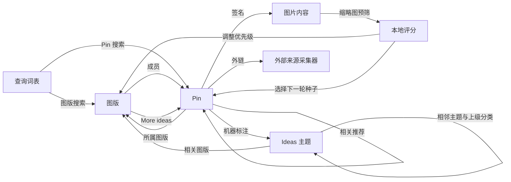

# Pinterest 发现策略与入口实测

创建日期：2026-10-09。状态：研究结论与方案建议；Pinterest 采集器尚未实现。

本文研究如何利用 Pinterest 自身的站点特性取得图片，并记录 2026-10-09 的一轮小规模匿名入口实测。总体采集原则见 [Pinterest 采集研究与方案](pinterest-collector-design.md)，原图判定见 [Pinterest 原图获取与验证](pinterest-original-media.md)。本文补充三件事：Pinterest 用什么替代 Booru 的 ID 遍历和 Pixiv 的作者目录、哪些入口实际可读、以及如何组织一个有预算的聚焦采集循环。

## 结论摘要

1. **Pinterest 不是归档，而是一张无边界的策展图加若干推荐服务。** Booru 可以按帖子 ID 遍历有限归档，Pixiv 可以按作者补全有限目录；Pinterest 不存在可遍历的全集。采集器应定位为有预算的聚焦采集器：从种子出发，用站点推荐扩展，用本地评分决定下一步，覆盖只针对已处理的种子、图版和查询。
2. **聚类单位由作者换成三层身份。** 图版（人工策展单元）承担 Pixiv 作者目录的组织作用；`image_signature` 是 Pinterest 内部的图片身份，同一图片的大量转存共享这一身份；`/ideas/` 兴趣主题提供带层级的题材分类。
3. **主要入口均可匿名读取。** 带上网页客户端请求头后，Pin 详情、图版内容、图版 More ideas、单 Pin 相关推荐、Pin 与图版搜索、账号图版列表及 Ideas 主题页均返回结构化数据。上一轮的匿名详情 403 不应归因为必须登录。首页推荐和视觉搜索尚未验证，预计依赖登录。
4. **下载前即可做大量判断。** 列表响应已经带有原始媒体宽高、按图片聚合的收藏数、AI 内容类别标记和机器标注，CDN 还提供 236x、474x 等低成本缩略图。这使“元数据和缩略图预筛 → 只下载入选原图”成为可行方案，但它改变了“先下载再本地处理”的既有方向，需要明确决定。
5. **不同题材的收益差别很大。** 本轮动漫样本几乎全部为无外链的用户上传转存，AI 标记和 AI 常见分辨率占比明显；水彩风景样本的外链比例更高。Pinterest 对动漫插画的主要价值更可能是人工策展信号与已有湖之外的作品，而摄影、绘画、设计等非 Booru 题材更可能直接带来新内容。目标题材范围需要先确定。

## 与已有来源的组织方式对比

| 维度 | Booru 湖 | Pixiv 湖 | Pinterest |
| --- | --- | --- | --- |
| 全集形态 | 有限归档，帖子 ID 可遍历 | 作者目录有限，全站经由作者扩展 | 无可遍历全集，只有图结构与推荐结果 |
| 组织单位 | 帖子与标签 | 作者与作品 | 图版、图片签名、兴趣主题 |
| 内容身份 | 帖子 ID 与文件 md5 | 作品 ID 与页码 | Pin ID 是一次保存，签名才是同一图片 |
| 作者信息 | 标签与来源字段 | 发布账号即作者 | 上传者、转存者和原作者通常不同 |
| 更新语义 | 新帖子与标签变更 | 新作品与作品替换 | 图版成员变化，推荐结果随时间与会话变化 |
| 覆盖声明 | 某 ID 范围已同步 | 某作者某时目录已补全 | 某种子、图版或查询在预算内已处理 |

因此，Pixiv 的确定性作者前沿（按发现深度展开）不能直接搬用。Pinterest 的前沿需要按预计收益排序，并对每类入口、每轮扩展和媒体积压分别设预算。

## 2026-10-09 匿名入口实测

使用与 gallery-dl 1.32.1 相同的网页资源调用方式：`/resource/<Name>Resource/get/`，`data` 参数携带 `options`，请求头包含 `X-Requested-With`、`X-APP-VERSION`、`X-Pinterest-AppState`、`X-Pinterest-PWS-Handler`，并设置随机 `csrftoken` Cookie。共向 `www.pinterest.com` 发送 15 次请求，另向 CDN 下载 3 个原图文件，请求间隔约 2–3 秒。已记录的 14 次网页请求和 3 次下载均返回 200；另 1 次 Ideas 页请求因本地 brotli 解码失败未留下记录，改用 gzip 后重取成功。未出现限流。未登录，未保存或使用任何账号材料。

| 入口 | 资源 | 结果 | 每页规模与分页 |
| --- | --- | --- | --- |
| Pin 详情 | `Pin`，`field_set_key=detailed` | 成功，约 12 KB，含完整媒体与关系字段 | 单条 |
| Pin 详情（扩展字段） | `Pin`，`auth_web_main_pin` 加 `add_fields=pin.gen_ai_topics`、`fetch_visual_search_objects` | 成功，额外返回 AI 类别与检测框 | 单条 |
| 图版内容 | `BoardFeed` | 成功 | 25 条，有续页游标 |
| 图版 More ideas | `BoardContentRecommendation` | 成功；与图版首页仅 1 个签名重合 | 19 条，有续页游标 |
| 单 Pin 相关推荐 | `RelatedPinFeed` | 成功；12 条分别来自 12 个图版和 12 个账号 | 12 条，有续页游标 |
| Pin 搜索 | `BaseSearch`，`scope=pins` | “watercolor landscape”“anime illustration”成功；“anime girl illustration”两页均为空结果 | 17–18 条，有续页游标 |
| 图版搜索 | `BaseSearch`，`scope=boards` | 成功，返回图版 ID、名称、Pin 数和分区数 | 50 个图版，有续页游标 |
| 账号图版列表 | `Boards` | 成功 | 25 个图版，有续页游标 |
| Ideas 主题页 | `/ideas/<slug>/<id>/` 页面内嵌 JSON | 成功；含 `InterestResource` 与 18 条精选 Pin | 匿名时精选 Pin 游标为 `-end-` |
| CDN 原图 | `i.pinimg.com/originals/...` | 3 个文件均 200，与详情声明的格式一致 | — |

需要特别注意的现象：

- **200 空结果不等于没有内容。** 含“girl”的动漫查询返回 `results: []` 且附带 `sensitivity` 对象，而去掉该词后正常返回。推测匿名会话会对部分查询做安全过滤；登录后是否不同尚未验证。采集器必须把这类结果记录为受限观察，而不是查询已耗尽。
- **服务端按 IP 判定地区。** 响应的 `client_context` 显示 `country_from_ip` 为 TW。搜索与推荐结果可能按地区、语言变化，观察记录需要保存这一条件。
- **字段随字段集变化。** 收藏数在图版内容和 More ideas 中可得，在相关推荐和搜索的列表项中缺失；`gen_ai_topics` 在 More ideas 中逐条出现，在图版内容中缺失。缺失应记为“本字段集未提供”，必要时通过详情补齐。
- **签名不是文件 MD5。** 3 个原图文件的 MD5 均与 URL 中的 32 位签名不同，因此签名只能作为 Pinterest 内部图片身份，不能直接与 Danbooru 的 md5 比对。第一张图的 SHA-256 与上一轮报告一致，说明同一原图地址两天内字节稳定。
- **`X-APP-VERSION` 是固定值。** 当前沿用客户端参考值也能通过；网页版本更新后可能失效，需要监测响应结构与错误。

本机证据位于 `.local/reports/pinterest-discovery-20261009/`，包含 `requests.jsonl`、原始响应、`summary.json` 和 `signature-check.json`，不随仓库分发。

## 可利用的站点特性

### 图片签名与聚合 Pin

Pinterest 中大量 Pin 是同一图片的再次保存：本轮动漫图版首页 25 条全部为转存。每条 Pin 带有 `image_signature`，原图地址由签名派生；详情中的 `pin_join.canonical_pin` 指向该图片的规范 Pin，`aggregated_pin_data` 给出按图片聚合的收藏数。

可以据此设计“Pin 是观察，签名是内容”：同一签名只下载一次原图，其余 Pin 只保存观察、图版关系和元数据。这对带宽和存储的节省幅度取决于入口中的转存比例，需要在收益试验中实测。签名只在 Pinterest 内部有效，跨来源的同图识别仍依赖本地内容哈希和近似匹配。

### 图版：人工策展单元

图版是 Pinterest 最接近“作者目录”的组织单位，但它表达的是策展者的选择，而不是创作者的作品。图版搜索直接返回 Pin 数和分区数；`BoardContentRecommendation`（即图版页面的 More ideas）基于图版内容产生推荐，对任意公开图版可以匿名读取。

这意味着不需要自己的账号也能“借用”他人的公开图版作为种子图版：找到主题吻合、质量稳定的图版，读取其成员，再用 More ideas 向外扩展。本轮 More ideas 首页与图版首页仅重合 1 个签名，说明它确实产出新候选。

维护者账号的其他图版不宜自动展开。本轮样本中，“Anime Art”图版的维护者另有 25 个以上、题材完全不同的图版，账号层面的主题一致性明显弱于 Pixiv 作者。

### 相关推荐：近邻扩展

`RelatedPinFeed` 返回与一张 Pin 视觉和关系相近的结果，相当于站点提供的近邻检索。本轮 12 条结果来自 12 个不同的图版和账号，适合从某张高分图片出发，向题材、画风或构图相近的区域扩散，同时触达新的图版。它适合作为“利用”型扩展，按轮限制种子数量与深度，避免沿推荐链进入大量近似转存。

### Ideas 兴趣主题图

每条 Pin 的 `pin_join.annotations_with_links` 给出若干机器标注，每个标注链接到 `/ideas/<slug>/<id>/` 主题页。主题页内嵌的 `InterestResource` 提供：

- `related_boards`：与主题相关的图版（本轮样本 10 个），可直接作为种子图版候选。
- `seo_related_interests` 与 `seo_breadcrumbs`：相邻主题与上级分类路径（如 Entertainment › Film › …），可以构成主题树。
- `internal_search_count`：主题的站内搜索量，可作为热度参考。
- 精选 Pin：匿名时只返回首屏 18 条。

主题图适合承担系统化的题材覆盖：从目标题材出发，沿相邻主题和上级分类展开，在每个主题收集候选图版，再交给图版评估。它也是避免推荐链持续集中于单一画风的独立入口。

### 下载前可用的结构化信号

| 信号 | 字段 | 适合的作用 | 已知限制 |
| --- | --- | --- | --- |
| 原图尺寸与格式 | `images.orig` 宽高与 URL 后缀 | 不下载即可过滤过小图片 | 尺寸不代表编码质量 |
| 图片级收藏数 | `aggregated_pin_data.aggregated_stats.saves` | 热度先验、评审排序 | 无曝光分母，部分字段集缺失 |
| AI 内容类别 | `gen_ai_topics` | AI 内容标记与范围控制 | 部分字段集缺失，未标记不代表非 AI |
| 机器标注与主题 | `pin_join.visual_annotation`、`annotations_with_links` | 题材标签、主题图入口 | 机器生成，可能偏向 SEO 用语 |
| 检测框 | `visual_objects`（标签与相对坐标） | 局部视觉搜索输入、构图线索 | 需要扩展字段集 |
| 上传与转存链 | `method`、`is_repin`、`native_creator`、`origin_pinner`、`via_pinner` | 区分首次上传与转存 | 上传者不等于原作者 |
| 外部出处 | `link`、`domain`、`rich_metadata` | 交给 Pixiv 等来源采集器复核 | 动漫样本中外链很少 |
| 其他 | `dominant_color`、`created_at`、`is_eligible_for_image_download` | 多样性控制、时间分层 | — |

`gen_ai_topics` 的值是兴趣类别（本轮出现 `art` 和 `beauty`），与 Pinterest 按类别提供的“减少 AI Pin”控制一致。官方说明 AI 标记依据图片元数据和自有分类器，且分类器可能出错；第三方整理的可调类别包括艺术、娱乐、美妆、建筑、家居、时尚、运动、健康。该字段与页面上“AI modified”标签的逐条对应关系尚未核对。[减少 AI Pin](https://help.pinterest.com/en/article/see-fewer-ai-pins)、[AI 标记说明](https://help.pinterest.com/en/article/gen-ai-labels)、[类别整理](https://metricool.com/pinterest-ai/)

### 多尺寸 CDN

同一签名在 CDN 上有 `236x`、`474x`、`736x` 和 `originals` 等版本。236x 缩略图通常只有数 KB 到数十 KB，可用于本地快速评分、近似匹配和 AI 检测，再决定是否下载原图。缩略图只作为预筛输入，不进入原图取得统计。

### 依赖登录的入口

| 入口 | 参考资源 | 价值 | 当前判断 |
| --- | --- | --- | --- |
| 首页推荐 | `UserHomefeed` | 综合兴趣下的新候选，随账号行为变化 | 依赖账号，未验证 |
| 视觉搜索 | `VisualLiveSearch`，参数含签名与相对裁切框 | 以局部区域检索相似内容，可用 `visual_objects` 给出的框 | 预计依赖账号，未验证 |
| 搜索分级 | `BaseSearch` | 匿名过滤后的查询可能恢复结果 | 未验证 |

参数形态参考 [py3-pinterest](https://github.com/bstoilov/py3-pinterest/blob/master/py3pin/Pinterest.py)，不代表当前站点行为。

## 方案：以图版为主干的聚焦采集

### 发现图

所有实体与边均作为带时间、入口、访问条件和返回位置的观察保存。推荐和搜索的同一请求在不同时间可能得到不同结果，每次响应都是独立快照。

### 前沿排序与预算

候选的优先级由四项共同决定：本地评分得到的预计质量、相对已有湖和已采内容的新颖度、与当前已选内容的多样性，以及取得成本。入口层面可以采用多臂老虎机式的预算分配：每类入口（图版内容、More ideas、相关推荐、主题、搜索）按“每次请求带来的新入选签名数”累积收益，收益持续下降的入口降低预算，但保留最低探索份额，避免过早锁定少数画风。

每轮分别限制新图版展开、推荐请求、详情补全和原图下载积压。低优先级候选保留记录和延后原因，不作为永久排除。

### 图版评估

图版是主要投资决策点。建议对新图版只读取首页（1 次请求，约 25 条）并取得其缩略图，在本地估计质量分布、AI 占比、尺寸分布和与已有湖的重叠，再决定：

| 评估结果 | 后续动作 |
| --- | --- |
| 质量稳定且新颖 | 读取全部成员与分区，并以 More ideas 扩展 |
| 质量参差 | 只保留高分成员，从高分成员出发做相关推荐 |
| 与已有湖高度重叠 | 记录策展关系与收藏信号，不优先下载 |
| 低质量或 AI 占比过高 | 降为低优先级，保留评估结果 |

首页样本能否预测整个图版的质量，需要在试验中验证。图版“经评估认可”和“本图已评审通过”仍按现有方案分别记录。

### 两段式媒体取得

建议分为两段：

1. 元数据与缩略图预筛：保存列表或详情响应，下载 236x 缩略图，计算本地评分、感知哈希和 AI 检测结果。
2. 原图取得：只对入选签名按原图规则取得与验证原始媒体。

这与 [多来源采集规划](README.md) 中“倾向先下载，再在本地处理”的方向不同。Booru 和作者目录是有限集合，可以先下载；Pinterest 没有可穷尽的全集，不设门槛的下载会迅速被转存、低分辨率和 AI 内容占满。被预筛搁置的候选保留元数据、缩略图哈希和评分依据，后续标准改变时可以重新下载，因此这一门槛是可逆的排序决定，而不是永久排除。是否采用需要确认。

项目当前没有视觉嵌入、感知哈希或 AI 检测组件，预筛与跨湖近似匹配都需要新增本地能力。

### 与已有湖的交叉利用

- **已有湖作为种子：** 已有湖来源字段中的 Pinterest 或 pinimg 链接可以作为初始 Pin 种子；其规模尚未统计。
- **Pinterest 信号回挂已有图片：** 通过本地近似匹配识别与 Danbooru、Pixiv 等湖中已有图片相同的 Pinterest 图片，把图版共现、收藏数和机器标注作为这些图片的额外人工策展证据，同时避免重复保存较差的转存版本。
- **新颖度度量：** 未匹配到已有湖的入选图片才计为实际扩张收益，避免以 Pin 数或下载数高估收益。
- **外链交接：** 指向 Pixiv 等来源的外链交给对应采集器取得原站文件，Pinterest 观察独立保留。

### 种子图版写回（可选）

可以用专用账号维护少量种子图版，把本地评审通过的图片保存回去，使 More ideas 和首页推荐更贴近目标，形成相关反馈循环。由于公开图版的 More ideas 可以匿名读取，这一循环中只有写回步骤需要登录。写回会改变账号推荐和站点上的公开内容，也增加账号受限的风险，建议在匿名入口的收益试验之后再决定是否尝试。

## 题材收益判断

| 样本 | Pin 数 | 无外链的用户上传 | AI 类别标记 | 长边 ≥1500 |
| --- | --- | --- | --- | --- |
| 动漫图版首页 | 25 | 25 | 字段未提供 | 15 |
| 该图版 More ideas | 19 | 18 | 5 | 10 |
| 搜索“anime illustration” | 17 | 14 | 6 | 6 |
| 搜索“watercolor landscape” | 18 | 9 | 0 | 8 |

动漫图版首页中另有 6 张为 AI 生成常见尺寸（5 张 1024×1536，1 张 1152×2048）；尺寸只是弱信号，不能单独判定 AI。样本很小且非随机，只用于提出假设：

- **动漫插画：** 大量为无出处的转存，与 Pixiv 和现有 Booru 湖重叠的可能性高，并有可观的 AI 内容。主要价值可能在于人工策展信号，以及已有湖之外、来自 X 等平台的作品。应以交叉匹配后的新颖度衡量收益。
- **摄影、绘画、设计、建筑、时尚等：** 现有 Booru 湖覆盖少，外链比例更高，Pinterest 更可能直接带来新的高质量内容，但同样需要 AI 和尺寸控制。

目标题材范围会直接决定词表、主题树起点、评分模型和 AI 策略，需要在试验前确定。

## 访问条件与风险

- 当前所有已测入口都依赖网页内部资源，不是稳定的开发者接口。请求头、字段集和游标格式变化应能被识别为结构错误，而不是空结果。
- 匿名会话存在查询过滤和精选流截断，地区由 IP 决定。覆盖声明需要绑定访问条件。
- 本轮请求量很小，未测量限流阈值。持续运行前应逐步提高请求速率，记录 429、挑战页和异常空结果出现的条件。
- Pinterest 条款要求自动化采集获得事先许可，现有方案已注明这一点；使用账号写回会进一步增加账号层面的风险。[服务条款](https://policy.pinterest.com/en/terms-of-service)

## 与现有采集框架的衔接

现有 [发现规划代码](../../../services/lake-worker/src/studio_lake/collections/planner.py) 提供实体、冻结任务和发现边的持久化，前沿按最小发现深度展开，范围判断含 Pixiv 字段。Pinterest 可以沿用实体、任务、发现边和观察分离的思路，但需要：

- 新的实体类型：Pin、图片签名、图版、分区、账号、兴趣主题、查询。
- 按评分排序的前沿，而不是只按深度展开；评分变化时可调整优先级。
- 推荐与搜索快照语义：相同请求的不同时刻结果分别保存，不要求可重放。
- 签名级媒体去重：媒体任务以签名为主体，多条 Pin 共享同一媒体结果。
- 预筛阶段与原图阶段分离，各自有积压上限。

## 下一步试验

| 试验 | 内容 | 回答的问题 |
| --- | --- | --- |
| 入口收益 | 选 3–5 个差异明显的主题，对图版内容、More ideas、相关推荐、主题页和搜索各分配相同请求预算 | 每次请求的新签名数、转存率、尺寸分布、AI 占比、本地评分分布 |
| 跨湖重叠 | 用缩略图与已有湖做近似匹配 | 各题材的实际新颖度，以及可回挂到已有图片的信号量 |
| 图版预测 | 对若干图版比较首页样本与全量成员的评分分布 | 首页评估能否用于图版投资决策 |
| 推荐稳定性 | 对同一图版和 Pin 在多个时间窗口重复读取推荐 | 推荐是否稳定、何时值得复查 |
| 限流测量 | 低速开始逐步提速 | 可持续速率与限流表现 |
| 登录入口 | 决定是否使用账号后，再验证首页推荐、视觉搜索和过滤差异 | 登录入口的额外收益是否值得账号风险 |

前两项不需要账号即可开展，但跨湖重叠依赖新增的本地视觉组件。

## 待决定的问题

| 问题 | 影响 |
| --- | --- |
| 目标题材：以动漫插画为主，还是扩展到摄影、绘画、设计等 | 词表、主题树起点、评分模型及收益口径 |
| 是否采用缩略图预筛后再下载原图 | 存储与带宽规模，以及与“先下载”原则的关系 |
| AI 内容策略：排除、降权，还是标记后保留 | 预筛规则与入湖字段 |
| 是否使用专用账号，以及是否允许写回种子图版 | 首页推荐、视觉搜索和反馈循环能否使用 |
| 本地视觉组件的选型 | 预筛、跨湖匹配和多样性控制能否实现 |
