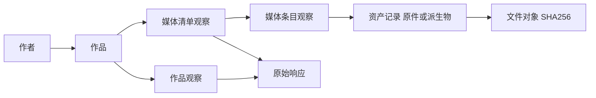

# Pixiv 后端与统一数据湖设计草案

创建日期：2026-10-02。更新日期：2026-10-03。状态：设计基线；具体选择见[三份契约 v1](contracts/README.md)，阶段 1–3 的实际实现与调整见 [ADR 0052](../../decisions/0052-pixiv-collections-and-canonical-media.md)。旧三湖未改写，前端页面暂缓。

建议继续使用三个既有数据湖的统一架构：不可变归档保存事实，按内容哈希存放文件，版本化在线库提供查询，由同一类后台服务协调采集和发布。Pixiv 使用独立的库身份与目录，并采用通用的作品到多媒体关系扩展。来源专属的请求、字段解释和可见性判断留在 Pixiv 适配器内。

架构可复用，当前 schema 需要演进。首先补齐作品、媒体页、媒体观察和资产之间的关系，再扩展队列、发布、查询和重建。当前范围包括这些后端能力及无前端验证入口；新页面不作为本阶段完成条件。取数流程见[采集器设计草案](pixiv-collector-design.md)，推进安排见[验证与接入建议](pixiv-validation-and-integration-plan.md)。

## 当前实现的核对结论

| 位置                                                                           | 当前事实                                                                               | 对设计的影响                                                           |
| ------------------------------------------------------------------------------ | -------------------------------------------------------------------------------------- | ---------------------------------------------------------------------- |
| [归档写入](../../../services/lake-worker/src/studio_lake/library.py)           | 文件按 SHA-256 写入 PAX TAR；结构化记录使用 Zstd Parquet；manifest 与 journal 确认批次 | 复用物理存储和确认机制，扩展批次的关系记录及版本描述                   |
| [观察与资产 schema](../../../services/lake-worker/src/studio_lake/metadata.py) | 观察以帖子为主体；资产连接观察、帖子、文件哈希与存储配方。同帖可有多条资产             | 不需要把多页作品拆成多个伪造的 Pixiv 帖子 ID                           |
| 同一文件中的 `asset()`                                                         | 当前资产 ID 由观察 ID、文件 SHA 和配方生成                                             | 同一作品内两页字节相同时，还需保留不同页的来源身份或显式关联           |
| [在线发布](../../../services/lake-worker/src/studio_lake/online.py)            | 每个当前帖子按既有规则选择一条资产，查询含 `LIMIT 1`                                   | 当前关系改为作品下逐媒体的绑定；不能仅在资产表插入更多行               |
| [在线查询](../../../crates/studio-sources/src/online/query.rs)                 | 当前帖子查询经过 `current_posts.asset_id`；结果图片键取文件 SHA                        | 扩展关联查询，同时保留既有图片身份                                     |
| [元数据端口](../../../crates/studio-domain/src/metadata.rs)                    | 文件对象已有多来源记录、观察和原文读取概念                                             | 增加所属作品、页与媒体观察的信息，不把每页来源关系丢到不可查询的备注里 |
| [任务状态](../../../services/lake-worker/src/studio_lake/updates/state.py)     | 条目主键为 `(job_id, post_id)`，控制 schema 当前为 7                                   | 新采集任务需要媒体级条目与阶段进度；既有任务不能被隐式改写             |
| [在线重建](../../../services/lake-worker/src/studio_lake/archive_rebuild.py)   | 从归档 journal 重放，当前关系仍按单资产规则生成                                        | 新关系必须进入归档并有对应重建规则，不能只存在在线 SQLite 中           |

上述结论来自关键路径的源码核对，不代表新格式或 Pixiv 功能已通过运行验证。

## 保持不变的架构边界

- 每个数据湖继续拥有独立的 `library_id`、提交序列、归档目录和在线库。统一格式不要求把四个来源合成一个数据库。
- 文件字节、来源资产记录、元数据观察分别表达。文件按实际保存字节的 SHA-256 寻址；物理复用不删除作品与页的来源关系。
- 原始响应和原始字段保持可追溯；整理后的公共字段是有版本的投影，不能替代原文。
- 归档事实先可靠提交，在线投影按序发布并可从归档重建。读取继续使用版本、水位、租约和有界分页。
- 采集、下载、编码、归档、在线发布保持独立进度及有界积压，共享设备和来源请求预算。
- Rust 负责服务生命周期、应用端口和公开接口；采集执行优先沿用项目自有 Python 服务。前端将来通过公开 SDK 接入。

这些边界延续 [ADR 0035](../../decisions/0035-source-registry-and-dispatch.md)、[ADR 0040](../../decisions/0040-owned-lake-worker-and-image-recipes.md)、[ADR 0043](../../decisions/0043-independent-lake-stages.md) 和 [ADR 0050](../../decisions/0050-archive-rebuild-and-producer-retirement.md)。

## 逻辑身份与关系

以下是建议的逻辑模型，集合名称不等同于最终 DDL；可在细化时合表，但不能合并不同身份的语义。

| 对象               | 身份与范围                                     | 保存什么                                                     |
| ------------------ | ---------------------------------------------- | ------------------------------------------------------------ |
| 作者               | 库内的来源用户 ID                              | 发布账号资料及观察；不把昵称当身份                           |
| 作品               | 库内的来源作品 ID                              | Pixiv 真实作品 ID、作品类型、发布账号                        |
| 作品观察           | 一次已保存响应中的作品记录及解析版本           | 标题、说明、标签、分级、统计、时间、可见条件与原文引用       |
| 媒体清单观察       | 一次成功取得并校验的作品媒体列表               | 所属作品、来源响应、页数或动画结构、完整性状态               |
| 媒体条目观察       | 清单观察＋槽位或序号＋媒体角色                 | 当前清单中的位置、URL、逐页尺寸或动画信息；这是来源出现记录  |
| 资产记录           | 媒体条目观察＋表示角色＋保存配方＋实际文件哈希 | 取得的原件或派生文件、处理证据、取得时间及复用依据           |
| 文件对象           | 实际保存字节的 SHA-256                         | TAR 位置、长度、格式和可用的媒体类型证据                     |
| 原始响应与关系观察 | 独立捕获 ID、关系类型和观察范围                | 作者资料、目录、收藏、关注、推荐等原文，以及可查询的来源关系 |

例如，一部作品三页内容均不同，保存原件时通常得到三个媒体条目和三个文件对象；如果其中两页字节相同，仍保留三个媒体条目，但只需要两个文件对象。重复的是文件字节，页在作品中出现的位置仍分别保留。

`work_id + page_index` 可用作当前作品内的页位置键，如 `150271830 / page:1`。它不是永久文件 ID。每次清单观察单独标识位置与内容的对应关系，因而可以表达换图、增页、减页和重排；不声称仅凭页位置能追踪同一张图跨版本移动的身份。

同一原始响应重放时沿用捕获身份和派生记录身份；重新发起的一次观察保留新的时间和身份，即使响应字节相同。内容摘要可用于判断变化，但不能因此抹去观察历史。

## 图片身份与来源记录

当前 Studio 的规范湖浏览结果使用 `AssetKey { source_id, asset_id }`，其中 `asset_id` 是文件 SHA；归档表的 `assets.asset_id` 则是来源资产记录 ID。两者已有不同语义，设计和接口必须明确区分。

建议继续保留文件对象作为现有工作集、选择、图片分析和预览的身份基础。新页键进入来源关联，不替换既有工作集里的图片键。一个文件可以关联同一作品的多页或多个作品，元数据读取通过有界关联查询给出这些出处。

每页只保存一种表示时，十页作品最多产生十个不同图片对象；同时保存原件和派生物时，对象数可以更多。重复字节仍按现有对象逻辑复用。需要逐页列出作品时，使用作品媒体关系查询，不能拿去重后的文件对象数量当作品页数。跨湖相同哈希仍有各自的 `source_id`；本设计不新增跨湖全局对象仓库。

来源原件的 SHA 与编码后文件的 SHA 分别记录。长期是否保留原件、是否另存编码结果由保存策略决定，不能用派生文件哈希替代原件校验值。多个表示共用同一媒体观察，并以表示角色和配方区分。

## 归档格式扩展

建议在统一批次协议中增加媒体关系及非作品原文记录的能力，沿用有摘要的 manifest、不可变批次和 journal。新增能力必须有可识别的格式或功能版本，旧程序不能把无法理解的多媒体批次当作完整单图批次读取。

| 逻辑记录族     | 建议的关键内容                                                        | 设计约束                                                                           |
| -------------- | --------------------------------------------------------------------- | ---------------------------------------------------------------------------------- |
| 原始捕获       | 捕获 ID、接口、非敏感参数、状态、观察时间、可见性引用、原文位置与摘要 | 保存所定义字节层级的原文及编码信息；不以重新序列化的 JSON 代替原文，不归档认证秘密 |
| 作品及观察     | 真实作品 ID、发布账号、作品字段、捕获引用、解析版本                   | 公共字段与 Pixiv 字段分开解释；缺失与未知不能补成零或否                            |
| 媒体清单及条目 | 清单 ID、作品 ID、槽位、顺序、媒体种类、尺寸、来源地址、捕获引用      | 每个清单内位置唯一；清单未完整取得时不能用缺席推断页面被删除                       |
| 资产与关联     | 媒体观察 ID、资产记录 ID、对象哈希、表示角色、配方、取得与复用证据    | 同字节的多个来源位置分别有关系；不得只按作品 ID 选一条资产                         |
| 作者与发现关系 | 实体引用、关系类型、入口、观察时间、分页范围与可见条件                | 推荐是某次返回的关联，不能当作永久作者关系；部分关系扫描不能证明完整集合           |
| 事件与检查点   | 批次、阶段、任务引用、缺口、恢复位置和交接结果                        | 与事实一起保留必要恢复证据；运行租约等短期状态留在控制库                           |

原始捕获可复用既有 Parquet 与原文归档方式，按批次组织，避免为每张图复制作者资料或为每个关系创建小文件。一个详情、清单或作者响应可以被多条结构化记录引用。原文读取继续遵守大小限制，超限明确返回状态，不提供被截断却看似完整的 JSON。

Pixiv 标签保留数组、原文及翻译，查询投影按精确标签建立索引，不强行套用 Booru 空格拼接语义。宽高属于具体媒体页，不能把详情里首图的宽高复制给所有页。收藏与浏览统计属于作品，按作品归属读取；逐图展开不改变统计的归属层级。

Ugoira 以动画媒体表达，帧文件名和时长随媒体清单保存。原始帧包、可选帧文件、封面或转换动画是不同的表示；动画帧不冒充作品的多个静态页。文件存储层可以保存这些字节，图片读取和解码能力则按媒体类型声明，不能把 ZIP 当普通图片交给现有预览器。

## 在线投影与查询

在线库继续承担可重建的服务投影，建议形成以下通用读取关系：

- 当前作品观察：作品当前采用哪次元数据观察。
- 当前已知媒体清单：作品最后成功校验的清单，以及清单观察时间、可见条件和刷新状态。
- 清单中的媒体条目及其资产绑定：每页可以尚未取得、有原件、有派生物或存在缺口。
- 文件对象到全部来源记录的反向关联：供元数据、出处与作品成员查询使用。

一次详情和一次媒体列表请求不是站点的原子快照。作品观察和清单各自保存时间与依据；如果页数或媒体线索冲突，标记需要复查。元数据更新可以先归档，不能据此把旧清单伪装为刚刚重新确认。

完整新清单取得后，才在同一发布水位切换对应关系。旧文件及旧来源记录保留。新清单中某页未下载时，该页显示未取得；不能把同位置的旧图冒充新页。请求失败或登录范围变化不触发页面删除结论。

相同 URL 不证明文件字节未变。复用历史文件时记录依据和上次字节校验时间；“以前已取得”和“本轮重新校验”分别计数。媒体复查频率可独立配置。

查询按作品字段与媒体字段的归属执行。例如“标签 X 且宽度超过阈值”要求同一来源关系中的作品满足标签、该媒体页满足宽度；不能把同一文件的不同出处拼成一条不存在的匹配。返回对象时按 SHA 去重，按作品查成员时保留每个页位置。

来源版本、游标和字段语义包含格式版本。元数据或页关系变化时，对受影响文件产生变更记录，保留固定工作集和历史版本租约的语义。作品到页、页到资产、哈希到出处均需索引和有界分页，不能每次查询扫描整个作者或整湖历史。

基础查询、原文与媒体读取先接入通用端口；Danbooru 专属排名投影不自动用于 Pixiv。分级与 AI 标记先保留 Pixiv 原值，共同分析字段的映射另行给出版本与适用范围。

## 后台模块与职责

建议在现有 `services/lake-worker` 内增加独立采集模块，复用运行服务及资源协调。来源适配与通用执行分工如下，模块名称为逻辑名称：

| 模块                    | 责任                                                                         |
| ----------------------- | ---------------------------------------------------------------------------- |
| Pixiv 适配器            | 会话校验、网页请求、作者目录、作品与媒体解析、关系发现、来源错误和可见性解释 |
| 采集任务运行器          | 持久队列、任务与阶段状态、租约、检查点、扩展预算和取消恢复                   |
| 媒体流水线              | 按媒体条目下载、校验、可选编码，管理在途文件、暂存与解码预算                 |
| 统一湖写入与发布        | 写入通用记录、封存批次、journal 确认、在线发布和交接重放                     |
| Rust 应用端口与来源读取 | 托管后台、提供版本化控制接口与 SDK、注册来源并提供统一读取                   |

采集适配器不自行选择 TAR 布局或改写在线库；统一湖写入层不理解 Pixiv 下一页参数。CLI 验证入口和正式控制接口调用同一核心。

新增采集任务类型承载作者种子和关系扩展范围，不把作者 ID 填进既有帖号区间。建议首版至少有作者扫描、作品详情、媒体清单、媒体取得和关系扩展几类工作单元。媒体任务身份应包含任务、媒体观察、表示角色和配方；页位置相同但观察已变化时不会覆盖旧执行结果。

公共控制语义包括创建、查询、暂停、继续、失败项重试和取消。返回作者、作品、媒体条目、文件字节、已归档和已发布的独立计数，并报告等待凭据、冷却、资源或发布的原因。总量随扩展变化时不计算虚假的全任务完成百分比。

任务定义固定种子、目标类型、分级范围、扩展规则和保存策略；执行资源额度与任务范围分开。凭据通过保护存储中的引用提供，首版以 Cookie 和后台 HTTP 为主。账号或可见条件变化建立新的扫描条件，不把旧扫描与新扫描混算覆盖。

一个受控后台服务协调旧更新任务与新采集任务，共享来源请求额度、设备准入和每湖写入所有权。旧 Booru 更新入口先保持原语义；新采集器通过明确端口复用传输、配方和发布能力，避免把站点分支散落到各阶段。

## 提交与恢复顺序

1. 请求结果或下载文件先进入有界暂存，持久化身份、摘要和收据；成功收到网络数据本身不代表已归档。
2. 写入器组成批次，检查关系引用、记录数量和文件摘要，封存不可变归档。依赖的作品或媒体观察须已归档，或在同一批次中提交。
3. 在 journal 确认批次及幂等身份，得到归档序号。这是事实已入归档的确认边界。
4. 控制库按归档收据重放状态与检查点，已确认的后续任务可继续；在线发布器独立按序应用记录和关系，完成一批后推进可见水位。分块写入中的不完整关系不能对读者可见。
5. 分别记录控制应用和在线发布确认；同时满足确认及无在途消费者后，才释放相应暂存。已归档但尚未发布的结果可直接重放，无需重新抓取。

“已下载”“已归档”“已发布可读”分别表达。用于恢复的暂存或交接证据只有在对应结果可可靠重建、控制状态已确认后才回收；发布积压仍计入资源预算。

| 中断位置                     | 恢复依据                               |
| ---------------------------- | -------------------------------------- |
| 文件下载完成，尚未封存批次   | 校验暂存收据与任务身份，继续写入       |
| 批次封存，journal 尚未确认   | 沿用现有孤立批次核对与接纳机制         |
| journal 已确认，在线发布失败 | 重放同一批次并继续发布，不重复网络取数 |
| 发布成功，控制库尚未确认     | 从归档记录重放控制状态，批次幂等去重   |

暂停和取消停止新准入，已有执行到达约定安全边界后确认退出。重启、继续和迟到的任务结果须核对执行代次，防止旧执行覆盖新状态。归档中已提交的事实保留，不因控制任务取消而回滚。

## 格式版本与三个既有湖的兼容

当前归档格式为 1、在线格式为 2、更新控制 schema 为 7。契约 v1 将新湖目标分别确定为归档 2、在线 3、控制 8，各层独立演进。若实现前其他工作占用迁移编号，按仓库顺序顺延，不能复用已执行迁移。

| 层次     | 建议演进方式                                                                                       |
| -------- | -------------------------------------------------------------------------------------------------- |
| 归档     | 新湖声明通用多媒体记录能力及后继格式；旧批次继续按原 schema 读取。新记录全部可从归档重建           |
| 在线投影 | 新版本提供媒体关系及必要索引；读取端明确支持旧版与新版，不能仅把全局版本常量改成新值               |
| 控制库   | 新迁移增加采集定义、媒体任务和检查点所需结构，保留现有任务、凭据和暂停状态；不修改已经执行的旧迁移 |
| 来源语义 | 增加 Pixiv 配置、字段和能力声明，共用统一协议的读写实现；站点差异由版本化语义映射表达              |

Pixiv 可以先建立采用扩展格式的新湖，三个既有湖继续保持当前身份、文件对象、项目引用和在线协议。旧湖的单图关系可由兼容层映射为作品下一个媒体位置，但必须沿用既有当前资产选择及历史兼容关联，不能重新猜测旧记录的绑定。

旧库中无帖子关联的记录继续保留未知关系，不为满足新模型虚构作品。新后端同时支持两代格式；之后是否升级旧在线索引，另以兼容验证决定。引入 Pixiv 不要求立即重编码或重打包旧湖图片。

## 本阶段后端验收

以下为后续实现的验收目标，本次未执行：

| 情况                                 | 必须证明的结果                                             |
| ------------------------------------ | ---------------------------------------------------------- |
| 一部多页作品，每页尺寸不同           | 各页独立取得、关联和查询，宽高不串用首图值                 |
| 两页字节相同，或不同作品复用同图     | 文件可复用，页数与来源记录仍完整                           |
| 同一页出现新内容、作品增减页或重排   | 新旧观察保留，当前关系正确，旧工作集图片身份不变           |
| 媒体清单失败、页数冲突、可见条件变化 | 保留缺口和条件，不误报完整或删除                           |
| 一页失败，其余页面成功               | 仅重试缺口，作品观察和已取得页面不丢失                     |
| 动画帧包与派生图像                   | 原文、时序与文件角色可回读，不将压缩包当普通图片处理       |
| 提交各阶段中断、重复回执和迟到结果   | 恢复幂等，读者只见完整发布，控制状态可与归档对账           |
| 删除测试在线投影后从归档重建         | 作品、媒体关系、资产、原文与当前绑定可重建，不依赖再次联网 |
| 使用既有格式的回归样例               | 三站读取、查询、原文、固定成员及版本行为保持兼容           |
| 队列与历史扩大                       | 取任务和查关系有界，内存、暂存与发布积压受限               |

实施顺序建议为：先细化关系 schema、批次示例与控制状态契约；再并行实现小型湖读写重放和 Pixiv 采集核心；最后通过 CLI 或后端接口贯通真实取数、入湖、发布与读取。前端在这些接口稳定后恢复设计。

SQL 结构、身份、批次确认、任务和读取接口现以[三份契约 v1](contracts/README.md)为实施依据。保存策略与复查参数作为明确任务输入；先在隔离小型湖中完成实现验证，再安排正式采集。
