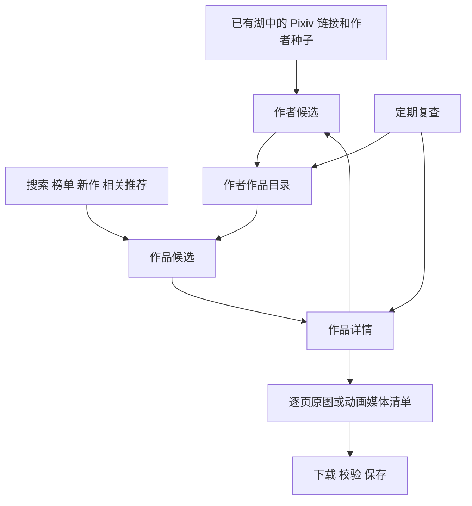

# Pixiv 采集器设计草案

创建日期：2026-09-30。更新日期：2026-10-03。状态：保留采集设计依据；阶段 1–3 已实现，当前范围与保留项见 [ADR 0052](../../decisions/0052-pixiv-collections-and-canonical-media.md)和[实现验收](../../verification/2026-10-03-pixiv-stages-1-3.md)。本文的搜索、榜单、新作等后续入口不能视为已接入。

本文说明 Pixiv 采集器如何发现作品、补全作者目录、取得原始元数据和媒体，以及如何维护更新和处理缺口。总体边界见[多来源图片采集规划](README.md)。文中的模块划分和处理规则是设计建议；接口事实与已有小样本证据单独标明。

核心方向是以作者目录组织覆盖，以作品 ID 获取信息，以图片页或动画帧执行下载。搜索、榜单、新作和推荐不断引入新的作品与作者。这里的作者指 Pixiv 上发布作品的账号，以用户 ID 标识，不以昵称或目录名称作为身份。

先明确网页取数方式、作者扩展规则和认证条件，再根据实际取得的数据结构设计存储湖与接入。后续工作如何并行推进，见[验证与项目接入推进建议](pixiv-validation-and-integration-plan.md)。以下浏览器与 HTTP 的分工、扩展优先级和预算仍为设计建议；网页端、作者中心和登录支持是已明确的方向。

当前讨论已推进到[后端与统一数据湖设计](pixiv-backend-and-lake-design.md)，前端页面暂缓。来源取数的可见性与持续运行仍需在后续实现中验证。

## 范围与覆盖口径

设计考虑静态插画、多页漫画和 Ugoira 动画。各类型是否默认全部采集、AI 与分级范围、小说附图等扩展对象，仍需在策略中明确。

覆盖结论必须带上扫描时间、来源入口、接口通道和可见性条件。作者目录用于描述当前条件下列出的作品集合；搜索和推荐用于发现候选。某次查询结束，不能据此推导全站历史作品已经覆盖。

采集优先级与永久排除分开。收藏数、榜单名次、作者来源和本地质量分析可以影响执行顺序；未执行的候选保留进度和延后原因。当前没有确定全站规模、固定请求速率或完成时间。

## 子模块协作

| 子模块       | 输入                                             | 主要产物与责任                                         |
| ------------ | ------------------------------------------------ | ------------------------------------------------------ |
| 候选发现     | 来源链接、作者种子、查询分片、榜单日期、关联入口 | 作品与作者候选，发现路径，入口进度                     |
| 作者目录     | 用户 ID、扫描条件                                | 作者资料、作品 ID 集合及目录快照，新增和暂时消失的作品 |
| 作品信息     | 作品 ID、复查计划                                | 原始详情、作品类型、元数据观察、作者与系列关联         |
| 媒体清单     | 作品详情                                         | 逐页 URL、尺寸与顺序，或动画媒体信息及帧时序           |
| 媒体下载     | 待取得的媒体条目                                 | 文件、实际哈希、校验结果、可续抓的缺口                 |
| 更新与复查   | 已知作者、作品与历史观察                         | 新目录扫描、旧作品复查和版本变化记录                   |
| 来源运行控制 | 会话条件、来源预算、阶段状态                     | 限速与冷却、暂停恢复、失败分类及进度汇总               |

这些是逻辑职责，尚未决定每项独立进程、线程池或具体类。模块通过持久结果交接，避免一次网络失败导致整条发现链路重新执行。结果可靠保存后再推进对应游标；暂停和重启后继续尚未完成的工作。

总体流转如下。循环扩展需要候选合并、分轮预算和复查时间约束。

## 候选发现

| 入口                     | 工作方式                                                                       | 覆盖作用                       |
| ------------------------ | ------------------------------------------------------------------------------ | ------------------------------ |
| 已有数据湖的来源链接     | 识别 Pixiv 作品链接、旧式链接及可识别的 pximg 地址，解析作品 ID 并取得发布账号 | 利用现有资料建立第一批作者种子 |
| 指定作者                 | 根据用户 ID 读取作品目录                                                       | 补全明确范围内的作者作品       |
| 标签与关键词搜索         | 按词、时间和适用的作品类型划分查询任务                                         | 扩展题材、年代与画风           |
| 当前与历史榜单           | 按榜单类型和日期取得作品，再提取作者                                           | 引入不同时间段的作者           |
| 新作入口                 | 持续取得新发布作品与发布账号                                                   | 发现尚未进入热门范围的作者     |
| 相关推荐与公开收藏及关注 | 从已有作品和账号扩展关联候选                                                   | 扩大相邻兴趣范围               |

现有客户端实现包含上述请求类别，可作为后续实现参考；这不证明每个入口在本机当前会话下都已验证可用。[Web 接口实现](https://github.com/xuejianxianzun/PixivBatchDownloader/blob/master/src/ts/API.ts)、[App 接口实现](https://github.com/upbit/pixivpy/blob/master/pixivpy3/aapi.py)

### 作者扩展

从已有湖发现一张作品后，取得作者 ID，将作者加入候选，再读取其作品目录。目录中的其他作品进入待处理集合。同一作者或作品由多个入口发现时合并待执行任务，同时保留各条发现关系。

建议将作者当前可见的作品目录作为主要补全路径。一个作者任务分别维护作品补全和关系扩展两类进度；目录可先交出作品任务，关系扩展也可按预算推进，无须等待全部媒体下载结束。

| 扩展入口             | 候选路径                                    | 建议用途                                   |
| -------------------- | ------------------------------------------- | ------------------------------------------ |
| 作者公开收藏         | 作者 → 收藏作品 → 作品发布账号              | 发现该作者感兴趣的其他创作者               |
| 作者公开关注         | 作者 → 关注账号 → 检查作品目录              | 直接取得账号候选，再确定是否具有待采集作品 |
| 已有作品的相关推荐   | 作者 → 自己的作品 → 推荐作品 → 作品发布账号 | 从不同年代和题材的作品向外扩展             |
| 搜索、榜单和全站新作 | 独立入口 → 作品 → 作品发布账号              | 持续补充已有关系网未触达的作者             |

公开关注、收藏和作品推荐的请求方式可参考 [Web 接口实现](https://github.com/xuejianxianzun/PixivBatchDownloader/blob/master/src/ts/API.ts)。这些路径是取数候选，当前没有实测各入口在登录会话下的分页完整性。公开收藏可供其他用户查看，私有收藏不向其他用户展示；这里的作者收藏扩展以公开范围为基础。[收藏可见性说明](https://www.pixiv.help/hc/en-us/articles/235646967-What-are-Bookmarks)

建议执行规则如下，默认选择仍待讨论：

- 新作者的全部可见目标类型作品进入补全计划；排队和延后不等于永久排除。目标类型和分级由采集范围决定。
- 每个关系入口独立保存游标或 offset、扫描条件、观察时间与结束原因。offset 列表可能在扫描期间变化，需要重叠读取、ID 合并和后续复查。
- 新发现的作者进入候选队列，在后续调度轮次展开；不在当前请求中无限递归。相同作者的任务合并，但保留不同的发现路径。
- 作品推荐先按作者、年代和题材选择有限种子，之后可扩大；不默认对每张作品都立刻发起推荐请求。
- 分别约束新增作者、关系请求和待下载媒体积压。保留已有作者补全预算，并根据新增作者产出与积压调整发现预算；降低优先级不删除候选。
- 粉丝列表和专门的推荐作者入口暂不作为首轮核心路径。前者需区分创作者与浏览账号，后者的接口及收益另行核对。

额外保留独立搜索与新作发现预算，覆盖旧年份、冷门题材和新作者，降低已有 Booru 种子及推荐入口带来的集中偏好。

### 搜索与推荐进度

搜索任务保存词、匹配模式、时间范围、排序、过滤条件和分页进度。大结果集按适用时间粒度拆分，并处理边界重叠。达到接口深度或结果限制的分片标为覆盖未完成；日粒度仍过大时，不能通过丢弃边界结果宣称完成。

当前 gallery-dl 的 Pixiv 搜索实现会在较深 offset 时调整日期边界。这是具体客户端的处理方式，不是所有 Pixiv 接口共享同一硬上限的证明。[搜索分页实现](https://codeberg.org/mikf/gallery-dl/src/branch/master/gallery_dl/extractor/pixiv.py)

推荐保存种子作品、观察时间和实际返回集合，并按轮次扩展。推荐结果处理完毕只表示本轮候选已处理。新作入口保存游标和重叠窗口；其历史回溯范围及持续发现完整性尚未验证。

## 接口通道与作者目录

本轮以网页端使用的 AJAX 接口作为主要设计对象。建议由浏览器会话处理登录与必要的人机交互，元数据请求复用该会话，媒体下载按实际清单独立执行。优先读取结构化响应；仅在确有必要时解析页面。独立 HTTP 客户端能否复用同一会话，需要后续验证，不能仅凭 Cookie 已导入就认定有效。

这些是网站前端使用的接口，并非已获得稳定性承诺的公开开发者 API。接口差异和错误解析集中在 Pixiv 内部的请求模块中维护。App API 保留为以后可能的补充通道，当前流程不以接入 App API 为前提。

| 内容         | 当前参考路径                    | 设计用途                   | 2026-09-30 证据                    |
| ------------ | ------------------------------- | -------------------------- | ---------------------------------- |
| 作者信息     | `/ajax/user/{uid}?full=1`       | 保存账号资料观察           | 客户端源码参考，未进行本机账号验证 |
| 作者作品目录 | `/ajax/user/{uid}/profile/all`  | 保存作品 ID 集合与目录快照 | 一个匿名公开作者样本返回成功       |
| 作品详情     | `/ajax/illust/{id}`             | 保存作品原始信息           | 一个匿名公开作品样本返回成功       |
| 静态作品各页 | `/ajax/illust/{id}/pages`       | 取得逐页媒体清单           | 同一作品样本返回原图地址与尺寸     |
| Ugoira 信息  | `/ajax/illust/{id}/ugoira_meta` | 保存动画媒体信息与帧时序   | 客户端源码参考，未验证实际动画下载 |

路径参考 [PixivBatchDownloader](https://github.com/xuejianxianzun/PixivBatchDownloader/blob/master/src/ts/API.ts) 与 [gallery-dl](https://codeberg.org/mikf/gallery-dl/src/branch/master/gallery_dl/extractor/pixiv.py)。已有样本的范围见本文证据部分。

作者向外扩展的 Web 请求参考如下。表中列出基础路径和关键参数，不代表完整请求契约或已验证的分页上限。

| 内容     | 当前参考路径                                                                                  | 取数责任                                     |
| -------- | --------------------------------------------------------------------------------------------- | -------------------------------------------- |
| 公开收藏 | `/ajax/user/{uid}/illusts/bookmarks`，`rest=show`、`offset`、`limit`                          | 取得收藏作品候选，保留分页进度               |
| 公开关注 | `/ajax/user/{uid}/following`，`rest=show`、`offset`、`limit`                                  | 取得账号候选，后续确认其作品范围             |
| 作品推荐 | `/ajax/illust/{id}/recommend/init`                                                            | 保留已返回作品与后续候选 ID，按预算展开      |
| 独立发现 | 搜索 `/ajax/search/artworks/{word}`、榜单 `/ranking.php?format=json`、新作 `/ajax/illust/new` | 补充关系网以外的作者，分别维护查询和遍历条件 |

以上发现路径来自 [Web 客户端源码](https://github.com/xuejianxianzun/PixivBatchDownloader/blob/master/src/ts/API.ts)，尚未验证当前登录条件下的行为。推荐首屏中的作品数量不能当作全部候选数，搜索、榜单和新作也各有独立的结束语义。

当前 gallery-dl 会使用网页作者目录核对并补查 App 作者列表，可作为通道差异的参考。若以后引入 App API，应分别保存两个通道的原始集合、扫描条件和失败，不以任一列表正常结束代替媒体归档完成。

一次目录扫描应记录扫描时间、接口通道、会话与显示条件、作品 ID 集合和结束原因。请求失败不能返回为正常空目录。与上一份目录比较时，分别产生新增、仍然存在和本次未出现的作品；目录变化只提供后续处理线索。

首次补全时保存一份明确的目录快照，按该集合计算本轮待处理任务。扫描期间出现的新作品可以进入后续扫描，避免任务范围随站点更新无限增长。

一个作者的建议取数顺序为：读取资料与目录 → 合并作品 ID → 获取作品详情 → 按作品类型获取逐页或动画媒体信息 → 下载并校验。首次扫描与后续复查共用这条链路，但根据已有观察和缺口安排请求。目录条目和列表缩略信息不能替代作品详情；响应中的真实作者 ID、作品类型和媒体清单用于校验后续任务。

## 作品信息与原始元数据

作者目录、作品详情、逐页媒体、动画信息以及各发现入口的原始响应分别保存，再提取查询字段。原始内容保留未知字段和嵌套结构，整理后的下载器 metadata 不作为唯一原始档案。

优先保存以下作品信息：

- 标题、原始说明 HTML、链接、标签原文与翻译，以及接口返回的锁定或编辑信息。
- 发布时间、上传时间、重新上传时间的原值与时区信息。
- 浏览、收藏、点赞等统计及对应观察时间。
- 发布账号、系列、作品回应等关联。
- 作品类型、页数、分级、AI 标记及可见性信息；字段缺失不推断为否。
- 来源媒体 URL、逐页尺寸、媒体版本以及动画帧时序。

原始响应附带抓取时间、接口通道、请求条件、解析器版本和响应摘要。会话记录使用非敏感引用；Cookie、令牌等认证材料不混入归档。

评论、完整社交关系等额外数据的采集深度与优先级待定。作者资料等共享实体按观察保存，避免每处理一张作品都重复抓取同一份资料。

## 静态图片与动画

### 静态插画和多页漫画

取得完整分页清单后，再按清单下载每一页。详情中的第一页原图地址不代表其他页面已经识别。每页单独记录 URL、尺寸、格式、顺序、取得状态和下载后哈希。

下载结果核对文件类型、实际可读性和完整性，避免将登录页面、限制提示图或截断文件计为成功。只取得预览或其他替代版本时，明确记录实际媒体级别，继续保留原件缺口。

### Ugoira

保存动画元数据、逐帧文件名与显示时长，并保存实际取得的帧文件或帧包。Pixiv 允许逐帧设置时长；动画还原需要这些时序信息。[Pixiv Ugoira 说明](https://www.pixiv.help/hc/en-us/articles/235584628-What-are-Ugoira)

当前 gallery-dl 区分普通帧包与原始帧获取方式。采集器应记录实际取得版本，不能仅凭 ZIP 格式认定最高质量媒体已取得。[动画选项](https://gdl-org.github.io/docs/configuration.html#extractor-pixiv-ugoira)

GIF、视频等浏览格式作为派生结果。原始帧、帧包和转换结果各自保留到什么程度，以及如何兼顾空间，需在媒体保留策略中确定。

### 编码与重复识别

编码前计算原始下载字节的哈希，记录格式、尺寸和必要的内嵌信息；编码输出单独计算哈希并记录转换关系。哈希能够确认身份，不能恢复已经删除的原文件。

相同字节可在后续物理存储层复用，但保留所有来源与版本关系。近似重复、裁切、水印、重编码和高低分辨率版本交给本地分析识别；不以尚未验证的相似判断提前排除采集。

## 更新与版本

Pixiv 支持给已有作品替换、增删图片并调整顺序。因此作品 ID 保持不变时，其媒体仍可能变化；`作品 ID + 页码` 是某次观察中的页面位置，不能作为永久不变的图片身份。[Pixiv 重新投稿说明](https://www.pixiv.help/hc/en-us/articles/235584308-Can-I-repost-contents-submitted-to-pixiv)

更新包含两条相对独立的流程：

1. 目录复查识别新作品，以及暂时消失或重新出现的作品。
2. 作品复查检查旧作品的元数据、媒体清单和图片版本。

只维护最大作品 ID 或只比较作者 ID 集合，都不足以发现同一作品下的图片替换。建议活跃作者更频繁复查目录，新近作品更频繁复查详情，较老作品低频回访；实际频率待定。

元数据变化新增观察。媒体清单变化触发进一步检查或下载，并保留已取得版本与当时的页面顺序。仅修改说明或统计时，不要求重复下载已验证未变的媒体。

媒体变化检测不能只依赖某个时间字段或 URL。相同 URL 下的字节变化、可用的条件请求与抽查策略仍需细化。采集器只能保存自身实际观察到的版本，不能宣称恢复未曾取得的历史版本。

## 会话与失败恢复

### 登录会话

登录认证属于取数流程的基础能力。建议首版由一个明确的登录账号提供会话，以凭据和后台 HTTP 客户端执行日常采集。支持显式导入 Cookie；独立浏览器可作为登录与会话恢复助手，在需要时由用户完成交互。浏览器不作为常驻执行前提，具体凭据入口和会话复用仍待验证。

网页请求参考实现使用浏览器的同源凭据；gallery-dl 的网页补查也识别 `PHPSESSID`。这支持基于网页会话设计认证，但并不证明仅复制一个 Cookie 就足以长期访问所有入口。[Web 请求实现](https://github.com/xuejianxianzun/PixivBatchDownloader/blob/master/src/ts/API.ts)、[网页补查实现](https://codeberg.org/mikf/gallery-dl/src/branch/master/gallery_dl/extractor/pixiv.py)

建议会话管理承担以下责任：

- 使用正常的网页登录流程；采集器不保存账号密码。需要保存的会话材料通过系统凭据保护能力保存，与原始元数据、日志和仓库隔离。
- 校验服务端认可的登录身份，并分别记录目标内容范围的可见性。成功读取一个全年龄公开作品只能证明该请求成功，不能证明登录有效或 R18 可见。
- 按域、路径和安全属性管理 Cookie，不把 Pixiv 登录材料附加到任意媒体主机或外链请求。
- 区分未登录、有效、失效、需要交互验证与限速冷却。检测 HTTP 状态、重定向、响应类型及 JSON 业务错误；HTTP 200 和 Cookie 存在都不单独代表成功。
- 登录失效时暂停依赖该会话的任务，重新登录后从已有进度继续；不静默切换匿名采集并沿用原覆盖口径。
- 账号或显示条件变化时建立新的观察条件。上一会话下列出的作品与当前未列出的作品不能直接推断为删除。

### 内容可见性

Pixiv 官方说明，年龄限制内容需要满足账号年龄条件并开启相应显示设置；新注册或未开启显示的账号不能因此被视为具备目标可见范围。R18 与 R18G 在采集范围和能力记录中分别表达，作品标签也不能替代站点自身的年龄限制字段。[年龄限制显示说明](https://www.pixiv.help/hc/en-us/articles/235585288-I-would-like-to-view-age-restricted-contents-R-18-R-18G)

可见范围与登录、显示设置等条件有关。Pixiv 官方说明 AI 作品显示设置影响搜索、新作、推荐和相关作品，并随同一账号跨 Web 与 App 生效。目录与发现结果应记录这些条件，不能将过滤导致的缺失解释为站点没有对应作品。[显示设置说明](https://www.pixiv.help/hc/en-us/articles/11866167926809-What-are-display-settings-for-AI-generated-work)

显示设置对每个具体接口的影响仍需验证，不能据此断言所有作者目录接口都会以同一种方式过滤。记录无法确认的条件为未知，不能默认为已开启。私有作品、My pixiv 限定、屏蔽或账号状态也可能影响访问；登录本身不会使这些访问条件自动消失。[作品可见性变化说明](https://www.pixiv.help/hc/en-us/articles/235646967-What-are-Bookmarks)

### 失败与恢复

以下为业务分类，尚未定义数据库枚举或正式接口：

| 情况                       | 建议处理                                             |
| -------------------------- | ---------------------------------------------------- |
| 临时网络错误或服务错误     | 保留请求条件、进度和重试时间，局部恢复               |
| 限速或站点冷却             | 尊重响应要求，协调受影响会话或主机的请求预算         |
| 登录失效或访问验证         | 暂停受影响范围，保留待处理任务，不记为作品不存在     |
| 作品不可访问或目录暂时缺失 | 保存响应证据与观察条件，后续复查，不据此删除本地档案 |
| 单页失败或文件损坏         | 标记具体媒体缺口，单独重试                           |
| 资源不足                   | 暂缓准入，保留候选与已有进度                         |

具体冷却是否覆盖某个接口、会话、主机或整个来源，需要依据站点响应确定；不同子模块共享同一来源的有效限制。元数据阶段暂停时，其他阶段能否继续取决于其请求是否属于受影响范围。

## 完成条件与调度边界

目录扫描完成、作品信息齐全、媒体下载齐全和归档交接成功分别表达。暂停、预算耗尽、暂时不可访问和正常遍历结束也分别记录。

例如一个作者目录列出 200 部作品，已取得媒体清单合计 820 页，下载成功 800 页，则目录可以已完成扫描，媒体仍有 20 页缺口。这是说明口径的假设例子，不是实测结果。

统一调度层分配来源预算、协调暂停及冷却、汇总状态。Pixiv 采集器报告下一项可执行工作、对应资源需求和等待原因，并自行维护目录、作品、媒体和复查进度。来源内限速与全局预算同时生效。

与 Studio 的任务模型、存储和数据湖协议如何衔接，另行设计。此处没有决定数据库结构、任务 DTO、具体进程模型或 UI。

## 待确认的问题

| 主题         | 需要明确的选择                                                     |
| ------------ | ------------------------------------------------------------------ |
| 默认采集范围 | 插画、漫画、动画的默认范围，AI 与分级策略，小说附图是否纳入        |
| 作者扩展     | 哪些入口引入作者，是否默认补全所有新作者，每轮扩展预算和积压阈值   |
| 搜索覆盖     | 初始词表、时间分片、触顶判定与仍无法完整覆盖的处理                 |
| 推荐与新作   | 扩展轮次、重复发现处理、新作游标与历史回溯边界                     |
| 媒体保留     | 原始静态文件、动画帧和帧包的保留方式，编码与替代媒体策略           |
| 元数据深度   | 作者资料、评论、公开收藏与关注、系列信息的优先级                   |
| 版本复查     | 作者活跃度分层、旧作品回访、相同 URL 内容变化的检测                |
| 登录接入     | 独立浏览器会话或显式 Cookie 导入、会话验证方式及目标范围可见性检查 |
| 运行与恢复   | 会话生命周期、共享限速、持久状态、暂停恢复和归档交接契约           |

先细化这些选择和子模块输入输出，再讨论实现及验证安排。

## 已有证据与限制

2026-09-30 进行过公开文档与客户端源码检查，以及一个匿名公开作品和一个作者的小样本元数据探测：

- 作品详情返回成功，但该响应没有提供原图地址。
- 同一作品的分页响应返回一页媒体及原图地址。
- 作者目录返回 150 个插画 ID 和 8 个漫画 ID。

这些事实仅证明当时样本的响应形态。未下载原图字节，未验证动画归档、认证会话下的完整可见范围、全作者媒体补全、全站覆盖或持续吞吐。

本轮进一步核对了网页客户端源码以及 Pixiv 官方关于年龄限制、AI 显示设置和收藏可见性的说明，用于细化设计。没有进行新的登录采集或媒体下载实验；会话复用、关系分页和各接口的可见性差异仍属于后续验证内容。

本机证据位于 `.local/reports/source-collection-research-20260930/`，包括 `findings.json`、公开响应样本和所检查的提取器源码。该目录被 Git 忽略，不随仓库分发。外部链接指向可能更新的文档或分支，实现时应重新核对版本与行为。
