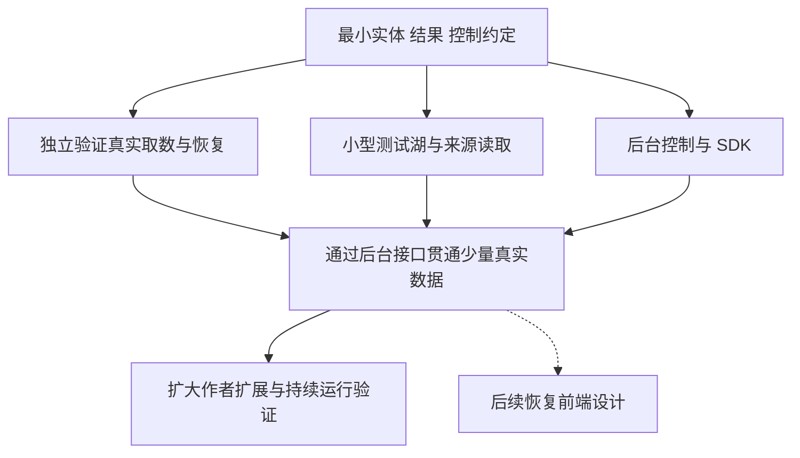

# Pixiv 验证与项目接入推进建议

创建日期：2026-10-02。更新日期：2026-10-03。状态：阶段 1–3 已实现并完成公开小样本与隔离项目接入；[验收记录](../../verification/2026-10-03-pixiv-stages-1-3.md)区分已验证和待验证能力。真实登录验证、规模验收及前端仍待后续。

建议在 Studio 仓库内实现可独立运行的 Pixiv 采集核心，先验证真实取数与恢复行为；同时推进数据湖关系模型和后台控制接口。独立验证入口与正式后台调用同一核心，原始响应和媒体结果可以离线重放。首次集成应尽早通过 CLI 或后端接口贯通少量数据的完整链路，之后再扩大作者扩展和持续运行范围。前端在后续阶段恢复设计。

来源内部流程见 [Pixiv 采集器设计草案](pixiv-collector-design.md)，当前关系模型与兼容方案见[后端与统一数据湖设计草案](pixiv-backend-and-lake-design.md)。本提案讨论工作如何拆分、何时汇合以及用什么证据判断可以推进；没有决定所有数据库字段、公开 DTO 或最终界面布局。

## 当前项目提供的基础与约束

2026-10-02 在迁移后的项目目录核对了以下实现：

- [内置 lake-worker](../../../services/lake-worker/README.md) 已由本仓库维护，以独立 Python 进程执行下载、原文保留、编码、持久任务和归档发布。Rust 引擎负责生命周期和公开接口，前端通过 SDK 操作。
- [全局数据湖工作台](../../decisions/0039-lake-update-workbench.md) 已有任务、计划、凭据和活动入口。任务不依赖页面挂载，也不依赖某个项目保持打开。
- [来源注册与读取端口](../../decisions/0035-source-registry-and-dispatch.md) 已分离来源能力、站点语义、查询和媒体读取；新来源仍需验证自己的字段和媒体语义。
- [更新队列](../../../services/lake-worker/src/studio_lake/updates/state.py) 使用 `(job_id, post_id)` 作为条目主键。[在线投影](../../../services/lake-worker/src/studio_lake/online_schema.py) 的 `post_versions` 为每个帖子版本保存一个 `asset_id`。这不是多页作品关系的现成实现。
- [归档与在线服务边界](../../decisions/0050-archive-rebuild-and-producer-retirement.md) 已明确不可变归档承担事实保留，在线库是可重建的服务投影。Pixiv 的新关系需要同时考虑写入、读取和重建。

这些基础支持复用运行服务、资源准入、凭据保护和工作台组件。是否复用某个具体函数，要在核对其单帖子、单媒体或站点字段假设后决定。

## 先对齐最小边界

并行实施前先形成以下四项约定，避免各条线自行解释同一个实体或状态。约定包含版本和变更方式；远端尚未验证的字段保持可选或未知。

1. **作品与媒体关系。** 区分作者、作品、一次作品观察、该次观察下的图片页或动画媒体，以及实际文件。页序号不能单独代表永远不变的媒体版本。明确同一作品多页如何查询、预览和回溯，保留原始作品 ID，不用不可逆的 ID 拼接迁就旧条目主键。
2. **采集输入与结果。** 输入包含作者种子、目标范围、扩展预算、凭据引用和保存策略。输出包含原始响应、目录快照、发现关系、媒体清单、文件校验与取得结果。结果能在不访问 Pixiv 的情况下重放给入湖模块；认证秘密不进入采集档案。
3. **任务与确认边界。** 作者补全和关系扩展独立推进；分别记录元数据、媒体下载和入湖确认。文件已下载不能被显示为已入湖。结果可靠保存后才推进对应检查点，只有目标发布确认后才释放待交接数据。
4. **控制与进度。** 统一创建、暂停、继续、重试、取消和等待原因；计数分别按作者、作品、媒体页和字节表达。总量未知时不生成整体百分比。明确页面关闭、浏览器关闭、引擎退出和验证进程退出各自的生命周期。

验证入口建议使用显式 Cookie 导入和后台 HTTP 会话。浏览器作为可选登录与恢复工具，不作为常驻执行前提。真实会话的可用范围及失效处理仍需验证。

## 本阶段工作线与后续前端

| 工作线             | 首轮工作                                                                   | 可独立交付和验证的结果                                             | 主要依赖                                           |
| ------------------ | -------------------------------------------------------------------------- | ------------------------------------------------------------------ | -------------------------------------------------- |
| Pixiv 采集核心     | 会话校验、指定作者目录、作品详情、逐页或动画媒体、受限关系扩展、进度持久化 | 可独立启动的验证入口，真实响应与文件，小范围采集报告，中断恢复证据 | 最小实体、结果和控制约定；真实登录验证需要可用凭据 |
| 数据湖与来源读取   | 作品和多媒体关系、原文保留、归档发布、在线投影、来源注册、基础查询和预览   | 可用小型固定样例生成并读取的 Pixiv 测试湖，发布重放与关系回读验证  | 关系模型先行；真实采集结果到位后补充回归样例       |
| 后台任务控制       | 托管采集核心、凭据引用、资源与速率协调、状态持久化、公开 API 与 SDK        | 可使用确定性执行器验证的任务控制链，随后接入真实采集核心           | 控制约定；复用现有服务所有权和应用生命周期         |
| 前端工作台（暂缓） | 后续设计来源和账号状态、作者种子、补全与扩展设置、队列与覆盖、缺口与操作   | 后续使用明确标注的样例状态验证交互，再通过同一 SDK 接真实后台      | 本阶段后端语义和接口稳定后恢复设计                 |

独立运行是执行方式，代码仍由同一仓库维护。优先评估将来源核心放入现有 lake-worker 的独立模块，由薄验证入口和正式服务共同调用；具体模块位置在实现设计中确定。避免验证入口直接依赖 React、Tauri 或某个打开的项目。

本阶段先提供可供未来前端使用的控制和读取契约，覆盖队列增长、等待凭据、冷却、部分媒体失败、下载完成但尚未发布等状态。前端页面与布局暂缓，生产账号材料不进入公共状态和接口样例。

## 推进次序与汇合点

本阶段的汇合条件是后台采集、入湖和读取可以贯通；前端不阻塞这一验收。

### 第一阶段验证取数与数据形态

选择少量明确作者，以覆盖目标类型和故障状态为目标，限制总请求和媒体工作量。验证范围包括：

- 凭据有效、失效和目标内容可见性分别判断。成功取得公开内容不能单独证明登录及目标分级可见。
- 真实单图、多页作品与 Ugoira 的数据和媒体关系；动画帧时序与原始包必须可表达，完整动画播放界面可另行安排。
- 原始响应完整保留、媒体按清单取得并计算实际哈希，部分失败能定位到具体媒体。
- 作者目录补全与一轮关系扩展分别记账，重复候选合并且扩展预算生效。
- 正常暂停及中断后恢复，同一采集结果可以重复交接并取得稳定确认；入湖发布的幂等性由数据湖工作线共同验证。

真实网络证据与本地故障注入分别记录。记录各阶段请求数、字节、等待和耗时，用于后续安排预算；不由短样本推导持续吞吐或全站完成时间。

### 第二阶段贯通最小完整流程

第一次功能集成贯通：通过 CLI 或后端接口指定作者 → 后台调用同一采集核心 → 写入小型 Pixiv 湖 → 来源读取接口返回图片与作品页关系 → 读取原始元数据及媒体缺口 → 暂停并继续任务。

沿用归档、在线发布和读取版本的确认边界。重放固定采集结果时无需再次访问 Pixiv；使用同一批真实结果核对作品、页、对象和观察数量。旧来源按现有兼容承诺继续工作，新增关系的 schema 演进及回退边界必须明确。

### 第三阶段扩大覆盖与运行规模

在完整流程验证后增加更多作者发现入口、历史复查、版本变化、长期调度和更大队列。结合元数据请求、下载带宽、解码内存、暂存、归档与在线发布一起测量，调整有界并发和积压控制。

此阶段的重点是长时间恢复能力、资源上限和覆盖说明，不能只以下载文件数判断成功。不同发现入口的完整性和作者当前可见作品的补全程度仍分别表达。

## 进入实施前的具体交付

当前[三份契约 v1](contracts/README.md)已确定身份、schema、批次重放、任务状态和后端接口，并提供可独立校验的 SQL 与 JSON 样例。下一步按契约推进采集核心、湖读写和后台控制三条线。前端后续接入稳定的公开接口。

实现时先用小型隔离数据验证兼容性，不操作现有三湖的生产数据来验证新关系。真实账号条件、持续吞吐与远端行为仍需在实现后另行验证。
