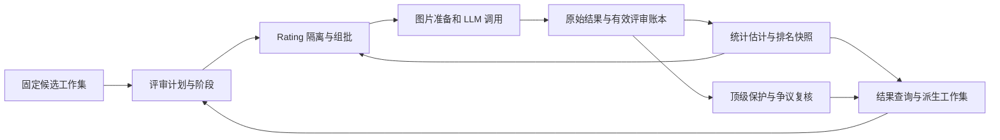

# 业务流程与统计方案

状态：设计草案，未实施。整理日期：2026-09-18；依据 2026-09-17 的讨论与审查。

[返回规划入口](README.md)。用户已确认全量相对名次稳定优先，以及顶级提名进入保护池后复核。下文的数据字段、具体算法、默认选取规则和调度策略均为建议；JSON 示例不是已经发布的 API schema。

## 新功能的对象和模块职责

建议侧边栏名称为“美学排序”，用现有 ModuleRegistry 注册独立主视图。产品中继续使用“项目”和“工作集”；评审计划是项目内的新对象，不再创建另一套“项目”。



实现上拆成七个职责，先组织成现有 crate 内的目录；是否增加独立 crate 由依赖和测试边界决定。

| 职责                           | 建议位置                                                 | 不变量                                                       |
| ------------------------------ | -------------------------------------------------------- | ------------------------------------------------------------ |
| 评审对象、分组和输出契约       | domain/aesthetic                                         | 图片身份、Rating、模型证据、并列与不可评判状态明确定义       |
| 计划、阶段、候选选择和复核用例 | application/aesthetic                                    | 不依赖 HTTP/SQLite；使用输入、账本、图片和 LLM 端口          |
| 组批与排名估计                 | 纯计算模块                                               | 可用保存的证据离线重放；不访问网络                           |
| 持久执行和恢复                 | engine 的独立评审执行器                                  | 任务不依赖前端；不能把网络请求放入 Operator::row             |
| 账本、投影和成果仓储           | storage/aesthetic                                        | 付费证据有持久归属、备份、唯一约束和引用保护                 |
| 评审图片准备                   | 图片服务及资源层                                         | 变换规格版本化、内容可核验、内存和磁盘受限                   |
| UI / SDK / DTO                 | features/aesthetic、client/aesthetic、protocol/aesthetic | 前端发送配置和范围引用，不能上传百万 ID 列表或自行编排全任务 |

最少需要这些对象：评审计划、不可变阶段配置、固定阶段成员、逻辑批次、调用尝试、已接受评审、估计快照、工作集派生规则、复核决定。

每个阶段固定：候选集及父快照、Rating/年份归属规则、模型与解析后的参数、System Prompt 原文/版本、业务 schema、图片变换规格、采样策略/种子、曝光目标和预算。仅引用一个可编辑的全局预设 ID 不够。阶段开始后修改配置需要新版本；凭据等运行连接信息独立解析，不落入证据快照。

## 16 图输出与“顶级候选”的语义

建议模型返回有序梯队，同时保留顶级提名。例如以下示例覆盖全部 16 个批内 ID：

```json
{
  "schema_version": 1,
  "tiers": [
    ["img07", "img12"],
    ["img03", "img05", "img11"],
    ["img01", "img02", "img04", "img08", "img09", "img13", "img16"],
    ["img06", "img10", "img14", "img15"]
  ],
  "elite_candidates": ["img07", "img12"],
  "unjudgeable": []
}
```

这只是业务形状草案。提交给模型的是随机展示顺序与短 ID；后端保存短 ID 到资产、位置、图片变体的映射。不要把 SHA、文件名、年份、点赞或历史模型分数暴露给评审，除非该实验明确研究这种提示。

模型支持 JSON Schema 时传入 schema；后端仍须执行自己的结构和语义校验。被拒绝、截断、无法读图、未知 ID、重复/遗漏 ID、空梯队、跨 Rating 等不能进入有效排名证据。所有输入 ID 必须在 tiers 和 unjudgeable 中恰好出现一次；elite_candidates 只能引用已评判对象。单张无法判断应有明确原因，不应被当作最低质量。

建议把同梯队定义为“在指定审美尺度下没有足够有意义的优劣差异”。这不是要求最终潜在分数精确相等，也不能将一次 A=B、另一次 B=C 用并查集永久合并成 A=B=C。如果实际想表达的是“内部懒得细排/信息不足”，则应采用有序分组的观测模型，不能直接当作平局。不可评判应单独表达。

顶级提名是“达到固定审美标准”的独立观察，不能强制每批选一个，也不能等同于本批第一梯队。允许一批全空，也允许多个。提名图片继续参与普通排名；同次提名不再转换成额外胜场或固定加分，避免重复计算同一判断。

按用户选择，提名进入保护候选池；普通初筛落选时仍可以送往复核，复核前不等于最终精选。保存每个模型/阶段的提名次数、有效评审次数、批次背景和复核状态；一次未提名不是“明确否定顶级”，不直接使用跨阶段的提名率当作客观概率。

System Prompt 的后续工作重点是固定判断标准、同梯队含义、顶级标准、弃判条件与输出形状。建议先用包含古早风格、现代风格、简洁构图、精细画面及中段近似质量的样本校准，避免默认把细节多、分辨率高或流行风格当成审美高。Prompt 的清晰程度和图像准备规格一起影响结果。

## 统计方案：围绕全量稳定性设计

事实单位是一整次 16 图评审。保存原始梯队，而不是只保存最终分数。一批至多可以推导 120 个图片对，但它们来自同一个模型判断，不是 120 次独立实验；不应把拆出来的图片对作为独立样本来夸大置信度。

算法选型建议先做对照验证，再确定生产实现：

| 方案                                  | 适用位置                                     | 需要验证的边界                                                                               |
| ------------------------------------- | -------------------------------------------- | -------------------------------------------------------------------------------------------- |
| 支持平局的 TrueSkill 类近似贝叶斯估计 | 有界成本的在线分数/不确定度更新和组批        | 多人平局的解释、更新顺序敏感性、静态图片不应套用玩家随时间变强的漂移；模型假设不自动适合审美 |
| 广义 Plackett–Luce（支持并列）        | 在同一批原始证据上做 listwise 拟合与基准对照 | 正则化、极端全胜/全败、并列阶数、批内上下文效应、百万参数的内存和拟合时间                    |
| 有序分组偏好模型                      | 梯队表示内部顺序未知而非“接近平局”时         | 观测语义不同，不能直接套用平局损失                                                           |
| 简单胜率/Borda/Elo                    | 开发阶段的基线和异常对照                     | 对手强弱、并列信息、相关观测和不确定度不足，不作为最终默认依据                               |

TrueSkill 原始研究处理多人结果、平局和不确定度；PlackettLuce 的作者文档支持子集排名和多阶并列；分组偏好研究则明确区分“组间有序、组内未知”。它们是候选方法的依据，不是本项目质量或吞吐保证。[TrueSkill](https://www.microsoft.com/en-us/research/publication/trueskilltm-a-bayesian-skill-rating-system/)、[PlackettLuce 作者文档](https://hturner.github.io/PlackettLuce/articles/Overview.html)、[有序分组偏好研究](https://proceedings.mlr.press/v130/ma21a.html)。

在线近似模型和最终拟合不必在第一版同时部署。先用同一证据做消融比较；若一种方法满足质量和容量要求，就先维护一种生产算法。若需要双层估计，在线状态只服务调度，发布排名明确标出实际估计器与版本，避免两个数值体系混用。

稳定性的展示需要包括估计名次、Rating 内百分位、有效曝光、对手多样性、估计不确定度/经验名次变化及复核标记。近似置信区间必须标明假设和校准方法；不能在百万维上建立稠密协方差矩阵。固定 ID 作为显示的最终平局打破规则只保证页面顺序确定，不代表这些图片的美学优劣已经被分清。

全量目标意味着预算不能只给 Top-K 边界。重点降低整张榜单中尚未稳定的关系，尤其是中段近邻；头部、尾部也保留探索下限和抽查。真正稳定的极端样本可以降低频率，但不是从排名宇宙删除。若只在 Top 20% 内继续比较，新增证据主要改善子集内部，无法自动修复其与落选图片之间的错误关系，需要保留跨分数段联系。

停止条件使用多项证据：最低有效覆盖、Rating 内连接情况、跨年联系、分位区间的名次稳定性、独立复评一致性及剩余预算。相邻图片本来接近时，应允许输出有不确定性的次序或质量区间，而不是无限付费强行分开。目标精度（例如百分位稳定程度）应作为后续产品参数明确，不能承诺每一个相邻名次都唯一正确。

## 组批：覆盖、连接和主动复评同时存在

首轮采用均衡覆盖计划，尽量使每张图片达到 4 次有效评审；拒绝、缺图或解析无效不算达标，另计尝试和费用。若只是从全池独立随机抽取、让平均曝光等于 4，理论上仍约有 1.8% 的图片从未被选中，因此不能用总曝光量代替逐图覆盖。

后续组批同时承担三类工作：补齐低曝光和低连接样本；比较估计质量接近但顺序不确定的图片；用轮换的跨分数段/跨年份样本保持整体标尺。各类比例先在试验中确定，不固定一个未经验证的“最佳配方”。记录调度器版本、候选资格、抽样原因和随机种子，必要时保存选择概率；给任何仍属评审范围的图片保留被重新抽到的机会。

每批去重，优先增加新对手；不反复把同一组 16 张作为唯一证据。输入位置随机化并在复评中交换，避免位置偏好。已有 LLM 裁判研究在文本评审中观察到位置偏好，本项目是否以及多大程度存在相同现象，需要用多模态样本单独测量。[位置偏好研究](https://arxiv.org/abs/2406.07791)。

Rating 是硬边界：一批只能来自同一个固定 Rating，分数和百分位也独立估计；不同 Rating 榜单可并列显示，不能声称 G 的第 100 名优于 S 的第 100 名。未知 Rating 进入单独状态，冲突保留依据并通过固定规则或复核解决，不能在任务中途跟随每日元数据更新换组。

年份是采样偏好：多数比较发生在同年或相近年份，持续安排跨年连接。不能只得到互不相连的年份小榜单后把它们拼成全局美学榜。对小年份桶采用相邻年合并或小批次，同 Rating 不足 16 张时允许小批量，不重复塞同图凑数。

年份优先使用固定的可信字段；当前 Danbooru created_at 是帖子创建时间代理，不等于作品创作年份，重复转载也可能改变代理。任务应记录年份字段来源和缺失状态，不能直接复用某个热度聚合日期冒充作品年龄。按年份多比较并不意味着按年份加减分或保证每年相同比例入选；后两者属于另一个显式策展政策。

每个 Rating 维护批次重叠图的覆盖/连接诊断，检查跨年和跨质量段是否只有脆弱的单点联系。图连通仅表示存在比较路径，不保证统计精度；对于长期全胜或全败样本仍需正则化及合理不确定度。主动子集排名有理论研究依据，但理论依赖特定噪声和选择模型，不能推导出真实多模态模型“4 次曝光必然足够”。[子集主动排名研究](https://proceedings.mlr.press/v89/saha19a.html)。

## 区分三类需要额外关注的图片

| 状态       | 含义                                       | 下一步                                       |
| ---------- | ------------------------------------------ | -------------------------------------------- |
| 信息不足   | 曝光不足、对手单一、跨桶联系弱、估计区间宽 | 先增加有信息量的不同对手                     |
| 相近且难分 | 相似质量、稳定并列或近邻次序变化           | 按全量目标补评，达到预算后保留区间或并列解释 |
| 系统性冲突 | 充分曝光后同模型仍不一致，或模型间稳定分歧 | 检查风格/上下文/图片规格；强模型或人工复核   |

低质量、数据缺失、读图失败、模型拒绝和预算耗尽必须分开。波动大不总能靠加样本解决；如果模型具有稳定的审美偏好差异，最后需要明确采用哪套评价标准，或呈现多套榜单。

## 多轮、多模型与工作集派生

支持在任一已发布排名快照上，按 Rating 内 Top 百分比、名次区间、年份、曝光量、估计不确定度、顶级提名或模型分歧构建工作集，并进行交集、并集与排除。结果保存为后端固定成员，记录父快照和派生规则，后续排序更新不偷偷改变该工作集。

Top 20% 默认解释为各 Rating 内分别取 20%；年份仅作弱分组，不默认要求各年也各取 20%。跨 Rating 总配额可另外配置。百分比分母、取整方式以及边界同分的处理必须写入派生规则；可以选择精确名额并标出边界不确定性，或保留边界同梯队导致超额。复核池与保护池是否占用普通 Top 名额也应显式显示。

用户举例的两个流程都能自然表达：全候选均衡曝光 4 次 → 发布 S1 → S1 各 Rating Top 20% → 原模型额外曝光 2 次；或者 S1 Top 25% 与保护/争议候选合并 → 强模型精排 → 发布 S2。

强模型先看全候选的一遍也作为独立阶段，保存自己的相对判断与顶级提名分布。一次评审仍然只是一条观察，不能把“强模型”视作无需复核的真值。

不同模型默认各有独立证据与分数。廉价模型的大量结果不能凭数量自动淹没强模型的少量结果。对同一批共同样本做校准和分歧分析；若后来需要共识排名，再显式定义评审者偏差/可靠性模型和融合版本。

强模型只看 Top 25% 时，它得到的是这个子集的榜单，不能声称它验证过剩余 75%。若希望更新全量参考榜单，应在既有全量模型中保留原范围与证据，并安排选中/未选中之间的桥接复评；不能直接把两套分数拼接成统一尺度。人工复核同样作为新证据或显式裁决记录，保留原始模型判断。

## 持久执行和数据布局

建议最初采用本机单写者模型：project.sqlite 保留计划、阶段目录、成果目录和引用；项目受控的评审目录保存独立账本，承担高频批次和评审写入；正式排名快照通过可恢复发布协议进入 artifacts。评审账本和原始响应是付费证据，不是可随缓存配额清理的临时文件，须纳入项目备份、移动和删除引用规则。

账本最少记录逻辑批次 ID、阶段配置哈希、Rating、16 个资产序号及展示顺序、图片变体哈希、调度依据、每次 attempt、提交/接收时间、供应商请求 ID、返回模型版本、用量/费用状态、原始输出、解析版本及接受状态。原始输出可压缩存储，图片字节独立去重。数据库中使用紧凑的本地资产序号关联到 SHA 和来源，不在每条关系上反复复制长身份字符串。

处理顺序应为：持久计划 → 领取有限批次 → 记录发送尝试 → 发往上游 → 原始响应落盘 → 业务校验 → 接受证据 → 增量更新估计。有效证据应用使用唯一约束与处理水位；崩溃后可以重放本地统计，不能仅凭总 completed 计数猜测哪些请求完成。

响应超时、进程退出或网络断开时，明确区分“确定未发送”“明确拒绝”“结果不明”。结果不明可能已经计费，需要按预定策略核对或显式允许新增尝试；即使上游没有幂等支持，也应保证同一接受证据只进入统计一次。无效结构可以在本地重试解析或修正规则，但不能凭空补 ID、猜顺序，重新请求是另一条付费尝试。

同一次逻辑评审的重试保留全部 attempt，按预定策略选择一份有效结果计入；想独立复评则创建新的逻辑评审，记录这是新增样本。高级重试和费用政策须与已有基础层仅自动重试明确 429 的行为协调。

CPU 拟合、图片解码、磁盘读取、HTTP 并发分别准入，禁止持有数据库事务或解码缓冲等待网络。现有单连接上限为 32、全局活动/等待上限为 128，适合作为底层保护，但需要增加阶段预算、账户/模型 RPM/TPM、在途费用预留、磁盘和字节背压，以及取消/暂停语义。缺失 token 用量与费用保持未知，不能按零估计已消费预算。

正式榜单不是每来一批都全量排序写出。在线状态按有界增量更新；按检查点或用户请求发布不可变快照。每份快照绑定证据水位、估计器、候选宇宙和配置版本；下游工作集使用确切快照。若复用现有成果唯一键 (job_id, output_id)，可以为每次拟合/发布创建独立的纯计算任务，不要让同一已发布成果被后台继续改写。

## 尚需收敛的产品与算法参数

同梯队表示接近等价还是组内顺序未知、可接受的排名不确定度、顶级标准、有效曝光口径、Top 边界处理、年份代理字段、跨阶段证据复用条件及人工裁决优先级，都需要在正式设计中明确。数据库与图片持久格式见[存储方案](storage-and-transport.md)，实验与交付次序见[实施与验证](implementation-and-validation.md)。
