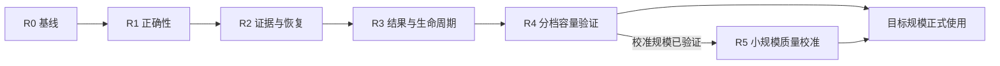

# 源码审查后的整体改进路线图

日期：2026-09-19。状态：**R0/R1/R2 已完成本机验收；R3 的结果有效性摘要与基础动态采样已接入，其余 R3–R5 待实施**。适用基线：Dataset Studio 0.9.1，提交 `0376312d310de671d03af446fd51c7ae9f180af0`。R2 的 2026-09-23 实现与范围见 [ADR 0031](../decisions/0031-aesthetic-transport-and-recovery.md)和[传输恢复验收](../verification/2026-09-23-aesthetic-transport.md)。R0/R1 接入变化见 [ADR 0027](../decisions/0027-aesthetic-recovery-and-admission.md)，实测边界见 [R0/R1 验收记录](../verification/2026-09-19-r0-r1.md)。

目标是把现有后端推进到可恢复、可解释、经实际容量和质量验证的美学排序工作流，同时改善项目整体的存储治理、资源控制和可维护性。继续沿用模块化单体、独立 Rust 引擎、只读来源适配器、项目库和独立评审账本。

## 1. 依据与范围

主要依据为用户提供的《Dataset Studio 0.9.1 源码与美学排序后端审查》，本机文件为 `C:\Users\Xuness\Desktop\源码审查报告.md`，不随仓库分发。本文保留报告的 F01–F09 编号，并为未编号的数据库、统计语义和工程建议安排实施位置。

本次规划做了以下核对：

- 受审归档 SHA-256 为 `8645b571914ace82ada00da3714da887ef102cbaa81e8d99f0ed0afc2e739355`，与报告一致。
- 比较归档与当前仓库的 Rust/SQL、客户端 TypeScript、美学规划及 ADR 0025/0026，共 229 个文件：221 个字节一致，另 8 个仅有换行差异；其中 38 个美学相关文件一致。这个比较范围不等于整个仓库的重新审查。
- 阅读关键控制流，确认创建恢复、运行器停止标志、发送模板、离线候选上限和新分析读取等路径仍对应报告。
- 当前实现边界以[第二阶段后端说明](aesthetic-ranking/phase-2-backend.md)、[ADR 0025](../decisions/0025-aesthetic-evaluation-ledger.md)和 [ADR 0026](../decisions/0026-aesthetic-offline-analysis.md)为准。

最初规划阶段仅形成本文和导航，没有运行新的 Rust/HTTP/Windows 验收、故障复现、商业模型调用或百万候选压测。后续 R0/R1 的实际运行结果单独记录在阶段验收中；报告中的隔离复现和既有文档中的历史测试保留各自证据边界。

## 2. 改进方向与持续约束

整体改进围绕六个方向展开：业务状态可恢复；付费输入和返回可追溯；结果有效性可解释；数据库可恢复和可治理；资源消耗有界；核心用例可测试。

实施期间持续保护以下规则：

1. **付费尝试和接受证据分开。** 每次实际网络尝试有独立 attempt；一个逻辑批次最多接受一份证据；重复落盘、解析和恢复不重复累计曝光、提名或预算。结果不明的尝试不自动重发。这是本地幂等保证，不是供应商账单的 exactly-once 保证。
2. **先准入，再收费。** 创建时验证下游能力、冻结配置和输入身份；发送前验证实际图片和编码后的请求。调用次数上限与估算金额分别表达，未知 usage/费用不能记作零。
3. **历史事实不可改写。** 已接受证据、已发布排名快照和冻结水位保持稳定；复核采用追加记录。新模板、新图片策略或新的独立复评必须有可追踪的新身份。
4. **排名语义保持诚实。** Rating 独立；未比较、不可评判、不连通、未收敛和稳定性未知分别表达。不同分量、不同阶段的原始分数不能直接拼接。
5. **全量排序与保护复核同时保留。** 目标仍是全体候选尽量稳定的相对名次。顶级提名进入独立保护候选池，供强模型或人工复核，不直接加分，也不自动成为最终精选。
6. **发布和释放都有边界。** 派生工作集在构建期间隐藏，完成后短事务发布；放弃、恢复和删除具有明确幂等语义。付费证据不能随缓存回收。
7. **资源预算覆盖实际工作。** 重读取、图片准备、模型派发、回执写入和离线投影都受容量控制；页面关闭、HTTP 取消和后台任务取消分别处理。

## 3. 阶段、依赖和放行条件

使用 R0–R5 表示本轮改进阶段，避免与已经完成的“美学第一阶段/第二阶段”混淆。阶段以验收结果结束，不预先承诺开发天数。

| 阶段 | 主要交付 | 完成后能做什么 |
| --- | --- | --- |
| R0：基线与验收设计 | 当前工程基线、故障矩阵、旧库样本、预算和指标定义 | 为每项修复建立可复跑的判据 |
| R1：业务正确性与恢复 | F01/F02/F03/F04/F06，以及 F05 的请求 ID 修补 | 在 mock 条件下完整创建、恢复、停止和推进评审 |
| R2：付费证据与恢复底座 | F05 完整保全、F08 准入与组批、写入优先级、项目恢复包 | 已收到的返回有可审计的保存/解析路径，项目可恢复 |
| R3：结果使用与生命周期 | 排名有效性、F07 读取资源、F09 释放、SDK 契约 | 解释并正确筛选结果，完成派生、恢复和放弃闭环 |
| R4：真实容量与按证据优化 | 1 万/10 万/100 万真实 SQLite 链路、索引和重放优化 | 只对通过验收的硬件、数据规模和并发组合声明支持 |
| R5：真实质量校准与正式接入 | 真实模型实验、人工参考、正式排序交互、放量策略 | 在质量和成本边界明确后扩大实际使用 |

三个放行门槛：

- **开发验收门槛：** R1 完成，使用本地供应商 mock 验证正常、异常和中断路径；不能据此声称已验证商业模型。
- **小规模付费校准门槛：** R2、R3 完成，且 R4 已验证校准所需的数据规模；先固定模型、图片策略、样本和显式调用预算。无需等待百万档压测结束才进行小样本校准。
- **目标规模正式使用门槛：** R4 对目标负载通过，R5 的质量验收通过，并完成恢复演练。容量和审美质量分别验收，任一通过不替代另一项。

### R0：建立工程基线和验收设计

交付内容：

- 在当前机器运行 `pnpm check` 和 `pnpm test:integration`，区分原有失败与本轮引入的问题。报告未运行的 Rust/Windows 路径必须由本地证据补齐。
- 把报告的隔离复现转成针对真实 Rust/SQLite/HTTP 路径的测试设计；准备项目库 v11、评审库 v2 及仍受支持的旧版本升级夹具。
- 定义故障注入位置：项目事务提交后、账本 stage 创建前、回执接收前后、COMMIT 前后、解析前、派生发布前后，以及最终发送准入点。
- 定义验收环境和负载：磁盘、可用空间、来源介质、候选分布、图片字节分布、供应商响应速度、并发浏览负载。记录 writer 延迟、取消耗时、RSS、WAL、吞吐和存储增长。
- 在压测开始前写下可接受的延迟、内存和磁盘预算；正确性不变量一律零容忍。性能目标属于待验证指标，不沿用历史纯算法耗时作为承诺。

R0 控制在建立基线与测试支点的范围内；发现阻塞缺陷就进入 R1，不扩展成另一轮无边界重构。

### R1：先修业务正确性和恢复出口

| 工作项 | 实施决定 | 核心验收 |
| --- | --- | --- |
| F01 创建与对账 | 在项目库保存持久创建意图及必要保护引用；恢复按完整请求和冻结配置幂等补建账本/引用。明确放弃后才按生命周期释放；已终止意图不返回伪成功 | 两库提交之间强制退出，同键恢复后恰好一个有效 stage，所需工作集/来源仍受保护；不同请求复用同键被拒绝 |
| F02 写入故障 | 分开引擎 shutdown、账本存储健康和共享资源故障；区分 BUSY/队列满、磁盘满、损坏、writer 退出。可恢复错误排空回执并健康检查后恢复准入 | 一次 BUSY 后可继续；回执最多应用一次；未受影响的项目不被永久停用；故障不通过重发模型请求解决 |
| F03 不可评判 | 增加有原因的候选处置：待处理、可重评、明确排除。阶段区分完整完成和带排除完成；冻结总量、可比较量、排除量和未决量分别保留 | 15 张可判断加 1 张不可判断有明确出口；不虚增曝光，不改写 accepted 证据 |
| F04 能力边界 | 提供版本化 capability/preflight，创建阶段必须执行权威复验；首版拒绝当前无法离线分析的阶段，保留整个 stage 100 万候选上限 | 1,000,001 候选在任何模型发送前得到机器可读的拒绝原因；预检后输入变化时重新验证 |
| F06 冻结指令 | 发送使用阶段冻结模板；记录模板、业务 schema、编码器、图片策略和 sampler 版本，生成不含凭据的语义请求摘要 | 改变内置模板后旧 stage 仍用旧指令，或明确拒绝继续；配置哈希不再掩盖实际请求变化 |
| F05 请求 ID | 补齐 HTTP JSON 失败分支的 provider request ID | 无效 JSON 仍可追踪请求；完整原始回执在 R2 落地 |

F02 的发送屏障必须有明确的并发语义：上传节流等待之后重新准入，停止准入与发送承诺点同步协调；越过承诺点的请求作为在途请求排空。不能只增加一次无锁布尔检查就宣称消除了竞态。相同物理磁盘上的故障可影响多个账本，故障域要按实际资源关系传播。

F03 的候选级重评必须创建新的逻辑观察，安排同 Rating 的可比较对手；单独重发一张图片不能补出相对排序信息。重评仍受阶段预算和曝光规则约束。

R1 同步集中相关状态转换，建立最小故障注入端口；必要的领域枚举、数据库状态约束、DTO 和 SDK 一起变更。此阶段保留已有估计器和界面结构。

### R2：补齐付费回执、图片准入和项目恢复

**传输层回执先保存，随后解析。** 为付费调用增加有界 ReceiptSink：收到 HTTP 后，先保存状态码、允许保留的头、request ID、原始响应字节、完整性标志、摘要及适配器版本，再标准化并验证业务 observation。首版优先在现有评审账本中保存有上限的原始回执，避免立即新增第三个权威存储。

原始回执、解析尝试和接受证据保持独立身份。适配器修复后能够本地重新解析，不产生网络调用；已接受结果不会因重新解析被覆盖。超限、截断、超时的部分内容保留诊断用途和不确定状态，摘要要说明针对完整响应还是仅保留的字节。Authorization、API Key 和请求中的图片不进入普通日志。

持久化确认只能在提交成功后给出。若所有可用存储都失败、仅保留在内存的响应遭遇强制退出，仍只能恢复为结果不明；不能把方案描述为绝对不会丢失尚未提交的远端返回。

**候选预检和字节预算组批。** F04 的准入扩展到各 Rating 数量、图片存在性/大小/格式、版本、可用存储、预计调用规模和下游资源能力。已知元数据先查，真实读取再确认，最终对供应商编码后的完整请求计数。

- 单图问题只影响相应候选，并记录处置原因。
- 批量目标仍可采用 16 图，但允许按字节预算缩小；记录实际组大小，校准时检查组大小变化是否引入偏差。
- 16 张各 600 KiB 等“每张合法、总请求超限”情况必须能在发送前拆分/重组，保留可审计的批次替代关系。
- 已发送批次和既有 attempt 的成员不可更换；准备失败不能假装成已经发生的模型调用。
- 内容寻址、有版本的图片变体作为后续可选策略。改变图片规格需要新的阶段配置和质量校准，不在旧阶段中静默缩图。

**让重要写入先取得容量。** 为原始回执和关键状态提交保留有界队列容量，离线排名投影分批让出 writer；增加防饥饿策略。公开队列条数、字节数、最老等待年龄、提交延迟和熔断原因。保留付费账本的 FULL 持久性，先优化竞争和重复工作。

**提供最小可验证的项目恢复包。** 在项目范围暂停新付费派发、复核和相关元数据变更，让离线任务与派生发布在事务边界停靠；允许已有在途结果完成持久化，排空后建立覆盖两库和相关成果的写入屏障，再进行备份。无法建立屏障时明确失败，不产生声称一致的包。保存项目清单、两库、项目拥有的不可重建成果和依赖文件，manifest 记录 schema、generation、证据/复核水位、文件摘要和外部来源身份/位置。应用级 registry 只导出必要的可迁移引用，凭据单独处理。

两库分别使用 SQLite Backup API；恢复到新目录后执行完整性、外键、两库引用、证据水位及成果摘要对账，再开放派发。来源允许重新定位，但须验证身份和内容版本。单库 Backup API 提供数据库快照，多库一致性需要上述业务屏障；WAL 下 ATTACH 不提供整个多库集合的原子提交。[SQLite Backup API](https://www.sqlite.org/backup.html)、[SQLite WAL](https://www.sqlite.org/wal.html)。

退出条件：无效 HTTP JSON、供应商协议变化、部分响应、一次写入失败、发送前超限和备份恢复均有真实引擎测试；复原后已接受证据无遗漏、无重复、无静默重新收费。

### R3：把结果有效性和对象生命周期做成公共契约

**排名的任务状态与结果有效性分开。** `completed` 继续表示计算完成；新增版本化的有效性摘要，至少分别表达数值收敛、比较覆盖、连通状态、稳定性覆盖及缺失原因。不要用一个总布尔值掩盖多个问题，也不要把稳定性缺失直接解释为低质量。

| 情况 | API/SDK 和产品应表达的含义 | 可执行出口 |
| --- | --- | --- |
| 尚未比较或仍有未决候选 | 冻结范围尚未充分覆盖 | 补测、明确排除或人工处置 |
| 多个连通分量 | 当前仅有分量内相对名次 | 桥接比较，或显式选择某分量 |
| 可比较子集完整，冻结全集不完整 | 子集 Top 与全集 Top 使用不同分母 | 显式指定排名总体，并记录排除水位 |
| 达到迭代上限但未收敛 | 可浏览的实验快照 | 调参重算；实验派生须显式选择并保留标记 |
| 分半不可比较 | 稳定性未知及具体缺失原因 | 显示覆盖率；待校准其他诊断方法 |
| 有保护提名 | 独立的保留与复核渠道 | 展示排名命中数、保护新增数和并集去重数 |
| 空页仍有游标 | 本扫描页未命中，不代表全结果为空 | 继续有界扫描；只有到达末尾才给出最终空结果 |

正式派生默认要求所选范围满足对应的排名有效性条件；实验模式可以显式允许未收敛结果，并把选择写入任务输入和工作集谱系。改变排除集或排名总体需要新快照/新语义版本，旧快照的分母和历史分数不改写。稳定性最低覆盖阈值在 R5 校准后确定；依赖稳定性的筛选在信息不足时必须明确拒绝或报告不满足条件。

**分半诊断先修表达，再验证方法。** 增加 `not_requested / not_converged / insufficient_overlap / disconnected` 等原因及覆盖分母，保留四曝光万图用例。共同可识别核心、锚点拆分和整批 bootstrap 进入 R5 对照；现阶段不以补零或降低可比性检查来制造稳定性。仍按整批考虑相关观测，不能把 16 图展开的 120 对视为独立样本。

**F07 接入读取预算和协作取消。** 为新分析路由统一声明 ReadClass、priority、permit 和取消上下文，先覆盖 select/rows/reviews/comparison 等实际读取，再审计项目内其他昂贵路由。分页及 SQL/计算边界检查取消；单条可能很长的查询需有可用的中断机制或可证明的耗时边界。已开始的 `spawn_blocking` 不会因普通 abort 自动停止，因此验收要观察实际工作和连接释放，而非只检查 HTTP 已取消。[Tokio 官方说明](https://docs.rs/tokio/latest/tokio/task/fn.spawn_blocking.html)。

**F09 补齐保留、放弃和释放。** 为任务和存储清单展示 hidden building、failed、cancelled 的引用与占用；提供“继续恢复”和“放弃并释放”。放弃后保留幂等墓碑，旧请求不能悄悄重建。无引用历史分析允许显式释放，仍被实验、复核、派生谱系等依赖的对象受引用保护；先确定如何保存必要溯源摘要再允许精简。空筛选应成为有解释的终态，首版不发布空工作集并释放其构建成员，保留结果摘要。

所有新增含义先落实到后端和 SDK。将边界层 `wire<T>` 的 JSON 往返转换替换为显式 `From/TryFrom` 或受生成器检查的映射，更新契约与字段兼容测试。R3 完成后再定正式页面交互，避免界面自行推断领域规则。

### R4：按真实负载验证容量，再优化存储和计算

采用三档同构负载，明确标注“纯算法”“SQLite 重放”“完整引擎链路”各自覆盖范围。商业调用用本地供应商 mock 替代，避免容量压测产生费用。

| 规模 | 主要验证内容 |
| --- | --- |
| 1 万候选 | 图片读取/编码、mock HTTP、账本、拟合、筛选和派生全链路；注入取消、重启、异常响应和写入背压 |
| 10 万候选 | 真实 SQLite 候选与证据、排名落库、反复筛选、浏览并发、备份屏障、长读/WAL 和释放；验证持续运行 |
| 100 万候选 | 完整候选、按曝光设计生成的全部 evidence、全量重放/排名写入/派生及重启恢复；叠加目标浏览和评审负载，形成支持范围 |

四曝光、每批 16 张时，100 万候选约对应 25 万批次；这只是正常满批条件下的规模估算，不包含尾批、不可评判和额外复评。fixture 使用真实 schema 和生产写入/接受路径，不能直接灌最终 ranking_rows 代替拟合与发布。大规模账本可在专门准备阶段生成，但不能把跳过图片/HTTP的重放测试标为百万图片全链路；图片/传输另以真实字节分布和目标并发做专项验证，最终支持声明保留该区别。

每档记录：总时长、各轮证据重放耗时、JSON 解码时间、RSS、候选/证据/排名存储体积、WAL 峰值与 checkpoint 积压、writer p95/p99、排队年龄、有效在途数、取消到实际停止的时间，以及备份/恢复时长。

优化顺序由测量决定：

1. 批量读取当前页的复核覆盖，减少逐行 SQL；按真实查询计划投影 Rating、component、名次、曝光和复核状态等高频列，建立必要索引。
2. 在重复解码成为瓶颈时，建立按 evidence watermark、输入格式和解析版本标识的紧凑重放投影，保留 ordinal、批次 offsets、tiers/flags 和原始证据引用。投影可校验、可重建，批次语义保持不变。
3. 调整批写大小、队列优先级和 checkpoint 策略，验证回执优先与离线任务持续取得进展。`journal_size_limit` 仅约束事务/checkpoint 后保留文件的相关行为，不是活动 WAL 硬上限，应同时监控磁盘余量和长读事务。[SQLite PRAGMA](https://www.sqlite.org/pragma.html#pragma_journal_size_limit)。
4. 将迁移备份的固定总超时改为进展感知的超时、进度与取消，慢盘上仍须完成备份才迁移。
5. 只有上述优化后仍无法达到预先约定的指标，才评估把可重建分析投影分离到独立存储。保留权威证据身份、水位和可重建边界，再讨论数据库迁移或任务分区。

R2 将原先固定每请求 104 MiB 的预留改为按图片/配置大小估算准备及序列化副本，加上回执空间；仍共享 512 MiB。新阶段请求体默认 32 MiB，可配置至 48 MiB，旧阶段预算保留。配置中的 32 并发不等于实际在途数。容量报告应把请求许可、内存预留、上传速率和供应商限额分别展示。

退出条件：在目标机器与负载下满足 R0 的预算和延迟目标；中断、取消、备份、派生、释放后引用可对账；低档通过不能替代高档验收。仍保留首版 100 万 stage 上限，只有完整端到端契约升级后才提高。

### R5：完成真实美学质量校准和正式接入

先用经过 R2/R3 和对应容量档验证的小规模样本做真实评审，再逐步扩展。实验配置固定模型、System Prompt、按阶段冻结的 User 指令、图片策略、Rating/年份/风格分布、组批策略、曝光计划和调用预算。User Prompt 仍随具体任务生成，冻结要求不意味着加入全局预设管理。

校准至少包含：

- 同模型重复运行与少量顺序扰动，识别位置偏差、并列/不可评判比例以及组大小差异。
- 在同一冻结证据上对照 Davidson、Borda、参数和诊断方法，先利用离线重放，避免为算法比较重复收费。
- 分层人工参考覆盖头部、中段、尾部、难例和保护提名；同时评估全量相对次序、分位迁移、中段稳定性、Top 保留率及保护复核工作量。
- 对稳定性方法报告覆盖率、条件和偏差；相关性不是审美正确性，数值收敛也不是人工认可。
- 在探索样本上选择方案后，冻结验收指标，用留出的样本验证；质量阈值要在正式放量前确定，不根据测试结果临时降低。
- 按可比较图连通性和信息不足程度补测，再评估自适应组批、争议组、强模型复核。预算仍覆盖全体候选，不能悄悄退化为只服务 Top-K。

正式前端依赖 R3 的 SDK 契约，提供预检、执行健康、排名诊断、保护复核、筛选预览、派生及放弃恢复等必要操作。空值和阻塞原因从后端取得，浏览采用有界分页。UI 完成后在 Windows 实机验证切换项目、关闭页面、取消、引擎重启及项目移动。

扩大付费前，补齐目标供应商需要的 RPM/TPM、请求上限和预算策略。货币预算只有在价格版本、usage 缺失和在途占用有明确规则时才能声明为硬上限；此前如实使用调用次数限制和费用估算。

## 4. 数据库改进的统一安排

| 数据归属 | 权威内容 | 本轮治理重点 |
| --- | --- | --- |
| registry | 应用配置、来源位置、模型和提示词管理 | 配置可迁移，凭据单独保护；项目恢复包仅携带必要依赖 |
| project.sqlite | 工作集、项目元数据、持久创建意图、引用和发布记录 | 创建恢复、保护引用、幂等墓碑、隐藏构建、两库对账 |
| evaluation.sqlite | 冻结输入、attempt、原始回执、accepted evidence、人工复核 | 追加事实、归属约束、持久写入、重解析和版本溯源 |
| 分析结果与重放投影 | 固定证据上的快照、诊断和派生索引 | 区分被引用的不可变结果与可重建加速层，按依赖释放 |
| 查询/媒体缓存 | 可重建的读取加速 | 上限、盘点、回收和取消，不混入付费数据 |
| 外部来源 | 只读 catalog、元数据与图片内容 | 保持来源身份、版本核验和位置重绑定 |

约束随相关阶段逐步加入：R1 增强状态与计数约束；R2 加强 receipt/attempt/batch 的归属和原始回执完整性；R3 强化 review/snapshot/ordinal 与发布引用。先检查旧数据，再建立 CHECK、复合 UNIQUE/FK 或同事务断言。`evidence.attempt_id` 与 `evidence.batch` 的一致性属于加固项，目前没有已确认的串证据事件。

迁移统一采用“检查旧数据 → 一致备份 → 事务迁移 → 完整性与语义对账 → 发布新版本”。跨库不变量由意图和对账协议维护，不能靠跨库 FK 或两次各自成功的 COMMIT 替代。

历史兼容必须显式处理：没有原始 HTTP 回执的记录标为历史缺失，不能编造；没有语义请求摘要的旧 attempt 保留来源不完整标记；旧阶段优先使用其实际冻结模板，无法证明兼容时要求新阶段；旧快照不因新增排名总体规则而改变分母。升级失败保留原库和可恢复备份，旧引擎对未来 schema 明确拒绝，不假设可直接降级打开。

## 5. 可维护性改进如何融入实施

| 位置 | 目标职责 | 实施位置 |
| --- | --- | --- |
| domain | 状态、身份、冻结配置、结果有效性和不变量 | R1/R3 随语义变化集中整理 |
| application | 创建/对账、派发、接受、拟合、派生的用例规则与必要端口 | R1–R3 逐条移出分散业务编排；纯估计保持独立 |
| storage | SQL、短事务、迁移、引用和投影，执行领域规定的持久副作用 | 随每个阶段改动并做故障边界测试 |
| engine | 依赖组装、生命周期、资源调度、HTTP 和事件 | 保留编排入口，减少跨 handler/runner 重复规则 |
| llm/resources/sources | 协议与传输、统一准入、只读来源访问 | R2/R3 接入统一回执和资源契约 |
| protocol/client/frontend | 显式类型映射、生成契约、SDK 和交互 | R3 稳定契约后进入 R5 页面接入 |

按实际测试需要引入 ProjectReferences、EvidenceStore、ModelClient、ReceiptSink 和故障注入边界，避免给所有函数套 trait。每条控制命令集中说明前置状态、事务副作用、收费可能性、幂等键、取消和恢复出口。

同一次用例变更应一起覆盖状态规则、数据库副作用、API/SDK 和回归。大文件按业务变更原因拆分，优先创建/恢复、证据接收、分析、派生和存储治理；文件变短不单独作为验收目标。公共任务能力可以复用 identity、进度、取消、租约和指标，付费请求与离线重算保留不同重试语义。

新增状态协议、恢复包、排名总体和存储归属时补充正式 ADR。本文是实施规划，不提前取代 ADR 0025/0026 中的已实现契约。

## 6. 报告覆盖与关键验收矩阵

| 来源 | 首次处理阶段 | 后续验证 |
| --- | --- | --- |
| F01 跨库创建恢复 | R1 | R2 恢复包、R4 中断压测 |
| F02 存储故障停止 | R1 | R2 回执优先级、R4 多项目资源故障 |
| F03 不可评判死角 | R1 | R3 排名总体、R5 补测质量 |
| F04 上下游容量不一致 | R1 | R2 完整预检、R4 能力标定 |
| F05 回执保全 | R1 请求 ID；R2 完整链路 | R4 异常返回与恢复压力 |
| F06 冻结模板漂移 | R1 | R2 原始回执/请求摘要、R5 对照实验 |
| F07 读取预算与取消 | R3 | R4 取消风暴、并发筛选 |
| F08 图片与请求大小 | R2 | R4 字节负载、R5 图片规格校准 |
| F09 隐藏构建和历史释放 | R3 | R4 大对象回收与恢复 |
| 分半覆盖、连通、收敛 | R3 明确语义 | R5 方法和质量校准 |
| 约束、writer、备份/WAL/迁移 | R1–R3 保正确性与恢复 | R4 容量及性能加固 |
| 用例、状态机、类型映射、模块耦合 | R1–R3 随功能收拢 | 每阶段边界与契约检查 |

必须进入验收的场景：

| 场景 | 关键断言 |
| --- | --- |
| project 提交后、ledger 创建前退出；同键重试 | 一个 stage，保护引用完整，缺失上游有明确失败 |
| BUSY/磁盘满/writer 退出，以及恢复健康 | 不重复接受，不静默重发；可恢复与不可恢复状态有区别 |
| 节流等待期间熔断或暂停 | 不再新增发送承诺；已在途请求有明确处理路径 |
| 200 但 JSON/供应商形状错误；超限或部分响应 | request ID 和可用原始回执保留；本地重解析不调用模型 |
| 接受前后重复提交回执或解析 | 一次接受，一次计数，复核/保护不重复应用 |
| 15 可判断加 1 不可判断 | 有候选处置与阶段完成出口，不篡改旧证据 |
| 1,000,001 候选；预检后输入改变 | 付费前拒绝或重新预检，不靠前端限制 |
| 单图超限；每图合法但整请求超限 | 正常候选不被连坐，未发送批次可审计重组 |
| 软件更新后继续旧阶段 | 冻结模板与实际发送一致，或明确拒绝混用 |
| 多次取消/重复 select 并叠加浏览 | 真实读取停止或有界退出，连接与配额回收 |
| 未覆盖、多分量、全并列、四曝光分半无覆盖 | 不伪造全池名次或稳定性；Top/保护与并列规则正确 |
| 未收敛拟合继续派生 | 正式模式拒绝；显式实验模式保留原因与谱系 |
| derive 中断、取消、空结果、放弃、重复请求 | 半成品不发布，可恢复或释放，墓碑防止意外复活 |
| 两库备份恢复、慢盘迁移、来源重新定位 | 引用和水位可对账，已确认持久化证据完整，旧快照不变 |

报告已排除的疑点不重新列为缺陷：组批会改变对手、batch sequence 全库唯一、当前全池 Top 分母未被证明错误、顶级提名不入分、派生半成品不直接发布。相关现有测试作为防退化依据保留。

## 7. 验证与阶段交付方式

每阶段先完成互相依赖的用例、存储和契约变更，再统一运行相应检查：

- 公共 DTO/路由变化运行 `pnpm contracts`，不手改生成文件。
- 运行 `pnpm check`；涉及任务、存储或协议运行 `pnpm test:integration`，补齐本阶段故障用例。
- 涉及桌面生命周期时增加 Windows 原位置/中文路径测试；R5 完成正式界面后做完整交互验收。
- 阶段摘要存于 `docs/verification/`，写明提交、环境、通过项、失败项与未覆盖范围；日志进入 `.local/logs/`，临时夹具进入 `.local/test-runs/`，长期本机证据进入 `.local/reports/`。
- 收尾按明确目标清理本阶段临时文件，保留需要复查的证据、备份与真实数据。

**R0 + R1 + R2 已完成本机验收。** R2 的首版恢复包要求项目静止，活跃任务由现有暂停/取消入口停靠后重试备份；不自动改变任务状态。2026-09-24 已接入按轮次采样、追加预算计划及版本化结果有效性摘要，见 [ADR 0032](../decisions/0032-aesthetic-adaptive-sampling.md)。R3 的完整排名总体/派生规则、读取预算、对象生命周期仍待继续完成；动态采样的首版容量上限为一万图，随后验证校准所需规模并开展真实模型实验。当前 145 张真实图片的 loopback 验证不替代 R3、容量档或真实质量校准。

复杂自适应采样、跨模型融合、数百万候选分区、远端图片复用和独立分析存储，在前置契约与实测结论具备后分别立项。同 Rating 的独立小榜不能作为绕过容量限制的全局排名方案。
