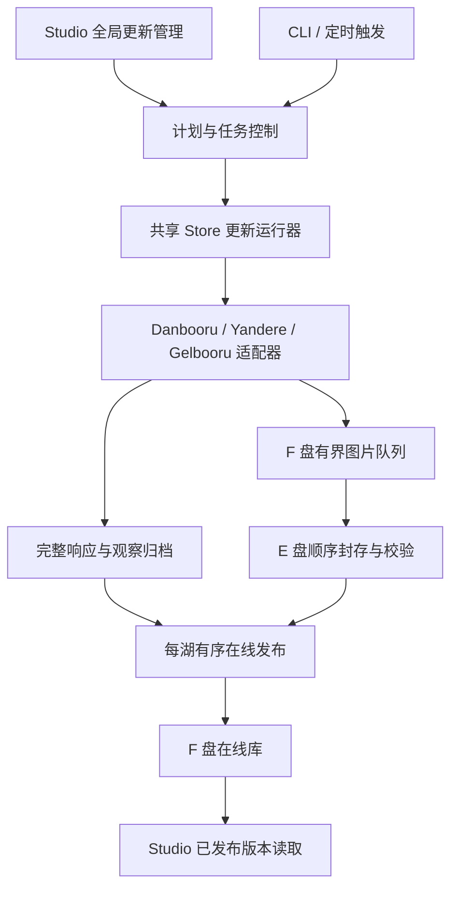

# 三站数据湖增量补全与更新管理

日期：2026-09-26，更新于 2026-09-27。状态：后端已交付，[前端工作台与范围准备](../verification/2026-09-27-lake-updates-ui.md)已接入，设计依据见 [UI / UX 规划](lake-updates-ui-ux-2026-09-27.md)。原始核对基线：Studio `f39fd14`、Danbooru-Store `47b4355`；后端交付提交：Studio `31b5dc7`、Store `991613b`。承接[架构升级计划](数据库架构审查升级-2026-09-26/README.md)与 [ADR 0037](../decisions/0037-versioned-online-lakes.md)。实现决策见 [ADR 0038](../decisions/0038-lake-update-control.md)，验证范围见[后端验收](../verification/2026-09-27-lake-updates-backend.md)。

目标：用户在 Studio 中选择数据湖、范围、内容和执行时间；后台可暂停、恢复、补抓，前台继续读取已发布版本。所有项目共享同一湖的更新成果。完整保留抓到的原始元数据，准确区分已覆盖范围、媒体缺口与仍未验证的能力。

已确认偏好：图片保存设计为可选策略，默认值稍后决定。已有三湖和热更新协议继续使用，不需要再次全湖迁移。

实施顺序已确认：先完成后端及其验收，再单独设计前端。后端交付包含任务控制接口、CLI/SDK、进度与错误契约、凭据管理、计划与周期触发、恢复和资源调度；不会把必须的操作能力留到前端开发时补做。现有页面方案仅表达功能需求，具体交互随后设计。

## 当前基础与需要抽离的部分

Store 已具备 API 原文归档、冻结计划、断点恢复、图片校验、资产复用、SSD 暂存预算、HDD 顺序封存和在线发布。当前 `daily.py` 支持新增、按 ID 刷新和补抓；`daily_state.py` 将批次归属与归档提交一起登记。应迁移并复用这些能力。

以下位置仍有 Danbooru 专属假设，不能把现有入口改个 URL 就用于另外两站：

| 位置（Store 仓库内）                    | 当前约束                                                              | P4 处理                                                              |
| --------------------------------------- | --------------------------------------------------------------------- | -------------------------------------------------------------------- |
| `ingest.py::api_get/fetch_api`          | 固定 posts.json、ID 分页和账号环境变量                                | 每站适配器负责请求、鉴权、分页和能力声明                             |
| `capture_api`、`metadata.py::normalize` | JSON 帖子形状与 Danbooru 字段绑定；api_json 优先级较高                | 按站点与格式版本选择解析器、normalizer；原文和观察身份保持可回放     |
| `daily.py::_plan_items/freeze_plan`     | 使用 native DuckDB、整批 fetchall、计划转内存列表；复用只匹配帖子/MD5 | 从在线版本有界读取，分块生成计划；图片复用还要检查保存策略和文件变体 |
| `candidate_image_urls`                  | 只认识 file_url、large_file_url                                       | 显式描述 original/sample/preview 等用途与校验依据                    |
| `daily.py` 各处 `Index.sync()`          | 图片计划和入库验收依赖生产者分析索引                                  | 在线发布与任务正确性不等待全库分析；native 分析独立补齐水位          |
| `.daily-run.lock` 与执行状态            | 同湖日任务串行；多站没有共享设备预算                                  | 共享运行器统一调度，保留每湖发布互斥和跨进程所有权                   |

Studio 已有共享来源位置登记和只读来源接口。新增更新控制端口，避免把网络抓取、凭据和写入逻辑塞入现有浏览适配器。数据湖默认读取行为不变，更新由显式创建的任务驱动。

## API 核对与证据边界

本轮只读小样本：每站匿名请求最多 2 条帖子元数据；另对 Yandere 做两次各 2 条的范围查询。没有下载图片或写入正式湖。

| 站点     | 当前可确认的能力                                                                                                    | 尚需验证                                                            |
| -------- | ------------------------------------------------------------------------------------------------------------------- | ------------------------------------------------------------------- |
| Danbooru | 本机 posts.json 返回 200；含原始字段与嵌套 media_asset；现有采集器使用 ID 游标                                      | 更新时间/版本/删除等发现途径的覆盖范围；账号可见性；分页边界和恢复  |
| Yandere  | 本机 post.json 返回 200，含 change、status、updated_at、原图及衍生图信息；ID 与 change 范围小样本均命中预期两条记录 | change 覆盖哪些字段；删除、held、可见性；高水位期间变化与深范围查询 |
| Gelbooru | 本机匿名 DAPI 请求返回 401；官方文档说明 api_key/user_id、cid 和删除列表入口                                        | 有凭据后验证响应、页限、ID/日期条件、cid 排序/边界、删除游标语义    |

官方资料：

- [Danbooru API 文档（官方 Safebooru 域名）](https://safebooru.donmai.us/wiki_pages/help:api)：长时间读取建议约 1 请求/秒，不把短时突发上限当持续抓取速率。
- [Danbooru 帖子模型](https://github.com/danbooru/danbooru/blob/master/app/models/post.rb)：帖子版本关注 tags/rating/source/parent 等属性，不能据此假定版本列表囊括所有动态字段。
- Moebooru 上游 [API 字段](https://github.com/moebooru/moebooru/blob/master/app/models/post/api_methods.rb)、[范围与排序](https://github.com/moebooru/moebooru/blob/master/app/models/post/sql_methods.rb)、[变更序号](https://github.com/moebooru/moebooru/blob/master/app/models/post/change_sequence_methods.rb)、[评分更新](https://github.com/moebooru/moebooru/blob/master/app/models/post/vote_methods.rb)。上游评分更新直接执行 SQL，没有推进 change 的路径，因此不能承诺单靠 change 就能发现全部评分变化；Yandere 实际部署仍须验证。
- [Gelbooru API](https://gelbooru.com/index.php?page=wiki&s=view&id=18780)、[搜索说明](https://gelbooru.com/index.php?page=wiki&s=view&id=26263)：cid 是可能重复的时间值；文档不足以证明无遗漏的变更流。

本机原始响应及摘要：`.local/reports/lake-updates-design-20260926/`，不随仓库分发。一次成功响应不证明长期稳定、全字段覆盖或整个站点可匿名完整读取。

## 用户操作模型

Studio 增加全局“数据湖 → 更新”入口。项目中的来源卡片可跳转到同一个入口，运行任务绑定 `library_id`，不依赖某个项目存活。

创建任务时分别选择三个维度：

| 维度     | 选项                                                                                             |
| -------- | ------------------------------------------------------------------------------------------------ |
| 数据范围 | 上次检查之后；帖子创建日期；站点支持的修改日期；ID 区间/列表；当前工作集或筛选结果；已登记的缺口 |
| 更新内容 | 仅元数据；元数据与缺图补齐；仅重试已有图片待办；显式获取另一种图片版本                           |
| 执行方式 | 立即；预约；保存为周期计划                                                                       |

日常预设建议组合“发现新增 + 发现旧帖变化 + 有预算的定期回看 + 重试缺图”。用户可以独立运行其中任一部分，修改评分不必重新下载图片。

范围与执行时间分开。例如“10 月 1 日执行，补 9 月 1–7 日创建的帖子”应保存两套时间。范围统一采用明确时区和左闭右开边界 `[start, end)`；适配器无法精确表达时，扩大远端候选范围再本地判定，并显示额外成本。

今天查询旧日期，只能得到今天可访问的帖子状态。`created_at`、远端 `updated_at/change`、本机 `observed_at`、入库时间分别保存，不伪造历史快照。工作集输入先固定来源版本及来源帖子身份；一张图对应多个帖子时保留全部目标关系。

任务页分别展示：发现数量、元数据归档/发布进度、待下载/已复用/已下载/已验收数量、不可用原因、重试时间、暂存量、吞吐和发布版本。候选总数尚未知时显示扫描进度，不以最大 ID 推算完成百分比。状态包括等待权限、等待空间、等待重试和暂停，避免统一显示为“失败”。

## 模块与所有权

建议端口边界如下，具体接口名在实现时按工程约定落定：

- **站点适配器**：能力探测、认证、请求构造、分页、远端变化发现、完整响应解析、版本化字段投影和媒体候选。声明日期过滤、变化游标、删除信号、批量 ID、标签分类等能力及验证状态。
- **计划器与覆盖记录**：冻结范围、账号可见性、能力版本和媒体策略；将工作拆成有界分片，追踪确实检查过的区间和未解决项。
- **共享执行器**：网络重试/限速、下载、处理、磁盘预算、暂停恢复和进度。Studio 通过版本化的结构化协议管理 Store worker，保持 Rust 领域层不依赖 Python 进程细节。
- **归档与发布器**：继续使用 canonical 对象、资产、观察、raw、journal 与 online v2；每湖顺序提交，共享设备协调 I/O。
- **全局控制存储**：Studio 保存计划定义、触发记录、任务引用和凭据引用；每湖归档日志保存可验收的任务/分片/批次事实，F 盘执行队列可以重建。不复制一套互相竞争的“是否完成”状态。

旧 Danbooru 任务、冻结计划及验收历史需要兼容读取和恢复。现有 CLI 和定时入口最终接入相同控制协议；不能让旧脚本绕过站点限流和全局 HDD 预算。同湖执行所有权须有操作系统锁与运行代次，过期 worker 不得继续提交。重复启动应显示已有任务或明确排队，不创建第二个相同范围的写入者。

关闭一个项目不会终止全局任务。界面关闭和 worker 生命周期明确分开；引擎或 worker 被终止时从持久检查点恢复。周期计划的触发不依赖大模型常驻，关机期间的漏跑策略明确记录；首版先交付手动任务再接定时触发。

凭据管理复用现有 Windows DPAPI 机制的边界，通过独立凭据端口供更新运行器使用，不依赖 LLM 业务模块。长期配置仅保存凭据引用；给 worker 的认证材料通过受控本机通道传递，不放进命令行参数、任务计划、响应日志或 API DTO 返回值。本机导入文件只作为配置输入，不能被当作公开任务产物。

## 覆盖、游标与完整性

不能用单一“最后更新 ID/时间”代表整个湖完整。至少分别保存：新增发现边界、变化发现位置、实际范围覆盖、媒体缺口，以及已有 `archive_seq/served_seq/analysis_seq`。后面三项是本地提交序号，不是远端帖子覆盖范围。

1. **发现新增**：冻结本轮候选上界，优先使用稳定主键范围/游标，避免在不断变化的页码上裸翻页。按身份去重，检查排序、越界、重复页面和无进展；只有有效响应完成归档才推进检查点。
2. **发现变化**：使用经验证的 change、更新时间或历史入口；相同时间戳需要稳定次序与重叠回看。远端没有快照读取保证时，只承诺指定可见范围的本轮检查与后续收敛，不声称抓到了每一次中间修改。
3. **定期回看**：近期帖子与用户重点范围高频刷新，较老范围按预算轮换。评分等未被变化流覆盖的字段必须通过回看更新；新近重新可见的低 ID 帖子也不能永久跳过。
4. **补历史缺口**：首次接管 Yandere/Gelbooru 时，记录 HF 已收录的基线及未验证区域。先接续最新增量，再分日期/ID 段对账；湖里有最大 ID 不证明之前全部存在，ID 不连续也不证明缺图。媒体缺失、元数据缺失、站点不可用分别记账。
5. **权限与删除**：401/403、空页、暂时找不到帖子不自动等价于已删除。账号可见范围变化会影响覆盖解释。只有明确删除证据才更新删除状态；本地旧图和历史观察仍保留。

每个覆盖分片记录范围、边界条件、来源/账号可见性、请求证据、时间、完成状态和例外。预算用尽只暂停分片，不标记整段完成。已验证媒体或明确例外才能完成媒体覆盖；可重试失败不能冒充例外来跳过缺口。

## 元数据与图片

**原始响应、帖子观察和查询投影分开保存。** 请求身份、脱敏参数、端点、状态、时间、响应摘要和完整正文均可追溯。未知字段、嵌套数据、字段原始类型、精度和 schema 版本保留；错误正文也归档，但不成为帖子状态。凭据不写入 URL 日志或归档请求参数。

每站 normalizer 映射 tags、rating、尺寸、时间和删除状态等，不能沿用 Danbooru 同名字段假设。Yandere/Gelbooru 的标签类别可能需要标签接口补充，类别未知不等于没有该类标签。完整保留所有实际获取的字段，同时登记各端点的采集范围；“帖子 API 原文完整”不等价于已采集站点全部评论、注释、作者说明和历史。关联资源可作为独立可选采集项接入同一任务协议。

HF 原始记录与后续 API 观察并存。旧 HF 存在而新响应缺失的字段，不被从历史中删除，也不能无标记地拼成一条虚假的完整新快照。已知旧值若在界面辅助展示，必须标出来源和观察时间。解析失败或格式改变保留原文和待解析状态；修复 normalizer 后可本地重放，不强制重抓全部数据。

图片保存策略首版提供原字节和现有 WebP 策略，默认值待定；策略 ID、版本、尺寸、质量和处理版本写入任务，续跑不随全局设置变化。变更默认策略不自动重编码已有三湖。

复用判断基于站点、帖子、远端媒体身份及目标保存策略。仅 MD5 相同不足以证明现有缩图满足“原图”任务。HF WebP 的 SHA-256 与源站原图 MD5 不混用；缺少可信远端媒体身份时不得仅凭帖子 ID 推断原图未变。

同帖换图或显式补另一种版本，追加新对象/资产并保留旧对象。原图失败时是否允许衍生图替代是单独策略；替代成功不冒充原图完成。视频、动图及未知媒体保留元数据并明确标记支持范围，不能静默取第一帧当作原件。媒体任务去重后可供多个元数据任务引用，避免同一版本重复下载。

## 热更新与 I/O

元数据和图片按批发布。元数据完成后可先发布，图片未就绪的帖子在更新页显示待办；图片补齐后再发布新资产。现有图库按可浏览图片工作，不为海量未下载帖子塞满空卡片；同帖换图时新元数据不得错配到旧图。

网络等待、图片处理和大包复制均在数据库写事务外。已归档批次可重复投影，在线发布失败时重放归档；归档或完整性失败时不推进对应完成水位。取消停止领取新工作，在安全提交边界暂停，已发布批次继续有效。用户原有浏览和固定成果保持其版本，新打开视图使用新版本，更新提示由用户选择刷新。

三站可同时进行有节制的网络请求，共享下载字节、内存解码/编码和 F 盘暂存预算。三湖最终写同一 E 盘时，由同一设备调度器安排封存、写后顺序校验与离线维护，优先保障交互读取；不能各开一组不受协调的大流量写入。空间不足时在达到保留水位前暂停新下载，保留检查点。

发布由记录数、字节数或等待时间触发，首轮小样本测量后定批次参数，避免为每张图片单独封包，也避免整日任务全部结束才可见。下载状态频繁变化留在 F 盘队列，E 盘只写必要的持久批次和验收依据。native DuckDB 分析、在线 WAL checkpoint/历史回收也纳入后台预算，普通浏览不等待分析水位追平。

原始归档、已发布数据、任务恢复依据长期保留；临时下载/处理产物按已验收状态和期限清理。重复原文可以按摘要共享存储，但保留每次请求与观察的记录。先测量观察历史和写放大，再决定进一步压缩；不以覆盖旧元数据控制体积。

## 推进顺序与验收

| 步骤                | 交付                                                                                 | 通过条件                                                                  |
| ------------------- | ------------------------------------------------------------------------------------ | ------------------------------------------------------------------------- |
| P4-A 能力与基线     | 三站适配器契约、匿名/鉴权样本、字段差异、范围与分页验证、HF 接管覆盖策略             | 凭据保密；限制和未知能力显式记录；不能支持的条件不静默退化为“零结果”      |
| P4-B 更新闭环       | 共享运行器、持久计划/分片/缺口、图片策略、元数据与媒体独立发布、旧 Danbooru 任务兼容 | 三站隔离湖完成采集→归档→在线发布→读取；崩溃/重放/续跑不丢记录或越过缺口   |
| P4-C 后端接入与验收 | 全局任务 HTTP/CLI/SDK、凭据接口、进度与错误契约、周期计划、正式小批次与 I/O 调优     | 无需新前端即可操作与验收；三湖后台更新与读取并发；手动/定时恢复走同一路径 |
| P4-D 前端设计与接入 | 基于已验收后端设计全局数据湖页、范围/策略选择、预估、暂停/重试、更新提示             | 跨项目共享任务；进度和部分完成状态准确；项目关闭不影响任务生命周期        |

后端准备分工：用户准备 Gelbooru 的 user_id/API Key，有 Danbooru 账号/API Key 时可一并提供本机配置路径；Yandere 先验证匿名能力，若遇到必须登录的范围再按实际需要配置。实现方负责三站能力核实、样本与范围选择、隔离湖、恢复/并发验收及代码交付。当前没有依赖用户选择才能开发的阻塞项。图片默认值、前端布局和日常定时时刻稍后确定，后端通过显式策略与可配置计划支持这些选择。

各阶段内将互相依赖的存储、调度、协议一起完成再统一验收。首个端到端闭环优先使用已有 Danbooru 流程，同时以 Yandere/Gelbooru 固件验证抽象，不等 Danbooru 全部定型后才验证另两站。Gelbooru 的正式运行依赖可用 API 凭据，不能由匿名 401 推断实现已接通。

必测：新增、旧帖改标签/评分、同帖换图、同图多帖、无图元数据、未知/缺失字段、同时间戳跨页、页面不前进、抓取期间远端变化、401/429/5xx、URL 过期、校验失败、磁盘满、任意阶段停止/重启、旧计划恢复、双入口竞争、原图与衍生图策略、版本租约与回收。

正式湖试跑前先用隔离目录和录制响应完成故障矩阵；正式小批次固定并记录执行范围，核对源库身份和发布结果后再扩大范围。性能验收对照更新前后同一组查询，报告 p50/p95/p99、首图、取消延迟、队列等待、HDD 吞吐和 WAL/暂存/历史增长。普通已热查询沿用 p95 200 ms 的目标作为测量门槛；冷 HDD 原图和复杂全量分析分别报告，不用热缓存成绩替代。

2026-09-27：已完成 P4-A/B/C 的后端、HTTP/SDK、单次预约与周期计划、固定输入及三湖正式小批次验收。原图与 WebP 策略可选，保留旧图与升级版本独立控制。控制状态使用 `F:\Dataset\.lake-updates`，新周期计划尚未启用。原有 Danbooru 自动化配置保留。P4-D 已接入全局工作台、手动更新、计划及项目范围准备，见[前端验收](../verification/2026-09-27-lake-updates-ui.md)。

实现边界：修改日期按当前 API 的最后修改时间解释；缺少远端日期条件时按有界 ID 扫描，不能将预算用尽当完成。Gelbooru 独立删除事件流未启用，未返回保持未知。当前验证覆盖小批次并发和恢复，不外推全天连续抓取性能。
