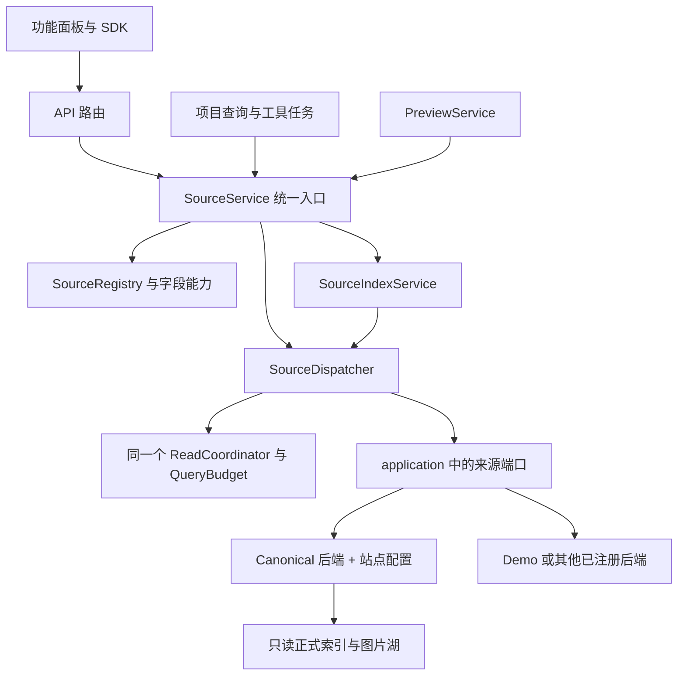

# Yandere / Gelbooru 数据湖接入计划

日期：2026-09-26。状态：**代码已接入，工程/集成/界面与正式湖有界验收通过；用户将在新项目中自行登记**。Studio 源码基线：`f232141a94aab417d8ad5ecbbc67d134141a229f`。

目标是在已完成统一架构转换的基础上，让 Studio 正确识别和使用两个新湖。复用现有的 SQLite / DuckDB / TAR 读取协议，以站点配置表达元数据差异；无需再次转换、复制或解包图片。

实现顺序调整为：先形成可复用的来源模块边界和统一调用入口，再通过注册站点配置接入 Yandere / Gelbooru。优先在现有 crate 内抽离职责，沿用已有端口和资源协调器；本轮不引入动态插件系统或新的全局任务框架。

## 1. 当前证据与接入边界

初版规划已完成源码检查和有界只读探测：核对两个湖的 `library.json`、`CURRENT.json`、`cache_owner.json`、转换来源清单、索引水位、表结构、原始 Arrow schema，并各读取 3 个真实资产及其元数据、校验图片 SHA-256。两湖均通过，所检查的目录标识与索引文件的大小和修改时间未变化。这证明底层协议具备复用条件，**不等于 Studio 新站点接口、UI 或性能已经验收**。此次模块化补充检查来源端口、具体调用点、缓存构建和资源调度代码，未重新扫描数据湖。

此前完成审计中的全量规模如下；本次未重新执行全湖计数或完整性扫描：

| 来源     | 原始元数据行 / 观察 | 图片关联记录 | 唯一图片对象 | 无图片的元数据记录 |
| -------- | ------------------: | -----------: | -----------: | -----------------: |
| Yandere  |           1,249,650 |    1,154,585 |    1,154,033 |             95,065 |
| Gelbooru |           3,784,478 |    3,784,478 |    3,773,838 |                  0 |

本机正式位置如下，不写死进产品代码：

| 来源     | 快速索引目录          | 图片湖目录                  | library_id / 当前 seq                        |
| -------- | --------------------- | --------------------------- | -------------------------------------------- |
| Yandere  | `F:\Dataset\Yandere`  | `E:\AI\AI_Dataset\Yandere`  | `eda9806c-0e41-4558-9ff2-2d584ca4edc2` / 143 |
| Gelbooru | `F:\Dataset\Gelbooru` | `E:\AI\AI_Dataset\Gelbooru` | `c5552b1b-f753-431a-b440-4d04c29a3b74` / 250 |

接入只依赖正式湖与正式索引。`.migration`、`hf_conversion`、原始 HF TAR 以及启动转换的脚本均不成为 Studio 运行依赖。

## 2. 已确认需要修改的位置

| 链路           | 当前实现                                                                                                              | 接入工作                                                                        |
| -------------- | --------------------------------------------------------------------------------------------------------------------- | ------------------------------------------------------------------------------- |
| 物理读取       | `studio-sources/src/danbooru.rs` 实际检查的是通用湖格式、library_id、索引版本，并按 pack/offset/length 读取和校验 SHA | 提取为通用 canonical lake reader，保留现有有界批量读取和版本校验                |
| 来源路由       | `studio-sources/src/lib.rs` 仅允许 demo / danbooru                                                                    | 登记三个站点，集中决定适配器和能力                                              |
| 添加与重新关联 | `studio-engine/src/api.rs`、`api/source_locations.rs`、`ProjectDialog.tsx`                                            | 增加预检和识别，保留同一 library_id 的重新关联约束                              |
| 查询与派生索引 | `query/{mod,fields,compiler}.rs`、`query_jobs.rs`、`api/scoped_browse.rs`                                             | 将通用湖路径上的类型判断改为能力判断；覆盖身份、帖子排序、Rating 缓存和查询恢复 |
| 元数据         | `metadata.rs` 的固定字段目录与 Danbooru 命名空间；原始 JSON 已有按观察读取入口                                        | 分离公共字段和站点字段，保留完整 raw 与 schema 身份，展示缺失和规范化问题       |
| 前端           | `QueryPanel`、`QuickFilters`、`Browser`、`MetadataInspector`、`CacheManagerPage`                                      | 来源列表、筛选、排序名称、元数据及缓存管理一起开放                              |
| 工具           | `ranking.rs`、`tool_inputs.rs` 对 Danbooru 有限制；美学创建也有 Danbooru 分支                                         | 保留 MetaRecall 的站点限制；通用工具和美学版本冻结改用明确能力                  |

另发现标签语义存在三处接入阻碍，必须一起解决：

1. `studio-sources/src/metadata.rs` 用 `split_whitespace()` 生成标签数组。
2. `studio-domain/src/query.rs` 拒绝标签值中的任意空白和控制字符。
3. `packages/ui/src/filters.tsx` 用 `/[\s,，]+/u` 分割输入。

转换器与查询 SQL 按 **U+0020 普通空格**分隔标签。Gelbooru 已有 49 条包含其他空白的记录；本次重新读取帖子 `5201025`，确认 `yaoi\u3000translated` 是一个原始标签，按 Unicode 空白切分会改变其身份。因此不能只增加两个下拉选项或统一替换所有 `kind == "danbooru"`。

### 2.1 可以沿用的模块基础

| 已有基础与源码                                                                                                         | 已有职责                                                                        | 抽离时需要补齐的边界                                                                      |
| ---------------------------------------------------------------------------------------------------------------------- | ------------------------------------------------------------------------------- | ----------------------------------------------------------------------------------------- |
| [application 来源端口](../../crates/studio-application/src/lib.rs)：`SourceAdapter`、`MetadataAdapter`、`QueryAdapter` | 来源探测/浏览/冻结、元数据、有界查询输出                                        | 接口已存在，但引擎仍直接创建具体 Reader；查询的 keys/delta/explain 等扩展尚未纳入统一端口 |
| [媒体与资源端口](../../crates/studio-application/src/resources.rs)：`MediaSource`、`ReadResources`                     | 内容身份、受字节预算限制的批读、资源租约                                        | 消除 `SourceAdapter.read` 与媒体读取的双路径；所有调用携带相同的读取上下文                |
| [ReadCoordinator](../../crates/studio-resources/src/scheduler.rs)                                                      | Index / Media / Decode / NativeQuery 分资源准入、字节预算、优先级、公平性、取消 | 保持同一实例；统一操作预算归属，避免调用方和新服务各取一次相同资源租约                    |
| [PreviewService](../../crates/studio-engine/src/previews.rs)                                                           | 预览订阅共享、优先级提升、缓存及取消、批读                                      | 注入来源服务，去掉对静态 `SourceRouter` 的依赖；预览逻辑与来源载荷读取分别维护            |
| [QueryRunner](../../crates/studio-engine/src/query_jobs.rs)                                                            | 项目查询任务、成员暂存/发布，同时管理来源排序/身份/Rating 索引构建              | 拆出应用级来源索引服务；项目成员发布、查询引用和恢复仍由项目查询模块负责                  |
| [QueryBudget](../../crates/studio-engine/src/query_budget.rs)                                                          | 一次重查询的不可变内存预算快照，与 NativeQuery 资源额度联动                     | 对查询和索引构建共用；不按站点复制预算对象                                                |
| [来源位置仓储](../../crates/studio-storage/src/source_locations.rs)                                                    | 多项目共享位置与重新关联持久化                                                  | 继续只负责持久化；识别、能力与路径验证由来源服务负责                                      |
| [算子端口与注册](../../crates/studio-application/src/tools.rs)                                                         | 参数/版本、所需冻结字段与纯计算                                                 | 补充输入需求判定，避免把某个算子的专属数据要求写进通用湖协议                              |

当前具体 Reader 的构造还出现在 `tool_inputs.rs`、`jobs.rs`、`aesthetic/creation.rs` 和 `ranking.rs`；媒体读取出现在 `previews.rs` 与 `aesthetic/media.rs`。迁移清单必须覆盖这些后台路径，不能只调整 HTTP 添加来源的入口。上述结论来自定向调用链审查，不是全仓库逐文件审计。

## 3. 模块边界与统一接口

本节保留实施设计及职责边界。接口与模块已落地，实际路径和生命周期决定见 [ADR 0035](../decisions/0035-source-registry-and-dispatch.md)；验收条件与数据见[验收记录](../verification/2026-09-26-multibooru.md)。辅助函数继续留在对应实现内。

### 3.1 分开存储格式、站点语义和来源实例

来源描述拆为三个维度：

- **存储后端**：`backend_id = canonical_lake_v1`，说明如何读取 catalog / analysis / TAR，以及支持哪些版本、分页和变更检测。
- **站点配置**：`site_id = danbooru | yandere | gelbooru`，加可解释的字段/投影语义版本，说明字段来源、标签和 Rating 口径、缺失值与工具适用性。
- **来源实例**：`source_id = library_id`，绑定一个具体湖及本机位置；同站点可有多个独立湖。

保留现有 `Source.kind` 作为兼容字段，通过集中注册表映射到以上描述；首轮不迁移已有项目中的 Source JSON。`observations.source_kind = hf_yandere_v1 / hf_gelbooru_v1` 则是采集/规范化来源标识，不能与存储后端或 UI 类型混为一谈。未来同一站点切换存储后端时，应通过显式兼容映射或版本迁移处理。

统一层仍使用 `AssetKey { source_id, asset_id }`。64 位 SHA、TAR 相对路径、generation 目录等约束由 canonical 后端执行，不成为所有未来适配器的强制身份格式；现有三个湖继续严格使用 SHA-256。

### 3.2 首轮抽离清单

以下路径均相对仓库根目录；目录是建议落点，可按实现体量合并文件，但必须保留职责边界。

| 模块                 | 建议落点                                                                         | 统一职责与接口                                                                                               | 明确保留在其他模块的内容                                   |
| -------------------- | -------------------------------------------------------------------------------- | ------------------------------------------------------------------------------------------------------------ | ---------------------------------------------------------- |
| 来源契约与注册       | `studio-domain::sources`、`studio-application::sources`                          | `SourceDescriptor`、能力/字段目录、修订信息、读取上下文；整理已有小端口；`SourceRegistry` 解析注册项         | 不打开数据库、不依赖 HTTP / Tauri、不硬编码本机位置        |
| 存储后端             | `crates/studio-sources/src/backends/canonical/`                                  | 从 `danbooru.rs`、`duckdb.rs` 和 reader 提取目录、媒体、读取会话、查询执行、变更检测；三站点复用             | 不决定工具是否有统计意义，不管理项目成员和用户选择         |
| 站点与字段配置       | `crates/studio-sources/src/profiles/`                                            | 公共 Booru 字段加 Danbooru/Yandere/Gelbooru 配置；同一字段说明驱动显示、验证与后端绑定                       | 不调度任务、不访问网络、不再次修改已归一化的数据           |
| 来源统一入口         | `crates/studio-engine/src/sources/{service,dispatch}.rs`                         | `SourceService` / `SourceDispatcher`：解析来源、能力判定、准备依赖、预算准入、调用端口、统一错误/指标        | 不暴露 SQL、SQLite/DuckDB 连接或具体 Reader 给调用方       |
| 来源派生索引         | `crates/studio-engine/src/source_indexes/` 加 canonical 后端的 builder           | `SourceIndexService` 管理身份、帖子排序、Rating 候选索引的准备/复用/取消/状态/清理；builder 负责各自构建算法 | 项目查询结果、排名范围索引、工作集和成果不迁入此服务       |
| 媒体变换与预览       | `crates/studio-resources/src/media_transform.rs`；沿用 `studio-engine::previews` | `MediaSource` 读取原始载荷；媒体变换模块处理 thumbnail；PreviewService 维护订阅和渲染缓存                    | 原湖适配器不负责编码 UI 缩略图；LLM 图片组装仍属于评审模块 |
| 工具输入适用性与投影 | `studio-application::tools` / `aesthetic`，后端的命名投影实现                    | `SourceRequirements` + 有界字段投影；统一解释缺少的能力/语义；工具消费冻结证据                               | MetaRecall 公式和美学分组政策不进入通用 Catalog            |
| SDK 与前端来源模型   | `packages/client/src/sources.ts`、前端来源功能模块                               | 来源探测、能力、添加/重连、状态的统一客户端入口；共享 UI 能力判断                                            | 功能面板不自己维护站点白名单、不自行访问文件系统或拼接 SQL |

`SourceService` 首轮作为引擎中的独立服务，方便与现有 Tokio 执行、项目关联检查和任务恢复组合；其调用端口和纯规则放在 application/domain。基础设施实现仍依赖 application 端口，application 不反向依赖 `studio-sources`、`studio-resources` 或 `studio-engine`。无需为每一行新建 crate；有独立消费方或明显依赖隔离需求后再拆包。

### 3.3 调用关系与装配

图表示运行时调用，源码依赖仍遵循端口倒置。`main.rs` 是生产装配入口：创建一份注册表、来源服务、来源索引服务和现有协调器，再注入预览、查询、工具与评审。业务路径不再调用 `SourceRouter` 静态入口或自行 `QueryReader::default()`。CLI 诊断复用同一装配方法，可使用单独的受控配置；测试通过端口注入 fixture。

旧入口在迁移中可短暂作为委托包装，避免一次更改所有签名；最终不能残留绕开预算、能力检查和版本检查的第二套生产读取路径。

### 3.4 接口按读取能力拆分

| 能力面         | 接口范围                                                                                        | 数据量与失败边界                                                         |
| -------------- | ----------------------------------------------------------------------------------------------- | ------------------------------------------------------------------------ |
| 来源发现/浏览  | 扩展 `SourceAdapter` 的 probe、page、freeze，包含受支持排序；媒体 read 逐步委托到 `MediaSource` | 预检不构建全量索引；列表使用有界 keyset 分页                             |
| 媒体           | 沿用 `MediaSource` 的内容版本、身份验证、read_many                                              | 保留逐项字节上限、每批 16 项 / 64 MiB、逐项错误与原逻辑顺序              |
| 元数据         | 沿用 `MetadataAdapter` 的摘要、记录、观察、raw；增加 schema / issues 的有界接口                 | 保留原始类型和来源证据、长度上限、缺失/不支持/离线的区别                 |
| 查询           | `QueryAdapter` 纳入当前正在使用的完整执行、指定键集合执行、可选增量、可选 explain               | 输出使用现有批次 sink；输入候选也分批传递。返回受控诊断而非开放 SQL 入口 |
| 字段投影       | 对工具所需元数据提供带版本和记录/观察关联的有界投影                                             | 公共投影只暴露已定义的字段和关联规则；站点专属投影显式命名和版本化       |
| 变更与派生数据 | 后端声明是否支持变更 token；索引服务提供 ensure/status/read-handle/release 等生命周期操作       | token 对上层不透明；不支持增量时走受预算限制的全量构建，不返回伪空增量   |

注册项把能力描述与实际端口一并提供；只有声明并实现的能力才对外开放。存储协议支持什么、此来源字段实际提供什么、来源当前是否在线分别表达。不能因为数据库存在某列就判定该站点提供该字段，也不能把暂时离线视为永久不支持。

`FieldDirectory` 作为公共字段契约继续使用。后端内部保存列名/JSON 路径等绑定；对外字段只暴露语义、类型、操作符、观察规则、成本类别和证据来源。元数据面板、查询验证和工具需求引用同一字段 ID，减少当前 `metadata.rs::FIELDS`、`query/fields.rs`、compiler 和前端中文映射之间的重复维护。

已有元数据字段名与查询字段名不完全一致，例如 `danbooru.score` 与 `score`；统一的是内部字段定义，对外保留兼容别名和映射，不通过原地改名破坏旧查询、成果或客户端。新字段采用确定的命名与语义版本。

### 3.5 统一版本与读取上下文

新增共用的读取上下文，包含请求 ID、取消信号、优先级、截止时间、期望来源版本和已分配的资源预算。预算由调度层决定，调用方只能提出上限或需求；该上下文不携带连接、SQL 或传输 DTO。

版本信息分层表达：

- 来源身份与数据修订：canonical 的 generation、catalog seq、需要元数据时的 analysis seq，以及必要的连续提交锚点。元数据/排序/查询复用同一套比较和错误规则。
- 字段/投影语义版本：改变标签分词、字段含义或关联规则时，使受影响的派生索引、查询计划和结果依赖正确失效。
- 内容版本与渲染版本：图片 SHA 或后端内容版本、缩略图编码参数等。仅有新观察或位置变化时，不无故丢弃内容未变的预览。
- 本机位置修订：影响句柄与可用性，不替代逻辑来源身份；重新关联不改写 AssetKey。

后端内部复用 `Catalog` / `ReadSession` 的打开、起始水位检查和结束检查。数据库连接仅属于当前受控操作，不跨 HTTP 分页或任意线程共享。跨页通过版本 token 校验；匹配水位和结束检查不宣称获得历史快照。

首轮保留已公开 token 和已保存查询的兼容读取，内部转换到共用版本表示；确需改变 token 语义时明确升级协议。查询根据实际依赖比较版本，继续遵守 [ADR 0021](../decisions/0021-fixed-query-dependencies-and-cache-inventory.md)：只依赖固定项目成果的查询不因为湖水位改变就重算。

### 3.6 统一调度与资源归属

一次来源操作采用以下顺序：验证项目引用/来源登记 → 解析已登记的能力与字段 → 判定所需派生索引 → 如需构建则返回准备状态或等待其完成 → 进入有界执行队列 → 获取资源预算 → 在预算内打开读取会话、复验身份并执行 → 结束版本检查 → 返回分页结果或向暂存 sink 交付批次。需要首次识别或刷新描述时，探测本身先作为受 Index 预算限制的小操作执行；不能把预检 I/O 放到准入之前。项目结果仍由项目模块在验证通过后原子发布。

调度设计遵循以下规则：

1. **复用一个协调器。** Index / NativeQuery / Media / Decode 分类别排队；查询、原图、预览与美学读取都使用同一资源入口。保留当前交互/后台/预取优先级和公平性策略，不按站点复制四套预算。
2. **每个操作只有一个准入所有者。** `SourceDispatcher` 管来源 I/O 准入；项目查询自身的暂存内存纳入同一次重查询预算分配。低层适配器只遵守已分配额度，不重新申请同类全额租约。现有 API、PreviewService、ranking 和 aesthetic 中的外层 acquire 随调用迁移一起梳理。
3. **先完成依赖，再持有主执行资源。** 不能持有唯一重查询槽位后，再排队等待同样需要该槽位的索引构建。复杂操作拆成显式阶段，执行前固定内存分配；同一操作内部的子步骤从现有预算划分，不叠加假额度。
4. **同一物理盘共用约束。** 当前三个湖在同一 E 盘，沿用全局 Media 并发 1；QueryBudget 保留一次重查询快照，NativeQuery 继续给小型元数据读取留容量。来源描述可以携带宿主内部的 I/O 资源组提示，首轮使用保守共享分组；自动识别设备、跨独立磁盘提高并发作为测量后的扩展。
5. **构建按完整任务身份合并。** 来源索引构建键包含来源、索引类型/参数、目标修订及构建语义版本。多个项目复用同一准备任务。实际实现将身份/排序 prepare 作为应用持有的基础设施构建，短暂 HTTP 轮询结束不取消构建；引擎停止取消任务，Rating 显式预构建保留取消入口。预览仍按最后订阅者取消。该生命周期决定见 ADR 0035。
6. **取消与截止时间贯穿底层。** 排队、原生查询、媒体分块读取、结束校验都检查同一取消/截止时间；DuckDB 中断和原有分块 I/O 检查保留。取消不能仅让 HTTP 返回而后台无限工作；已进入不可中断的单次解码仍明确其边界。
7. **队列和任务记录有界。** 已有 32/64 等来源准备上限在集中后形成统一可检查的额度，工作在线程启动前入队，避免为每个来源先启动一个等待线程；失败/取消记录有回收规则。
8. **统一可观测性。** 保留每个资源类别的 active/queued/bytes，补充操作类型、来源、构建复用、等待/执行/取消耗时。包打开/seek/实际媒体字节仍由适配器计量，轨迹保持有界，不能把 SQLite 内部读取量当成已测到的媒体字节。

预览已实现的请求共享、离线缓存、渲染键与最后订阅者取消继续保留。来源统一入口必须允许预览服务在确认为路径不可用时使用此前验证过的缓存；身份不符、对象不存在、格式错误仍不可由离线命中掩盖。媒体物理读取完成后释放 I/O 租约，再进入解码阶段；仍驻留的缓冲区计入其实际阶段预算。

### 3.7 来源索引服务与缓存边界

`SourceIndexService` 从 `QueryRunner` 抽出来源级排序、身份和 Rating 构建。统一提供 `missing / preparing / ready / failed` 状态、订阅、预算、目标版本校验、pin 和安全清理；具体 builder 保留当前各自的增量规则和文件结构。优先通过包装现有实现接入，避免首轮同时重写三套构建算法。

| 缓存种类                         | 身份与失效依据                                                                                    | 所有者                                            |
| -------------------------------- | ------------------------------------------------------------------------------------------------- | ------------------------------------------------- |
| 正式 catalog / analysis / 图片包 | 湖的 library_id、generation、水位                                                                 | Danbooru-Store；Studio 只读，不纳入应用可删除缓存 |
| 身份、帖子排序、Rating 候选      | 来源 ID、索引类型/参数、索引格式/投影语义版本；数据修订作为有效性和增量锚点，构建任务另带目标修订 | 应用级来源索引服务，多项目复用                    |
| 查询成员、固定范围排名索引       | 项目、范围/成员版本、成果与查询的实际依赖                                                         | 项目查询/排名模块；不改成仅凭 source_id 共用      |
| 预览                             | 现有来源/资产身份、内容版本和渲染参数                                                             | PreviewService / PreviewCache                     |

数据修订改变不要求每次生成一个永久新目录；保留当前可验证增量路径与原子发布。读取句柄固定其版本并持有 pin，构建成功且目标仍有效时才发布；旧任务完成不能覆盖较新的版本。缺少连续历史时重建，中断保留旧完整版本。

管理界面可以统一展示这几类缓存，清理规则仍按所有权执行。位置、占用统计、任务队列与具体索引算法分开，使后续配置 F 盘派生缓存根目录不必更换湖身份或改写项目成员。

### 3.8 站点配置与工具政策的边界

站点配置集中维护公共字段扩展、类型、缺失说明、标签编码规则、来源链接和显示名称。canonical 读取已经转换好的规范化字段；本轮不能在 Studio 中再次执行 Rating 映射、猜测时区或重写原始数据。HF 原始字段的解释由来源格式/投影版本确定，不能只按站点名称处理未来所有 API 记录。

`MetadataReader::aesthetic_groups` 当前同时包含数据库读取与“原始关联 Rating 一致、最早帖子年份”等业务规则。应把规则定义、版本和冲突处置归入 application 的美学模块，后端仅提供带关联证据的投影。性能需要时仍可按该明确规格用 SQL 下推聚合，并通过同一夹具与规则实现对照，避免为了分层把全湖观察搬进内存。

`RankingReader` 的 Danbooru 专属批量投影保留为显式 `danbooru_ranking_v1/v2` 能力；公式仍在算子模块。以 `SourceRequirements` 统一判定所需字段、观察规则、站点/投影语义和覆盖要求，返回逐来源的可用性理由。通用 capabilities 不增加一个永久绑定算子名称的总开关；MetaRecall 是否可用由其需求与来源事实匹配得到，记录级缺失仍由原算法准入规则处理。

### 3.9 扩展方式与首轮范围

- **再接一个同格式站点**：登记站点配置、字段绑定及语义夹具；共用媒体、查询、缓存和调度。普通来源功能页无需增加站点判断。
- **接不同存储格式**：实现实际支持的来源端口并登记后端；不要求实现帖子/Rating/Tag/增量等不存在的能力。本轮只用一个能力受限的测试 provider 验证边界，不开发真实新格式适配器。
- **增加工具**：声明所需能力与字段投影，复用冻结/准入/调度；不在 Catalog 中添加工具分支。
- **增加更新能力**：以后单独提供更新/写入端口与任务；只读来源接口、每日更新编排和 Danbooru-Store 的写入所有权保持分离，本轮不接入下载器。
- **延后项目**：动态插件加载、通用任意 SQL、所有缓存共用一种文件格式、设备自动调优、全部服务拆成独立 crate。当前的模块与端口应足以支持这些后续选择，不提前实现它们。

## 4. 接入实施决定

### 4.1 共用存储读取，分别登记站点

- 保留旧来源的 `kind: "danbooru"`，新增 `yandere`、`gelbooru`，三个值映射到同一个 canonical lake reader。`demo` 保持独立。
- `Source.id` 继续等于 `library_id`；`AssetKey` 继续由 `source_id + SHA-256` 构成。帖子和观察分别保留身份。相同帖子数字、相同文件名或跨湖相同 SHA 均不触发项目成员合并。
- 将能力定义集中在 domain/application 可用的类型中，由来源实现解析并通过版本化 DTO 返回。至少区分媒体读取、元数据、查询、帖子排序和重新关联；字段支持与操作符由字段目录说明，MetaRecall 的适用性由工具需求判定，遵循第 3 节的边界。
- 前端消费能力和字段目录，后端在实际操作时独立校验，避免靠 UI 控制作为限制。
- 不为了统一名称改写已保存的 Danbooru 来源、工作集、查询、任务或成果 ID。现有 Source 以 JSON 和字符串类型持久化，新增站点本身预计不需要搬迁项目数据；实现时复核新 DTO 的默认值和旧记录反序列化。

### 4.2 添加前只读预检，提交时复验

增加不登记项目、不构建大索引的来源预检入口。输入索引目录和图片湖目录，返回识别站点、library_id、存储版本、索引版本、水位、能力和可用性问题；提交添加和重新关联时再验证一次。

`library.json` 目前只声明通用存储格式，**没有站点字段**。本次两个湖可从正式目录的 `source_manifests/hf-conversion-plan.json` 读取 `site`、`normalizer`、`source_key`，并用有界的索引信息交叉检查。不能从目录名猜站点，也不能把任意符合存储格式的湖都默认称为 Danbooru。旧 Danbooru 无 HF 清单时保持既有显式登记路径；已识别站点与用户选择冲突时拒绝登记，未知或矛盾证据明确报告。

预检必须保留现有路径包含关系、库身份、格式和版本检查，并验证 catalog / analysis 水位一致。按 library_id、generation、seq 缓存识别结果；刷新或版本变化时失效。不得为识别站点扫描几百万条观察或读取图片包。

### 4.3 第一轮完成日常使用的完整链路

首轮交付同时包含：添加和重连、来源可用性、缩略图和原图、身份摘要、帖子 ID 排序、有界分页、Rating/Tag 查询、通用字段过滤、保存查询、选择和工作集、原始元数据检查、缓存管理及重启恢复。

- 浏览数量仍按唯一存储对象计；Gelbooru 同图多帖子通过元数据记录分页查看。查询条件必须在同一条符合规则的观察上同时成立，不能从一个帖子取 Rating、另一个帖子取 Tag 拼成匹配。
- Yandere 的 95,065 条缺图元数据继续保存在湖内，不制造空白图片卡片。接入信息解释“可浏览图片数”与“元数据记录数”的差异。独立浏览所有无图帖子属于后续元数据检索功能，不混入首轮图片浏览 API。
- 公共排序名称改为“帖子 ID 升序 / 降序”。跨站点范围按数字排序时明确它不是时间顺序，保留 `source_id + asset_id` 的稳定并列规则；跨站点可选择图片身份顺序，实际实现延续工作区当前选择，不强制重置已保存顺序。
- 注册时不自动运行全量查询，也不预热全部图片；身份与排序派生索引通过现有准备中状态按需建立。

### 4.4 元数据保真与可扩展显示

- 公共层展示 Rating、标签、帖子 ID、来源尺寸、来源 URL、时间等已经定义清楚的语义。评分、作者、父帖和站点特有字段按站点解释；保留旧 Danbooru 字段标识，新站点不使用 `danbooru.*` 名称。
- 字段目录区分“支持且有值”“支持但该记录未记录”“该来源未提供此字段”。收藏数、审核状态、分类标签等不能用 0、false 或空列表补齐。已保存查询所需字段不受支持时给出明确错误，不静默忽略。
- 保留按观察读取的 `arrow-row-typed-json/v1` 原始记录与 `schema_id`，补充可查看的 schema / 来源字段信息和 `issues_json`。原始值为准；字段未进入统一查询投影，不影响原始记录保留和查看。
- 延续元数据分页、长度上限和 raw 的 128 KiB 响应上限；超限明确返回状态。按需读取扩展内容，不把几百万行 raw JSON 复制进项目数据库。
- Yandere 原始 `s` 映射到统一 `g`，不能再映射成 Sensitive；Gelbooru 按已转换的 `g/s/q/e` 使用。界面可同时解释统一值及其原始来源值。
- Yandere 的无时区日期不伪造为 UTC；归一化时间缺失、原始时间与规范化问题共同呈现。Gelbooru `has_children` 原始是字符串，不能直接强制转换为布尔值。
- 来源图和存储图的尺寸、格式、大小分别显示。两个新湖的 `assets.details_json` 已有实际 WebP 宽高与 `dimension_method`，优先使用这些证据，不为了显示尺寸重新解码全湖。存储尺寸筛选若要新增索引投影，应单独测量成本后开放，首轮不把现有“不支持筛选”伪装成已支持。

### 4.5 标签从输入到显示保持同一身份

元数据转标签数组只按字面 U+0020 切分。API 的标签条件传原始字符串数组，不 trim、大小写折叠或 Unicode 归一化。校验规则区分标签和普通文本：放行本次已证实且索引能表达的非 U+0020 空白，仍限制数量、字节长度和不支持的字符；SQL 使用现有安全引用/绑定机制，不拼接未转义值。

前端保留方便输入普通标签的入口，同时增加精确标签项入口，支持从元数据直接加入完整标签。包含 Tab、换行等的标签用转义显示，底层值和复制/提交值保持原样，避免单行 input 自动改变它们。历史已经保存的结构化查询不重新分词；普通输入的分隔约定必须明确，不能让粘贴后静默变成另一个标签。

### 4.6 工具能力与更新边界

- 清单、选图、工作集及不依赖站点专属公式的工具跟随通用媒体/元数据能力开放。
- 美学评审需要同时更新来源元数据水位冻结和分组读取，测试未知年份、未知 Rating 与同图多帖 Rating 冲突。沿用既有缺失/冲突处置，不补造年份或自动选择某个 Rating；本轮通过本地 mock 验证，不自动发起商业模型调用。
- `danbooru.metarecall` / `danbooru.metarecall_v2` 继续只接收经过验证的 Danbooru 来源。新湖缺少收藏、部分标签分类和可信时间等输入，不能因为表结构一致就套用 Danbooru 校准结果。UI 按当前输入范围说明限制，而非仅检查项目中是否存在任意 Danbooru 来源。
- 本轮不接入 Yandere/Gelbooru 网络 API，也不执行 Danbooru 每日补全。保留 generation / seq 变化、缓存失效及观察追加的现有机制，并使用模拟追加验收，为后续更新提供基础。

## 5. I/O 与缓存安排

正式 catalog / analysis 索引继续位于 F 盘，图片包位于 E 盘。预计接入成本主要是 Studio 自有派生索引的建立和按需预览；图片全量复制、重新编码、解包和全湖解码均不需要。

需要区分两层索引：转换器生成的正式索引已经在 F；当前 Studio 自己的 `browse-index`、identity、`rating-cache`、`ranked-index` 和 `query-temp` 默认位于应用数据目录，本机开发环境是 D 盘 `.local/dev`。只把湖路径填写成 F 不会移动这一层。

首轮保持现有 Studio 缓存配置和 Danbooru 缓存位置，所有派生写入继续在 SSD。若后续要将 Studio 自有缓存也统一迁往 F，应增加独立可配置的缓存根目录，保留应用 registry、项目库和缓存的生命周期边界，并单独处理旧缓存的发现和迁移；不能通过修改正式湖路径来达成。

实际接入测试记录每个湖的首次身份/排序索引耗时和新增字节数、首屏与后续分页、Rating/Tag 冷热查询、预览请求的物理读取、取消与恢复耗时。注册预检应是小型元数据读取；大查询首次按需扫描 SSD 仍可能有成本。**没有实测前不承诺新增缓存容量或秒级全湖检索。**

## 6. 实施顺序与交付

| 阶段                    | 主要工作                                                                                                                    | 阶段完成标准                                                                                          |
| ----------------------- | --------------------------------------------------------------------------------------------------------------------------- | ----------------------------------------------------------------------------------------------------- |
| A：公共模块与旧路径迁移 | 整理端口和版本、抽出 canonical 后端与字段配置、SourceService/Dispatcher、SourceIndexService；把现有所有生产调用迁入统一入口 | Danbooru/demo 保持原有身份和行为；预算只有一个归属；具体 Reader 构造集中于装配/后端/受控诊断与测试    |
| B：站点接入与完整链路   | 注册 Yandere/Gelbooru、预检/重连、字段/标签语义、DTO/SDK/UI 和工具需求判定；贯通查询/缓存/浏览/元数据/工作集                | 两个新来源从添加到保存工作集可用；能力受限测试 provider 能被正确路由和限制，Danbooru 专属投影不误开放 |
| C：统一验证与实际登记   | 统一回归、隔离真实湖验收、记录 I/O 和重启恢复；正式路径已隔离验证，用户自行在新项目登记                                     | 验收证据完整，既有 Danbooru 项目不回归，正式湖只读，运行不依赖转换工作目录                            |

A/B 是同一轮接入中相互耦合的实现包，以“旧路径通过公共入口 → 新站点仅增加注册/配置”为迁移顺序；必要的针对性契约检查随实现进行，贯通后集中运行完整测试。用户已确认自行在新项目添加两个湖；本轮所有登记均在隔离 registry / 测试项目中进行。

阶段 A 的完成不能只看文件搬迁：API、预览、普通任务、排名、美学冻结/媒体与 CLI 诊断必须完成调用点核对；通过边界检查防止业务模块重新引入具体 Reader、原生连接或站点分支。`Source.kind` 字符串分支的允许位置限定为兼容解析、来源/站点注册与明确的站点专属实现，通用业务消费能力与字段契约。

实现时同步补充正式 ADR、README 能力说明、验证文档和工具导航。修改公共 DTO/路由后运行 `pnpm contracts`，由工具生成契约，不手改 schema。

## 7. 验收矩阵

| 维度         | 必测内容                                                                                                                                           |
| ------------ | -------------------------------------------------------------------------------------------------------------------------------------------------- |
| 模块与依赖   | domain/application 不引入数据库/HTTP/来源实现依赖；生产具体 Reader 构造点有明确白名单；新增同格式测试站点只需注册配置，公共业务不添加站点分支      |
| 统一接口     | media-only provider 能浏览/看图且明确拒绝不支持的元数据查询；声明能力必须有对应端口；raw 与统一字段共享版本；query keys/delta/explain 保留能力边界 |
| 调度和取消   | 三湖同时浏览、交互元数据与后台构建；全局额度不乘以湖数；重复请求共享构建；单订阅取消不误杀其他项目；依赖构建无租约死锁；失败/关闭/超时后释放资源   |
| 缓存依赖     | 内容未变的预览跨追加/重连复用；元数据语义改变使相关派生结果失效；固定项目成果查询不随湖水位重算；旧构建不能覆盖新版本；正式湖不被清理              |
| 识别和兼容   | 三站点 + demo；相同来源重挂载；Y/G 路径交叉填错；手选站点不符；缺失 CURRENT/analysis；不支持的格式；旧 Danbooru 项目重开                           |
| 身份         | 不同站点相同 post_id；跨湖相同 SHA；单湖同图多帖子；一帖多观察；记录/观察游标跨来源复用被拒绝                                                      |
| 查询         | Rating + Tag 同记录合取；AND/OR/排除；NULL/空标签；49 条特殊空白记录逐条精确匹配与展示；查询保存/重开值不变                                        |
| 元数据       | 完整 raw JSON 与 schema 身份；站点字段名称；时间缺失与 issues；Gelbooru 字符串布尔值；来源与存储宽高不混用；超长字段明确截断状态                   |
| 浏览和工作集 | 正反向分页；稀疏固定范围；多来源排序；选择/保存/重新打开；缩略图和原图 SHA；取消后没有持续物理读取                                                 |
| 缓存和更新   | 按 library_id 隔离；新湖首次构建；重启复用；generation 切换与 seq 增长；水位不一致；中断重建保留旧完整缓存；清理不能碰正式湖                       |
| 工具         | 通用工具可用；Y/G 与混合输入被 Danbooru MetaRecall 明确拒绝；美学预检/冻结/mock 读取的版本、缺年及 Rating 冲突行为                                 |
| 真实湖       | 每湖首屏、多页、代表性过滤、重复/缺失边界和保存工作集；湖文件无变更；去掉转换目录依赖仍可使用；记录 SSD/HDD I/O 和缓存新增量                       |

合成夹具验证错误/恢复分支，真实湖小范围验证实际数据语义，既有 Danbooru 回归验证兼容性；三者不能互相替代。统一执行 `pnpm check`、`pnpm test:integration` 及针对新增界面的 smoke 测试。测试与日志留在 SSD 的 `.local/test-runs` / `.local/logs`，完成后保留报告并清理本轮临时产物。

## 8. 本机证据

以下资料不随仓库分发：

- 本轮探测脚本、结果和日志：`.local/reports/multibooru-studio-plan-20260926/`。
- 模块补充审查：同目录的 `module-review.json` 保存 42 个定向审查文件的版本摘要，`source-call-sites.txt` 保存生产读取入口搜索结果，`plan-before-module-review.md` 保存此次更新前的计划。文件摘要用于锁定代码基线，不代表所有文件均逐行审计。
- 完成审计：`.local/reports/multibooru-assessment-20260925/yandere-completion-20260926/` 和 `gelbooru-completion-20260926/`。
- 初始字段完整度研究：`.local/reports/multibooru-assessment-20260925/`。

实施已修改产品代码并完成 Rust/HTTP/UI 及正式湖有界验证。正式湖、源索引、用户现有项目登记和现有缓存配置未修改。真实验收的临时应用索引在归档证据后清理。
